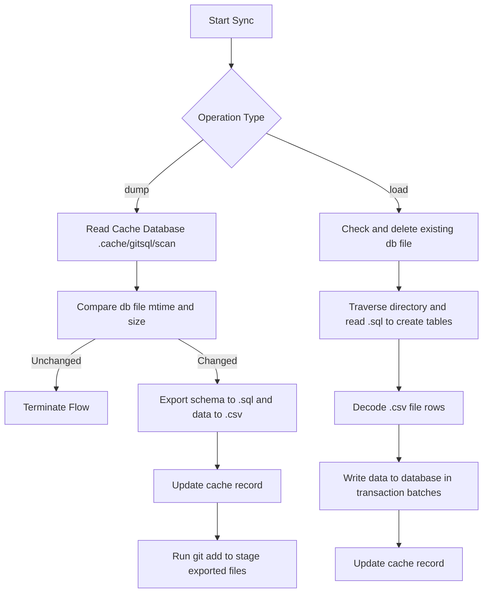
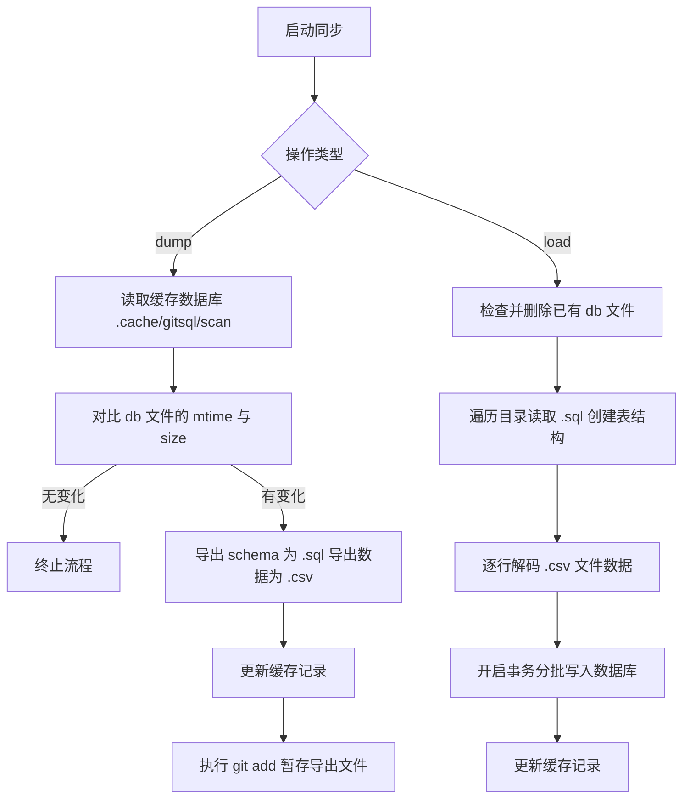

[English](#en) | [中文](#zh)

---

<a id="en"></a>
# @1-/gitsql : SQLite database Git bidirectional synchronization and version control

- [@1-/gitsql : SQLite database Git bidirectional synchronization and version control](#1-gitsql-sqlite-database-git-bidirectional-synchronization-and-version-control)
  - [1. Introduction](#1-introduction)
  - [2. Usage](#2-usage)
    - [Auto-install Git Hooks](#auto-install-git-hooks)
    - [Database Configuration](#database-configuration)
    - [Manual Sync](#manual-sync)
  - [3. Design Philosophy](#3-design-philosophy)
    - [Caching Optimization and Sync Flow](#caching-optimization-and-sync-flow)
  - [4. Technology Stack](#4-technology-stack)
  - [5. Code Structure](#5-code-structure)
  - [6. History](#6-history)
  - [About](#about)

## 1. Introduction

Deconstructs SQLite binary database files into plain-text format to enable database version control and team collaboration using Git.

Key Features:

- **Data Export (dump)**: Analyzes SQLite databases, exports schemas to `.sql` files, encodes rows to `.csv` files, and automatically stages them with `git add`.
- **Data Import (load)**: Reads `.sql` and `.csv` files from target directories to reconstruct and restore SQLite databases.
- **Git Hook Integration (postinstall)**: Installs Git `pre-commit` and `post-merge` hooks for automated export before commits and automated import after merges.
- **Incremental Scanning (scan)**: Determines database state using file modification times (mtime) and sizes (size), skipping export when unchanged to minimize I/O overhead.

## 2. Usage

### Auto-install Git Hooks

Configure `package.json` in your project:

```json
"scripts": {
  "postinstall": "bun run node_modules/@1-/gitsql/src/postinstall.js"
}
```

Or manually install hooks:

```bash
bun x gitsql-install
```

### Database Configuration

Create `gitsql.js` in the project root:

```javascript
// gitsql.js
export default ["db/dev.db"];
```

### Manual Sync

Run export and import manually from the command line:

```bash
# Export SQLite to SQL and CSV directories
bun x gitsql dump

# Restore SQLite from SQL and CSV directories
bun x gitsql load
```

## 3. Design Philosophy

### Caching Optimization and Sync Flow



## 4. Technology Stack

- **Bun**: Runtime and native `bun:sqlite` engine support
- **@1-/scan**: Incremental file scanner and cache recorder
- **@1-/upsert_gitignore**: Gitignore rules manager

## 5. Code Structure

```text
src/
├── cli.js           # CLI entry point, parsing dump/load commands
├── db.js            # SQLite database initialization
├── dump.js          # Export logic, writing SQL and CSV files
├── load.js          # Import logic, parsing SQL and CSV to rebuild DB
├── scan.js          # Scanner wrapper for incremental detection
├── read.js          # Async file reader wrapper
├── postinstall.js   # Script to install Git hooks (pre-commit, post-merge)
└── csv/
    ├── decode.js    # CSV format decoder
    └── encode.js    # CSV format encoder
```

## 6. History

D. Richard Hipp, creator of SQLite, developed the Fossil distributed version control system instead of using Git.

Fossil uses SQLite database files as its repository storage format.
This creates a loop: SQLite uses Fossil to manage source code, while Fossil relies on SQLite to store version history and metadata.

Git cannot perform line-level diffing or merging on binary SQLite `.db` files. Committing databases directly causes repository bloat and merge conflicts.

`@1-/gitsql` addresses this limitation by decomposing SQLite databases into plain-text SQL schemas and CSV data, enabling line-level diffing, branch merging, and conflict resolution in Git.


## About

This library is developed by [WebC.site](https://webc.site).

[WebC.site](https://webc.site): A new paradigm of web development for AI


---

<a id="zh"></a>
# @1-/gitsql : SQLite 数据库 Git 双向同步与版本控制

- [@1-/gitsql : SQLite 数据库 Git 双向同步与版本控制](#1-gitsql-sqlite-数据库-git-双向同步与版本控制)
  - [1. 功能介绍](#1-功能介绍)
  - [2. 使用演示](#2-使用演示)
    - [自动挂载 Hook](#自动挂载-hook)
    - [数据库配置](#数据库配置)
    - [手动同步](#手动同步)
  - [3. 设计思路](#3-设计思路)
    - [缓存优化与同步流程](#缓存优化与同步流程)
  - [4. 技术栈](#4-技术栈)
  - [5. 代码结构](#5-代码结构)
  - [6. 历史故事](#6-历史故事)
  - [关于](#关于)

## 1. 功能介绍

将 SQLite 二进制数据库文件解构为纯文本格式，通过 Git 实现数据库版本控制与团队协作。

核心功能：

- **数据导出 (dump)**：解析 SQLite 数据库，提取表结构输出为 `.sql` 文件，数据行编码为 `.csv` 文件，并自动执行 `git add` 暂存。
- **数据导入 (load)**：读取目录下 `.sql` 与 `.csv` 文件，重建并还原 SQLite 数据库。
- **钩子集成 (postinstall)**：自动安装 Git `pre-commit` 与 `post-merge` 钩子，实现提交前自动导出、合并后自动导入。
- **增量扫描 (scan)**：基于文件修改时间 (mtime) 与大小 (size) 判定数据库状态，无变化跳过导出，降低 I/O 开销。

## 2. 使用演示

### 自动挂载 Hook

在项目 `package.json` 中配置：

```json
"scripts": {
  "postinstall": "bun run node_modules/@1-/gitsql/src/postinstall.js"
}
```

或者手动执行挂载：

```bash
bun x gitsql-install
```

### 数据库配置

项目根目录创建 `gitsql.js` 配置文件：

```javascript
// gitsql.js
export default ["db/dev.db"];
```

### 手动同步

命令行执行导出与导入：

```bash
# 导出 SQLite 至 SQL 与 CSV 目录
bun x gitsql dump

# 从 SQL 与 CSV 目录还原 SQLite
bun x gitsql load
```

## 3. 设计思路

### 缓存优化与同步流程



## 4. 技术栈

- **Bun**: 运行时与 `bun:sqlite` 原生数据库引擎支持
- **@1-/scan**: 增量文件扫描与缓存记录器
- **@1-/upsert_gitignore**: Git 忽略规则更新组件

## 5. 代码结构

```text
src/
├── cli.js           # 命令行入口，解析 dump/load 指令
├── db.js            # SQLite 数据库实例初始化
├── dump.js          # 数据库导出逻辑，输出 SQL 与 CSV 文件
├── load.js          # 数据库加载逻辑，读取 SQL 与 CSV 重构数据库
├── scan.js          # 扫描器封装，用于增量判定
├── read.js          # 异步文件流读取封装
├── postinstall.js   # 自动安装 pre-commit 与 post-merge Git 钩子
└── csv/
    ├── decode.js    # CSV 格式解析与解码
    └── encode.js    # CSV 格式生成与编码
```

## 6. 历史故事

SQLite 的创始人 D. Richard Hipp 没有使用 Git 托管 SQLite，而是开发了分布式版本控制系统 Fossil。

Fossil 采用 SQLite 数据库文件作为底层存储仓库。
由此形成循环：SQLite 使用 Fossil 管理代码，Fossil 基于 SQLite 存储历史版本和元数据。

Git 无法对二进制格式的 SQLite `.db` 文件进行行级差异对比与合并。直接在 Git 提交数据库文件会导致仓库体积膨胀，并引发合并冲突。

`@1-/gitsql` 针对此痛点设计，将 SQLite 解构为纯文本 SQL 模式与 CSV 数据，使 SQLite 支持 Git 行级差异对比、分支合并与冲突解决。


## 关于

本库由 [WebC.site](https://webc.site) 开发。

[WebC.site](https://webc.site) : 面向人工智能的网站开发新范式

