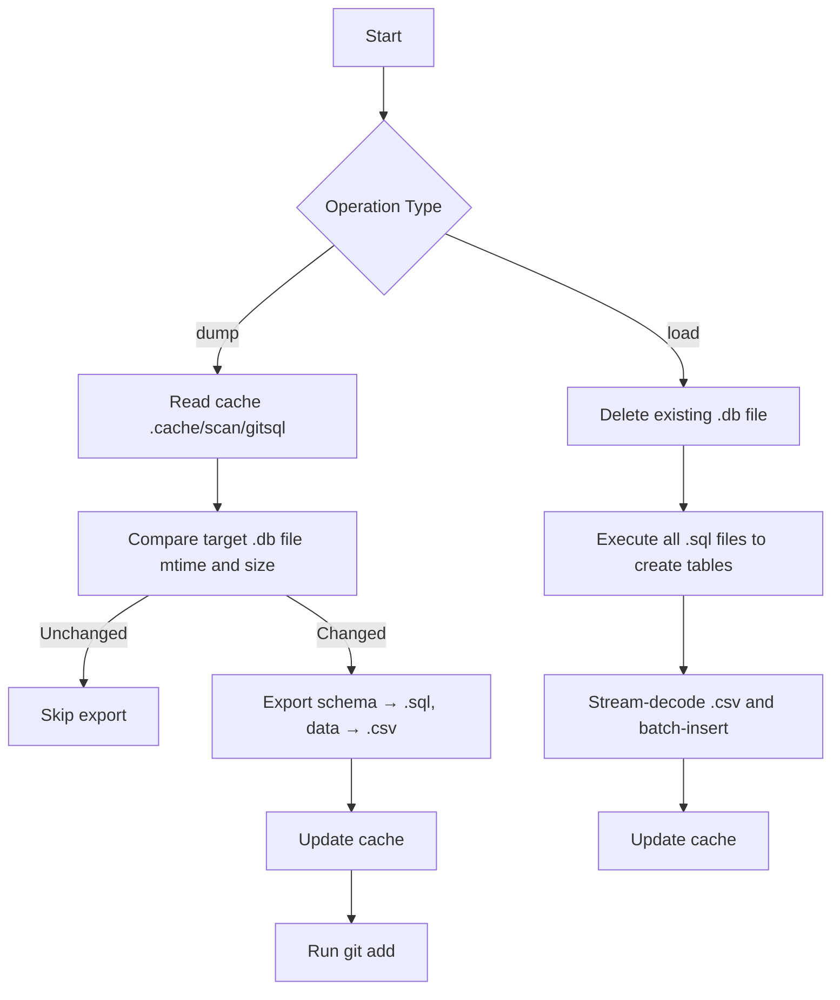

# @1-/gitsql : SQLite database Git bidirectional synchronization and version control

## 1. Introduction

Solves the inherent limitation of Git when handling SQLite binary database files: inability to perform line-level diffing, merging, or collaborative workflows. Decomposes databases into semantically versionable plain-text assets.

Key features:

- **Data Export (dump)**: Extracts table schemas into `.sql` files and exports data rows into UTF-8 BOM CSV files (with base64url-encoded BLOB columns), then auto-stages with `git add`.
- **Data Import (load)**: Executes `.sql` files to create tables, then streams and parses `.csv` files for batch insertion—supporting large files and full BLOB restoration.
- **Incremental Scanning (scan)**: Determines database change status using file modification time and size, exporting only updated databases to minimize I/O.
- **Git Hook Integration**: Provides the `gitsql-install` CLI command to automatically configure Git `pre-commit` and `post-merge` hooks, enabling an automated workflow: export before commit, import after merge.

## 2. Usage

### Installation & Initialization

Install the CLI globally:

```bash
bun add -g @1-/gitsql
```

Create a `gitsql.js` configuration file in your project root to declare databases to synchronize:

```javascript
// gitsql.js
export default ["db/dev.db"];
```

### Manual Sync

```bash
# Export SQLite to SQL and CSV directories (e.g., db/dev.db → db/dev.db.dump/)
bun gitsql dump db/dev.db

# Restore SQLite from SQL and CSV directories
bun gitsql load db/dev.db
```

### Automated Hooks

Run this command to install Git hooks:

```bash
bun gitsql-install
```

This command:

- Adds `.cache/` to your project's `.gitignore`;
- Writes `pre-commit` (triggers `dump`) and `post-merge` (triggers `load`) scripts to `.git/hooks/`.

## 3. Design Philosophy

### Sync Flow



### Key Design Decisions

- **Incrementality**: Leverages `@1-/scan` to maintain a lightweight SQLite state snapshot, avoiding full filesystem scans.
- **Atomicity**: `load` deletes the old database before reconstruction; `dump` and `git add` are coupled to ensure all exported files are staged.
- **BLOB Support**: Binary columns are base64url-encoded in CSV and decoded on import, preserving attachments, images, and other binary data losslessly.
- **Zero-Dependency Deployment**: All logic runs natively on Bun via `bun:sqlite`; no external SQLite CLI or Python runtime required.
- **Efficient Batch Processing**: Import process uses 10,000-row batching for optimal large file handling.
- **SQL Compatibility**: Exported `.sql` files ensure semicolon termination, conforming to SQLite standards.
- **CSV Processing**: Custom streaming CSV parser handles quoted fields and embedded newlines correctly.
- **Resource Management**: Uses Bun's `using` statement for automatic database connection disposal.

## 4. Technology Stack

- **Bun**: High-performance JavaScript runtime with built-in `bun:sqlite` engine
- **@1-/scan**: Incremental file-state scanner and SQLite-backed cache manager
- **@1-/csv**: Lightweight CSV encoder/decoder (`csvE.js` / `csvD.js`), optimized for database round-trips
- **bun:sqlite**: Built-in SQLite database driver
- **@1-/read**: Asynchronous file reading utility

## 5. Code Structure

```text
src/
├── cli.js                 # CLI entry point, parses commands and arguments
├── cli/dump.js            # dump subcommand logic: invokes scan + dump + git add
├── cli/load.js            # load subcommand logic: invokes scan + load
├── const/DB_PATH.js       # Cache database path constant (.cache/scan/gitsql)
├── db.js                  # SQLite database connection factory (wraps bun:sqlite)
├── dump.js                # Core export logic: schema → .sql, data → .csv
├── load.js                # Core import logic: .sql → CREATE, .csv → INSERT
├── scan.js                # Scanner wrapper, orchestrates @1-/scan module
├── read.js                # Async file reader utility
├── postinstall.js         # Initialization script: adds .cache/ to .gitignore
└── encode/
    ├── base64.js          # base64url encode/decode for BLOB columns
    ├── buf.js             # BLOB field stringification
    ├── str.js             # String SQL escaping
    └── val.js             # Generic value type handling
```

## 6. History

D. Richard Hipp, creator of SQLite, developed Fossil—a distributed version control system whose entire repository storage format is an SQLite database file.

This creates a famous self-referential loop: SQLite's source code is managed by Fossil, while Fossil stores all its metadata, history snapshots, and branch information inside SQLite database files.

Git's design philosophy centers on text-based line-level diffing and three-way merging, making it fundamentally incompatible with binary blobs. Committing `.db` files directly bloats repositories and renders `git merge` entirely ineffective.

`@1-/gitsql` breaks this impasse by semantic decomposition (schema + data), transforming non-mergeable binaries into Git-native textual assets. This SQL schema and CSV data representation enables line-level diffs, branch merging, and conflict resolution for SQLite within Git.
