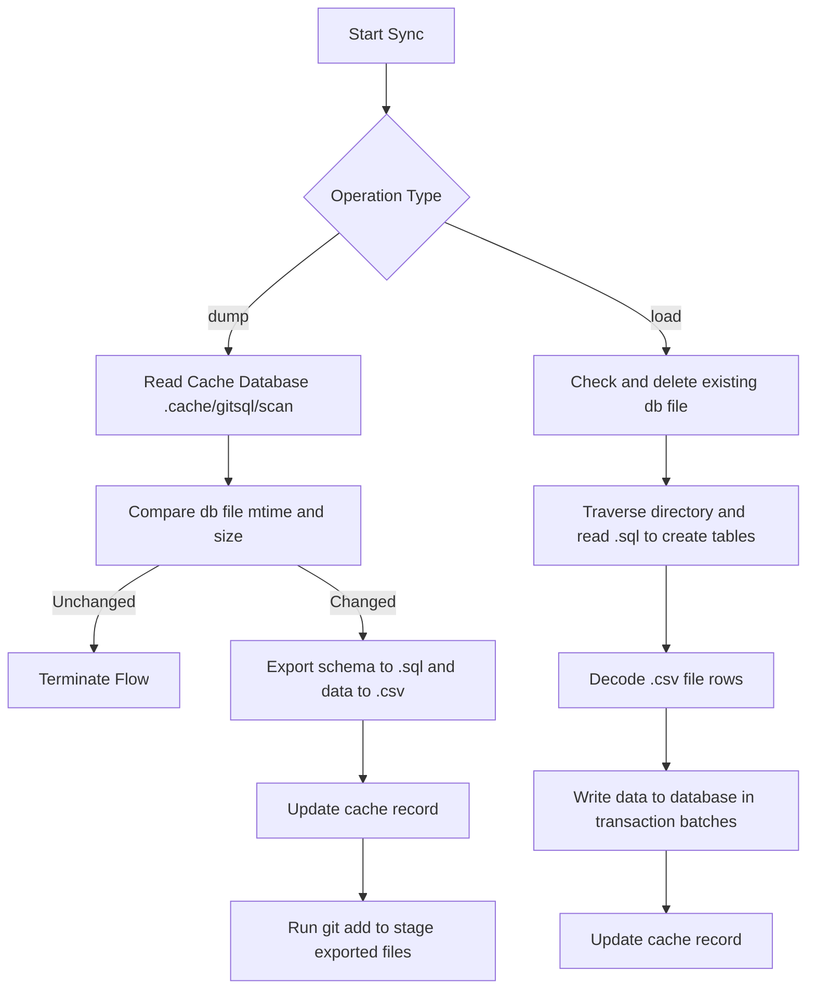

# @1-/gitsql : SQLite database Git bidirectional synchronization and version control

## 1. Introduction

Deconstructs SQLite binary database files into plain-text format to enable database version control and team collaboration using Git.

Key Features:

- **Data Export (dump)**: Analyzes SQLite databases, exports schemas to `.sql` files, encodes rows to `.csv` files, and automatically stages them with `git add`.
- **Data Import (load)**: Reads `.sql` and `.csv` files from target directories to reconstruct and restore SQLite databases.
- **Git Hook Integration (postinstall)**: Installs Git `pre-commit` and `post-merge` hooks for automated export before commits and automated import after merges.
- **Incremental Scanning (scan)**: Determines database state using file modification times (mtime) and sizes (size), skipping export when unchanged to minimize I/O overhead.

## 2. Usage

### Auto-install Git Hooks

Configure `package.json` in your project:

```json
"scripts": {
  "postinstall": "bun run node_modules/@1-/gitsql/src/postinstall.js"
}
```

Or manually install hooks:

```bash
bun x gitsql-install
```

### Database Configuration

Create `gitsql.js` in the project root:

```javascript
// gitsql.js
export default ["db/dev.db"];
```

### Manual Sync

Run export and import manually from the command line:

```bash
# Export SQLite to SQL and CSV directories
bun x gitsql dump

# Restore SQLite from SQL and CSV directories
bun x gitsql load
```

## 3. Design Philosophy

### Caching Optimization and Sync Flow



## 4. Technology Stack

- **Bun**: Runtime and native `bun:sqlite` engine support
- **@1-/scan**: Incremental file scanner and cache recorder
- **@1-/upsert_gitignore**: Gitignore rules manager

## 5. Code Structure

```text
src/
├── cli.js           # CLI entry point, parsing dump/load commands
├── db.js            # SQLite database initialization
├── dump.js          # Export logic, writing SQL and CSV files
├── load.js          # Import logic, parsing SQL and CSV to rebuild DB
├── scan.js          # Scanner wrapper for incremental detection
├── read.js          # Async file reader wrapper
├── postinstall.js   # Script to install Git hooks (pre-commit, post-merge)
└── csv/
    ├── decode.js    # CSV format decoder
    └── encode.js    # CSV format encoder
```

## 6. History

D. Richard Hipp, creator of SQLite, developed the Fossil distributed version control system instead of using Git.

Fossil uses SQLite database files as its repository storage format.
This creates a loop: SQLite uses Fossil to manage source code, while Fossil relies on SQLite to store version history and metadata.

Git cannot perform line-level diffing or merging on binary SQLite `.db` files. Committing databases directly causes repository bloat and merge conflicts.

`@1-/gitsql` addresses this limitation by decomposing SQLite databases into plain-text SQL schemas and CSV data, enabling line-level diffing, branch merging, and conflict resolution in Git.
