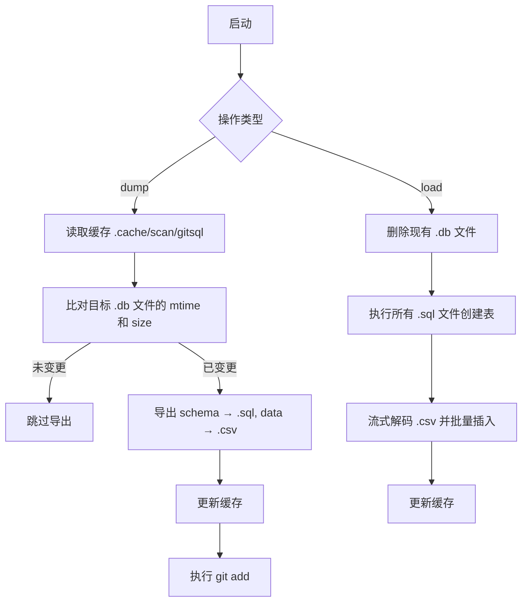

# @1-/gitsql : SQLite 数据库 Git 双向同步与版本控制

## 1. 功能介绍

解决 SQLite 二进制数据库文件无法被 Git 有效 diff、合并与协作的固有缺陷。将数据库语义解构为可版本化的纯文本资产。

核心功能：

- **数据导出 (dump)**：提取表结构为 `.sql` 文件，导出数据行为 UTF-8 BOM CSV 文件（含 base64url 编码 BLOB），并自动 `git add`。
- **数据导入 (load)**：按目录执行 `.sql` 创建表，流式解析 `.csv` 并批量插入，支持大文件与 BLOB 字段还原。
- **增量扫描 (scan)**：基于文件修改时间与大小判定变更，仅导出已更新的数据库，避免冗余 I/O。
- **钩子集成**：提供 `gitsql-install` CLI 命令，自动配置 Git `pre-commit` 与 `post-merge` 钩子，实现提交前导出、合并后导入的自动化闭环。

## 2. 使用演示

### 安装与初始化

全局安装 CLI 工具：

```bash
bun add -g @1-/gitsql
```

在项目根目录创建 `gitsql.js` 配置文件，声明需同步的数据库路径：

```javascript
// gitsql.js
export default ["db/dev.db"];
```

### 手动同步

```bash
# 导出 SQLite 至 SQL 与 CSV 目录（例如：db/dev.db → db/dev.db.dump/）
bun gitsql dump db/dev.db

# 从 SQL 与 CSV 目录还原 SQLite
bun gitsql load db/dev.db
```

### 自动化钩子

运行以下命令安装 Git 钩子：

```bash
bun gitsql-install
```

该命令会：

- 将 `.cache/` 目录加入项目 `.gitignore`；
- 在 `.git/hooks/` 下写入 `pre-commit`（触发 `dump`）与 `post-merge`（触发 `load`）脚本。

## 3. 设计思路

### 同步流程



### 关键设计考量

- **增量性**：使用 `@1-/scan` 模块维护 SQLite 文件状态快照，避免全量扫描。
- **原子性**：`load` 过程中先删除旧库再重建，确保数据库一致性；`dump` 与 `git add` 组合保证导出文件全部暂存。
- **BLOB 支持**：CSV 中的二进制字段经 base64url 编码，导入时自动解码还原，无损处理附件、图片等数据。
- **零依赖部署**：所有逻辑由 Bun 原生 `bun:sqlite` 驱动，不依赖外部 SQLite CLI 或 Python 环境。
- **高效批量处理**：导入过程采用 10,000 行批量插入，优化大文件处理性能。
- **SQL 兼容性**：导出的 `.sql` 文件确保以分号结尾，符合 SQLite 标准格式。
- **CSV 处理**：使用自定义流式 CSV 解析器，正确处理带引号的字段和换行符。
- **资源管理**：使用 Bun 的 `using` statement 确保数据库连接正确释放。

## 4. 技术栈

- **Bun**：高性能 JavaScript 运行时，内置 `bun:sqlite` 原生引擎
- **@1-/scan**：增量文件状态扫描与 SQLite 缓存管理器
- **@1-/csv**：轻量 CSV 编解码器（`csvE.js` / `csvD.js`），专为数据库场景优化
- **bun:sqlite**：Bun 内置 SQLite 数据库驱动
- **@1-/read**：异步文件读取工具

## 5. 代码结构

```text
src/
├── cli.js                 # CLI 入口，解析命令与参数
├── cli/dump.js            # dump 子命令逻辑：调用 scan + dump + git add
├── cli/load.js            # load 子命令逻辑：调用 scan + load
├── const/DB_PATH.js       # 缓存数据库路径常量（.cache/scan/gitsql）
├── db.js                  # SQLite 数据库连接工厂（封装 bun:sqlite）
├── dump.js                # 核心导出逻辑：schema → .sql, data → .csv
├── load.js                # 核心加载逻辑：.sql → CREATE, .csv → INSERT
├── scan.js                # 扫描器封装，协调 @1-/scan 模块
├── read.js                # 异步文件读取工具函数
├── postinstall.js         # 初始化脚本：将 .cache/ 加入 .gitignore
└── encode/
    ├── base64.js          # BLOB 字段的 base64url 编解码
    ├── buf.js             # BLOB 字段字符串化处理
    ├── str.js             # 字符串 SQL 转义处理
    └── val.js             # 通用值类型处理
```

## 6. 历史故事

SQLite 的作者 D. Richard Hipp 选择不使用 Git，而是开发了 Fossil——一个以 SQLite 数据库文件为唯一存储后端的分布式版本控制系统。

这形成了著名的“自指循环”：SQLite 的源码由 Fossil 管理，而 Fossil 的所有元数据、历史快照与分支信息均存储于 SQLite 数据库中。

Git 的设计哲学是面向文本的行级 diff 与三路合并，天然排斥二进制 blob。直接提交 `.db` 文件不仅导致仓库臃肿，更使 `git merge` 完全失效。

`@1-/gitsql` 通过语义解构（schema + data）打破这一僵局，将不可合并的二进制文件转化为 Git 原生友好的文本资产。本 SQL 模式与 CSV 数据，使 SQLite 支持 Git 行级差异对比、分支合并与冲突解决。
