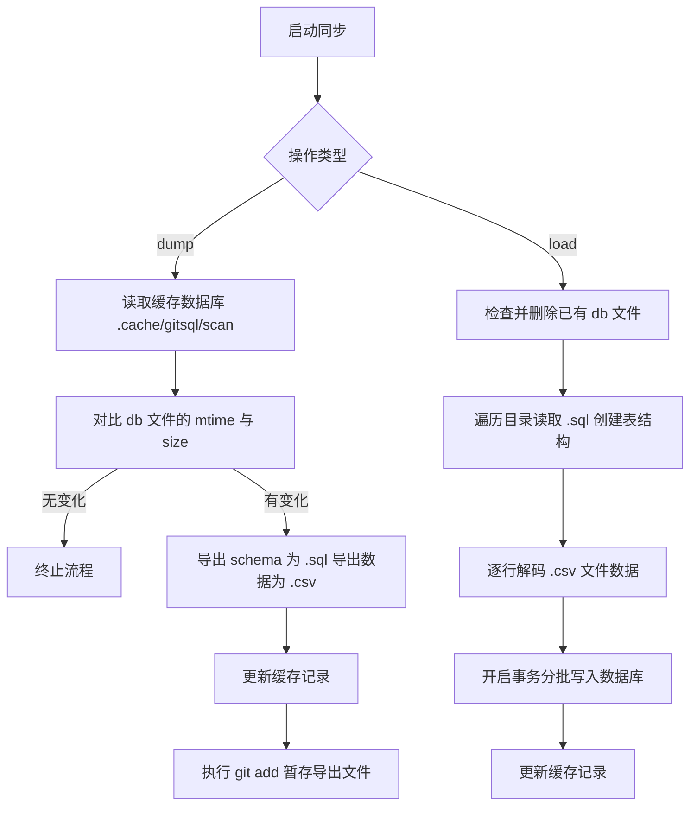

# @1-/gitsql : SQLite 数据库 Git 双向同步与版本控制

## 1. 功能介绍

将 SQLite 二进制数据库文件解构为纯文本格式，通过 Git 实现数据库版本控制与团队协作。

核心功能：

- **数据导出 (dump)**：解析 SQLite 数据库，提取表结构输出为 `.sql` 文件，数据行编码为 `.csv` 文件，并自动执行 `git add` 暂存。
- **数据导入 (load)**：读取目录下 `.sql` 与 `.csv` 文件，重建并还原 SQLite 数据库。
- **钩子集成 (postinstall)**：自动安装 Git `pre-commit` 与 `post-merge` 钩子，实现提交前自动导出、合并后自动导入。
- **增量扫描 (scan)**：基于文件修改时间 (mtime) 与大小 (size) 判定数据库状态，无变化跳过导出，降低 I/O 开销。

## 2. 使用演示

### 自动挂载 Hook

在项目 `package.json` 中配置：

```json
"scripts": {
  "postinstall": "bun run node_modules/@1-/gitsql/src/postinstall.js"
}
```

或者手动执行挂载：

```bash
bun x gitsql-install
```

### 数据库配置

项目根目录创建 `gitsql.js` 配置文件：

```javascript
// gitsql.js
export default ["db/dev.db"];
```

### 手动同步

命令行执行导出与导入：

```bash
# 导出 SQLite 至 SQL 与 CSV 目录
bun x gitsql dump

# 从 SQL 与 CSV 目录还原 SQLite
bun x gitsql load
```

## 3. 设计思路

### 缓存优化与同步流程



## 4. 技术栈

- **Bun**: 运行时与 `bun:sqlite` 原生数据库引擎支持
- **@1-/scan**: 增量文件扫描与缓存记录器
- **@1-/upsert_gitignore**: Git 忽略规则更新组件

## 5. 代码结构

```text
src/
├── cli.js           # 命令行入口，解析 dump/load 指令
├── db.js            # SQLite 数据库实例初始化
├── dump.js          # 数据库导出逻辑，输出 SQL 与 CSV 文件
├── load.js          # 数据库加载逻辑，读取 SQL 与 CSV 重构数据库
├── scan.js          # 扫描器封装，用于增量判定
├── read.js          # 异步文件流读取封装
├── postinstall.js   # 自动安装 pre-commit 与 post-merge Git 钩子
└── csv/
    ├── decode.js    # CSV 格式解析与解码
    └── encode.js    # CSV 格式生成与编码
```

## 6. 历史故事

SQLite 的创始人 D. Richard Hipp 没有使用 Git 托管 SQLite，而是开发了分布式版本控制系统 Fossil。

Fossil 采用 SQLite 数据库文件作为底层存储仓库。
由此形成循环：SQLite 使用 Fossil 管理代码，Fossil 基于 SQLite 存储历史版本和元数据。

Git 无法对二进制格式的 SQLite `.db` 文件进行行级差异对比与合并。直接在 Git 提交数据库文件会导致仓库体积膨胀，并引发合并冲突。

`@1-/gitsql` 针对此痛点设计，将 SQLite 解构为纯文本 SQL 模式与 CSV 数据，使 SQLite 支持 Git 行级差异对比、分支合并与冲突解决。
