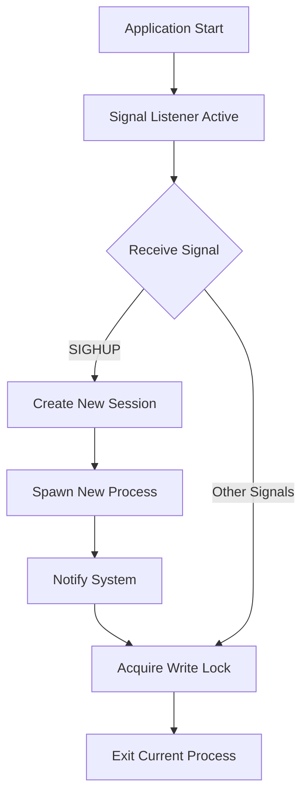
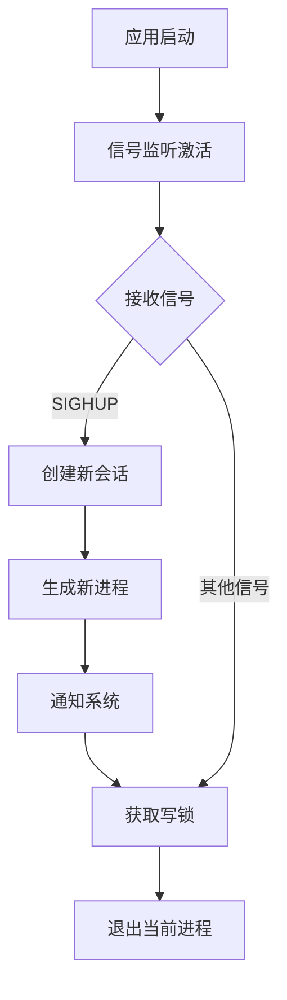

[English](#en) | [中文](#zh)

---

<a id="en"></a>
# graceful_restart: Zero-Downtime Process Restart Library

- [graceful_restart: Zero-Downtime Process Restart Library](#graceful_restart-zero-downtime-process-restart-library)
  - [Table of Contents](#table-of-contents)
  - [Features](#features)
  - [Installation](#installation)
  - [Usage](#usage)
    - [Web Server Integration](#web-server-integration)
    - [Request Handler Pattern](#request-handler-pattern)
  - [Design Philosophy](#design-philosophy)
    - [Core Components](#core-components)
  - [Technical Stack](#technical-stack)
  - [Project Structure](#project-structure)
  - [API Reference](#api-reference)
    - [Functions](#functions)
      - [`graceful_restart()`](#graceful_restart)
    - [Static Variables](#static-variables)
      - [`LOCK: RwLock<()>`](#lock-rwlock)
      - [`CANCEL: CancellationToken`](#cancel-cancellationtoken)
  - [Platform Support](#platform-support)
  - [Historical Context](#historical-context)
  - [About](#about)

## Table of Contents

- [Features](#features)
- [Installation](#installation)
- [Usage](#usage)
- [Design Philosophy](#design-philosophy)
- [Technical Stack](#technical-stack)
- [Project Structure](#project-structure)
- [API Reference](#api-reference)
- [Platform Support](#platform-support)
- [Historical Context](#historical-context)

## Features

- **Zero-downtime restart**: Seamlessly restart processes without service interruption
- **Signal-based control**: Responds to SIGHUP signals for graceful restart operations
- **Process isolation**: Creates new sessions to decouple child processes from parent terminals
- **Cross-platform awareness**: Linux-optimized with fallback behavior for other platforms
- **Thread-safe operations**: Uses tokio::sync::RwLock for async-friendly concurrent access control
- **Async-first design**: Built on tokio runtime for high-performance async operations

## Installation

Add to your `Cargo.toml`:

```toml
[dependencies]
graceful_restart = { git = "https://github.com/webc-site/npm.git", path = "graceful_restart" }
```

## Usage

### Web Server Integration

This library is designed for web servers that need zero-downtime restarts. Each incoming request should acquire a read lock and release it when the request is completed.

```rust
use graceful_restart::{CANCEL, LOCK};
use std::sync::Arc;

async fn handle_request(request: Request) -> Response {
  // Acquire read lock when request starts
  let _guard = LOCK.read().await;

  // Process the request normally
  let response = process_request(request).await;

  // Lock is automatically released when guard drops
  response
}

#[tokio::main]
async fn main() -> Result<(), Box<dyn std::error::Error>> {
  // Initialize xboot to activate global async calls
  xboot::init().await?;

  let listener = TcpListener::bind("127.0.0.1:8080").await?;
  println!("Web server started - send SIGHUP to restart gracefully");

  // Main server loop with cancellation support
  loop {
    tokio::select! {
      result = listener.accept() => {
        match result {
          Ok((stream, _)) => {
            tokio::spawn(async move {
              handle_connection(stream).await;
            });
          }
          Err(e) => eprintln!("Accept error: {e}"),
        }
      }
      _ = CANCEL.cancelled() => {
        println!("Shutdown signal received, stopping new connections");
        break;
      }
    }
  }

  Ok(())
}
```

### Request Handler Pattern

```rust
use graceful_restart::{CANCEL, LOCK};

async fn run_server() -> Result<(), Error> {
  let listener = TcpListener::bind("127.0.0.1:8080").await?;

  loop {
    tokio::select! {
      result = listener.accept() => {
        match result {
          Ok((stream, addr)) => {
            println!("New connection from {addr}");
            tokio::spawn(handle_client(stream));
          }
          Err(e) => eprintln!("Accept error: {e}"),
        }
      }
      _ = CANCEL.cancelled() => {
        println!("Server shutdown initiated");
        break;
      }
    }
  }

  Ok(())
}

async fn handle_client(stream: TcpStream) {
  let _guard = LOCK.read().await;
  // Process client connection normally
  process_connection(stream).await;
  // Guard automatically released
}
```

## Design Philosophy

The library implements graceful restart through signal handling and process management:



### Core Components

1. **Signal Monitoring**: Continuously listens for system signals using `listen_signal`
2. **Process Spawning**: Creates new process instances with session isolation
3. **Request Lock Management**: Each web request acquires read lock, preventing shutdown during active requests
4. **Graceful Shutdown**: Write lock ensures all requests complete before process termination

## Technical Stack

- **Runtime**: Tokio async runtime
- **Signal Handling**: listen_signal crate
- **Concurrency**: tokio::sync::RwLock
- **Process Management**: std::process with Unix extensions
- **Session Control**: nix crate for setsid operations
- **Logging**: log crate with structured output

## Project Structure

```
graceful_restart/
├── src/
│   └── lib.rs          # Main library implementation
├── tests/
│   └── main.rs         # Test cases and examples
├── readme/
│   ├── en.md          # English documentation
│   └── zh.md          # Chinese documentation
└── Cargo.toml         # Project configuration
```

## API Reference

### Functions

#### `graceful_restart()`

Core async function that handles graceful restart operations. Automatically spawned as a background task via `xboot::add!()` during library initialization.

**Behavior**:

- Continuously listens for system signals using `listen_signal::wait_all()`
- On any signal: immediately calls `CANCEL.cancel()` to notify all active requests to stop accepting new work
- On SIGHUP signal: spawns new process with session isolation using `nix::unistd::setsid()` (Linux only)
- On other signals: initiates graceful shutdown, waiting up to 10 minutes for `LOCK.write()`. If a second signal (e.g. Ctrl+C or SIGTERM) is received during this shutdown phase, the process exits immediately to prevent lockups.
- Integrates with system notification via `sys_notify::mainid()` to track process transitions

**Note**: This function runs automatically in the background. Users don't need to call it directly, but must call `xboot::init().await?` in their main function to activate it.

### Static Variables

#### `LOCK: RwLock<()>`

Global read-write lock for coordinating web request handling and graceful shutdown.

**Usage**:

- **Read lock**: Acquire for each incoming web request, release when request completes
- **Write lock**: Automatically acquired during graceful shutdown to wait for all requests
- Thread-safe across async contexts and multiple concurrent requests

#### `CANCEL: CancellationToken`

Global cancellation token for signaling graceful shutdown to all active requests.

**Usage**:

- **Check cancellation**: Use `CANCEL.cancelled()` in `tokio::select!` to detect shutdown signals
- **Automatic cancellation**: Token is cancelled automatically when any system signal is received
- **Immediate response**: New requests can immediately detect shutdown state and reject new work

## Platform Support

- **Linux**: Full functionality with process spawning and session management
- **Other platforms**: Signal handling with graceful shutdown (restart not supported)

## Historical Context

The concept of graceful restart has deep roots in Unix system administration. The SIGHUP signal, originally designed to notify processes of terminal hangups in the era of physical terminals and modems, evolved into a standard mechanism for configuration reloading and process restart.

Modern web servers like Nginx and Apache popularized zero-downtime restart patterns, allowing system administrators to update configurations or binary files without dropping active connections. This library brings similar capabilities to Rust web applications, using read-write locks to ensure that active HTTP requests complete before the process terminates, while new requests are handled by the restarted process.


## About

This library is developed by [WebC.site](https://webc.site).

[WebC.site](https://webc.site): A new paradigm of web development for AI


---

<a id="zh"></a>
# graceful_restart: 零停机进程重启库

- [graceful_restart: 零停机进程重启库](#graceful_restart-零停机进程重启库)
  - [目录导航](#目录导航)
  - [功能特性](#功能特性)
  - [安装方法](#安装方法)
  - [使用示例](#使用示例)
    - [网站服务器集成](#网站服务器集成)
    - [请求处理器模式](#请求处理器模式)
  - [设计思路](#设计思路)
    - [核心组件](#核心组件)
  - [技术堆栈](#技术堆栈)
  - [项目结构](#项目结构)
  - [API 参考](#api-参考)
    - [函数](#函数)
      - [`graceful_restart()`](#graceful_restart)
    - [静态变量](#静态变量)
      - [`LOCK: RwLock<()>`](#lock-rwlock)
      - [`CANCEL: CancellationToken`](#cancel-cancellationtoken)
  - [平台支持](#平台支持)
  - [技术历史](#技术历史)
  - [关于](#关于)

## 目录导航

- [功能特性](#功能特性)
- [安装方法](#安装方法)
- [使用示例](#使用示例)
- [设计思路](#设计思路)
- [技术堆栈](#技术堆栈)
- [项目结构](#项目结构)
- [API 参考](#api-参考)
- [平台支持](#平台支持)
- [技术历史](#技术历史)

## 功能特性

- **零停机重启**: 无缝重启进程，不中断服务
- **信号控制**: 响应 SIGHUP 信号执行优雅重启操作
- **进程隔离**: 创建新会话，将子进程与父终端解耦
- **跨平台感知**: Linux 优化，其他平台提供降级行为
- **线程安全**: 使用 tokio::sync::RwLock 进行异步友好的并发访问控制
- **异步优先**: 基于 tokio 运行时构建，提供高性能异步操作

## 安装方法

在 `Cargo.toml` 中添加：

```toml
[dependencies]
graceful_restart = { git = "https://github.com/webc-site/npm.git", path = "graceful_restart" }
```

## 使用示例

### 网站服务器集成

本库专为需要零停机重启的网站服务器设计。每个传入请求应获取读锁，请求完成时释放锁。

```rust
use graceful_restart::{CANCEL, LOCK};
use std::sync::Arc;

async fn handle_request(request: Request) -> Response {
  // 请求开始时获取读锁
  let _guard = LOCK.read().await;

  // 正常处理请求
  let response = process_request(request).await;

  // 守卫销毁时自动释放锁
  response
}

#[tokio::main]
async fn main() -> Result<(), Box<dyn std::error::Error>> {
  // 初始化 xboot，激活全局异步调用，启动 graceful_restart() 函数
  xboot::init().await?;

  let listener = TcpListener::bind("127.0.0.1:8080").await?;
  println!("网站服务器已启动 - 发送 SIGHUP 信号进行优雅重启");

  // 带取消支持的主服务器循环
  loop {
    tokio::select! {
      result = listener.accept() => {
        match result {
          Ok((stream, _)) => {
            tokio::spawn(async move {
              handle_connection(stream).await;
            });
          }
          Err(e) => eprintln!("接受连接错误: {e}"),
        }
      }
      _ = CANCEL.cancelled() => {
        println!("收到关闭信号，停止接受新连接");
        break;
      }
    }
  }

  Ok(())
}
```

### 请求处理器模式

```rust
use graceful_restart::{CANCEL, LOCK};

async fn run_server() -> Result<(), Error> {
  let listener = TcpListener::bind("127.0.0.1:8080").await?;

  loop {
    tokio::select! {
      result = listener.accept() => {
        match result {
          Ok((stream, addr)) => {
            println!("来自 {addr} 的新连接");
            tokio::spawn(handle_client(stream));
          }
          Err(e) => eprintln!("接受连接错误: {e}"),
        }
      }
      _ = CANCEL.cancelled() => {
        println!("服务器关闭启动");
        break;
      }
    }
  }

  Ok(())
}

async fn handle_client(stream: TcpStream) {
  let _guard = LOCK.read().await;
  // 正常处理客户端连接
  process_connection(stream).await;
  // 守卫自动释放
}
```

## 设计思路

库通过信号处理和进程管理实现优雅重启：



### 核心组件

1. **信号监控**: 使用 `listen_signal` 持续监听系统信号
2. **进程生成**: 创建具有会话隔离的新进程实例
3. **请求锁管理**: 每个网站请求获取读锁，防止活跃请求期间关闭
4. **优雅关闭**: 写锁确保所有请求完成后才终止进程

## 技术堆栈

- **运行时**: Tokio 异步运行时
- **信号处理**: listen_signal 库
- **并发控制**: tokio::sync::RwLock
- **进程管理**: std::process 配合 Unix 扩展
- **会话控制**: nix 库提供 setsid 操作
- **日志记录**: log 库提供结构化输出

## 项目结构

```
graceful_restart/
├── src/
│   └── lib.rs          # 主要库实现
├── tests/
│   └── main.rs         # 测试用例和示例
├── readme/
│   ├── en.md          # 英文文档
│   └── zh.md          # 中文文档
└── Cargo.toml         # 项目配置
```

## API 参考

### 函数

#### `graceful_restart()`

处理优雅重启操作的核心异步函数。通过 `xboot::add!()` 在库初始化期间自动作为后台任务生成。

**行为**:

- 使用 `listen_signal::wait_all()` 持续监听系统信号
- 收到任何信号: 立即调用 `CANCEL.cancel()` 通知所有活跃请求停止接受新工作
- 收到 SIGHUP 信号: 使用 `nix::unistd::setsid()` 生成具有会话隔离的新进程（仅限 Linux）
- 收到其他信号: 启动优雅停机流程，等待写锁（`LOCK.write()`）释放，超时时间为 10 分钟。如果在优雅关闭期间再次收到信号（如 Ctrl+C / SIGINT / SIGTERM），则进程立即强制退出，防止卡死。
- 通过 `sys_notify::mainid()` 与系统通知集成，跟踪进程转换

**注意**: 此函数在后台自动运行。用户无需直接调用，但必须在主函数中调用 `xboot::init().await?` 来激活它。

### 静态变量

#### `LOCK: RwLock<()>`

用于协调网站请求处理和优雅关闭的全局读写锁。

**用法**:

- **读锁**: 每个传入网站请求获取，请求完成时释放
- **写锁**: 优雅关闭期间自动获取，等待所有请求完成
- 在异步上下文和多个并发请求中线程安全

#### `CANCEL: CancellationToken`

用于向所有活跃请求发送优雅关闭信号的全局取消令牌。

**用法**:

- **检查取消**: 在 `tokio::select!` 中使用 `CANCEL.cancelled()` 检测关闭信号
- **自动取消**: 收到任何系统信号时令牌自动被取消
- **即时响应**: 新请求可以立即检测到关闭状态并拒绝新工作

## 平台支持

- **Linux**: 完整功能，包括进程生成和会话管理
- **其他平台**: 信号处理和优雅关闭（不支持重启）

## 技术历史

优雅重启概念在 Unix 系统管理中有着深厚的历史根源。SIGHUP 信号最初设计用于在物理终端和调制解调器时代通知进程终端挂断，后来演变为配置重载和进程重启的标准机制。

现代 Web 服务器如 Nginx 和 Apache 普及了零停机重启模式，允许系统管理员在不丢失活动连接的情况下更新配置或二进制文件。本库将类似功能引入 Rust 网站应用程序，使用读写锁确保活跃的 HTTP 请求在进程终止前完成，而新请求由重启后的进程处理。


## 关于

本库由 [WebC.site](https://webc.site) 开发。

[WebC.site](https://webc.site) : 面向人工智能的网站开发新范式

