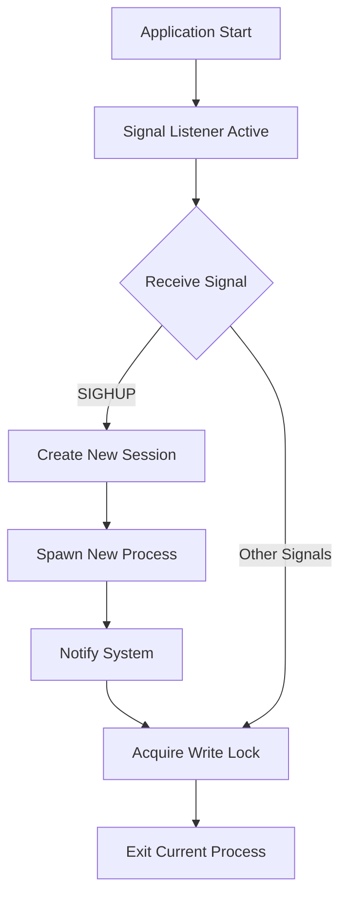

# graceful_restart: Zero-Downtime Process Restart Library

## Table of Contents

- [Features](#features)
- [Installation](#installation)
- [Usage](#usage)
- [Design Philosophy](#design-philosophy)
- [Technical Stack](#technical-stack)
- [Project Structure](#project-structure)
- [API Reference](#api-reference)
- [Platform Support](#platform-support)
- [Historical Context](#historical-context)

## Features

- **Zero-downtime restart**: Seamlessly restart processes without service interruption
- **Signal-based control**: Responds to SIGHUP signals for graceful restart operations
- **Process isolation**: Creates new sessions to decouple child processes from parent terminals
- **Cross-platform awareness**: Linux-optimized with fallback behavior for other platforms
- **Thread-safe operations**: Uses tokio::sync::RwLock for async-friendly concurrent access control
- **Async-first design**: Built on tokio runtime for high-performance async operations

## Installation

Add to your `Cargo.toml`:

```toml
[dependencies]
graceful_restart = { git = "https://github.com/webc-site/npm.git", path = "graceful_restart" }
```

## Usage

### Web Server Integration

This library is designed for web servers that need zero-downtime restarts. Each incoming request should acquire a read lock and release it when the request is completed.

```rust
use graceful_restart::{CANCEL, LOCK};
use std::sync::Arc;

async fn handle_request(request: Request) -> Response {
  // Acquire read lock when request starts
  let _guard = LOCK.read().await;

  // Process the request normally
  let response = process_request(request).await;

  // Lock is automatically released when guard drops
  response
}

#[tokio::main]
async fn main() -> Result<(), Box<dyn std::error::Error>> {
  // Initialize xboot to activate global async calls
  xboot::init().await?;

  let listener = TcpListener::bind("127.0.0.1:8080").await?;
  println!("Web server started - send SIGHUP to restart gracefully");

  // Main server loop with cancellation support
  loop {
    tokio::select! {
      result = listener.accept() => {
        match result {
          Ok((stream, _)) => {
            tokio::spawn(async move {
              handle_connection(stream).await;
            });
          }
          Err(e) => eprintln!("Accept error: {e}"),
        }
      }
      _ = CANCEL.cancelled() => {
        println!("Shutdown signal received, stopping new connections");
        break;
      }
    }
  }

  Ok(())
}
```

### Request Handler Pattern

```rust
use graceful_restart::{CANCEL, LOCK};

async fn run_server() -> Result<(), Error> {
  let listener = TcpListener::bind("127.0.0.1:8080").await?;

  loop {
    tokio::select! {
      result = listener.accept() => {
        match result {
          Ok((stream, addr)) => {
            println!("New connection from {addr}");
            tokio::spawn(handle_client(stream));
          }
          Err(e) => eprintln!("Accept error: {e}"),
        }
      }
      _ = CANCEL.cancelled() => {
        println!("Server shutdown initiated");
        break;
      }
    }
  }

  Ok(())
}

async fn handle_client(stream: TcpStream) {
  let _guard = LOCK.read().await;
  // Process client connection normally
  process_connection(stream).await;
  // Guard automatically released
}
```

## Design Philosophy

The library implements graceful restart through signal handling and process management:



### Core Components

1. **Signal Monitoring**: Continuously listens for system signals using `listen_signal`
2. **Process Spawning**: Creates new process instances with session isolation
3. **Request Lock Management**: Each web request acquires read lock, preventing shutdown during active requests
4. **Graceful Shutdown**: Write lock ensures all requests complete before process termination

## Technical Stack

- **Runtime**: Tokio async runtime
- **Signal Handling**: listen_signal crate
- **Concurrency**: tokio::sync::RwLock
- **Process Management**: std::process with Unix extensions
- **Session Control**: nix crate for setsid operations
- **Logging**: log crate with structured output

## Project Structure

```
graceful_restart/
├── src/
│   └── lib.rs          # Main library implementation
├── tests/
│   └── main.rs         # Test cases and examples
├── readme/
│   ├── en.md          # English documentation
│   └── zh.md          # Chinese documentation
└── Cargo.toml         # Project configuration
```

## API Reference

### Functions

#### `graceful_restart()`

Core async function that handles graceful restart operations. Automatically spawned as a background task via `xboot::add!()` during library initialization.

**Behavior**:

- Continuously listens for system signals using `listen_signal::wait_all()`
- On any signal: immediately calls `CANCEL.cancel()` to notify all active requests to stop accepting new work
- On SIGHUP signal: spawns new process with session isolation using `nix::unistd::setsid()` (Linux only)
- On other signals: initiates graceful shutdown, waiting up to 10 minutes for `LOCK.write()`. If a second signal (e.g. Ctrl+C or SIGTERM) is received during this shutdown phase, the process exits immediately to prevent lockups.
- Integrates with system notification via `sys_notify::mainid()` to track process transitions

**Note**: This function runs automatically in the background. Users don't need to call it directly, but must call `xboot::init().await?` in their main function to activate it.

### Static Variables

#### `LOCK: RwLock<()>`

Global read-write lock for coordinating web request handling and graceful shutdown.

**Usage**:

- **Read lock**: Acquire for each incoming web request, release when request completes
- **Write lock**: Automatically acquired during graceful shutdown to wait for all requests
- Thread-safe across async contexts and multiple concurrent requests

#### `CANCEL: CancellationToken`

Global cancellation token for signaling graceful shutdown to all active requests.

**Usage**:

- **Check cancellation**: Use `CANCEL.cancelled()` in `tokio::select!` to detect shutdown signals
- **Automatic cancellation**: Token is cancelled automatically when any system signal is received
- **Immediate response**: New requests can immediately detect shutdown state and reject new work

## Platform Support

- **Linux**: Full functionality with process spawning and session management
- **Other platforms**: Signal handling with graceful shutdown (restart not supported)

## Historical Context

The concept of graceful restart has deep roots in Unix system administration. The SIGHUP signal, originally designed to notify processes of terminal hangups in the era of physical terminals and modems, evolved into a standard mechanism for configuration reloading and process restart.

Modern web servers like Nginx and Apache popularized zero-downtime restart patterns, allowing system administrators to update configurations or binary files without dropping active connections. This library brings similar capabilities to Rust web applications, using read-write locks to ensure that active HTTP requests complete before the process terminates, while new requests are handled by the restarted process.
