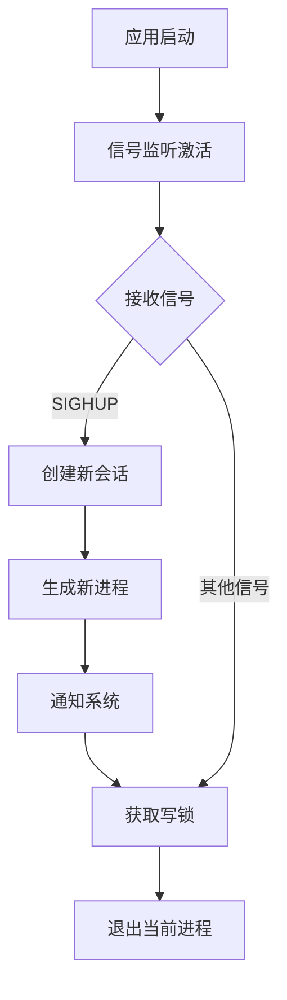

# graceful_restart: 零停机进程重启库

## 目录导航

- [功能特性](#功能特性)
- [安装方法](#安装方法)
- [使用示例](#使用示例)
- [设计思路](#设计思路)
- [技术堆栈](#技术堆栈)
- [项目结构](#项目结构)
- [API 参考](#api-参考)
- [平台支持](#平台支持)
- [技术历史](#技术历史)

## 功能特性

- **零停机重启**: 无缝重启进程，不中断服务
- **信号控制**: 响应 SIGHUP 信号执行优雅重启操作
- **进程隔离**: 创建新会话，将子进程与父终端解耦
- **跨平台感知**: Linux 优化，其他平台提供降级行为
- **线程安全**: 使用 tokio::sync::RwLock 进行异步友好的并发访问控制
- **异步优先**: 基于 tokio 运行时构建，提供高性能异步操作

## 安装方法

在 `Cargo.toml` 中添加：

```toml
[dependencies]
graceful_restart = { git = "https://github.com/webc-site/npm.git", path = "graceful_restart" }
```

## 使用示例

### 网站服务器集成

本库专为需要零停机重启的网站服务器设计。每个传入请求应获取读锁，请求完成时释放锁。

```rust
use graceful_restart::{CANCEL, LOCK};
use std::sync::Arc;

async fn handle_request(request: Request) -> Response {
  // 请求开始时获取读锁
  let _guard = LOCK.read().await;

  // 正常处理请求
  let response = process_request(request).await;

  // 守卫销毁时自动释放锁
  response
}

#[tokio::main]
async fn main() -> Result<(), Box<dyn std::error::Error>> {
  // 初始化 xboot，激活全局异步调用，启动 graceful_restart() 函数
  xboot::init().await?;

  let listener = TcpListener::bind("127.0.0.1:8080").await?;
  println!("网站服务器已启动 - 发送 SIGHUP 信号进行优雅重启");

  // 带取消支持的主服务器循环
  loop {
    tokio::select! {
      result = listener.accept() => {
        match result {
          Ok((stream, _)) => {
            tokio::spawn(async move {
              handle_connection(stream).await;
            });
          }
          Err(e) => eprintln!("接受连接错误: {e}"),
        }
      }
      _ = CANCEL.cancelled() => {
        println!("收到关闭信号，停止接受新连接");
        break;
      }
    }
  }

  Ok(())
}
```

### 请求处理器模式

```rust
use graceful_restart::{CANCEL, LOCK};

async fn run_server() -> Result<(), Error> {
  let listener = TcpListener::bind("127.0.0.1:8080").await?;

  loop {
    tokio::select! {
      result = listener.accept() => {
        match result {
          Ok((stream, addr)) => {
            println!("来自 {addr} 的新连接");
            tokio::spawn(handle_client(stream));
          }
          Err(e) => eprintln!("接受连接错误: {e}"),
        }
      }
      _ = CANCEL.cancelled() => {
        println!("服务器关闭启动");
        break;
      }
    }
  }

  Ok(())
}

async fn handle_client(stream: TcpStream) {
  let _guard = LOCK.read().await;
  // 正常处理客户端连接
  process_connection(stream).await;
  // 守卫自动释放
}
```

## 设计思路

库通过信号处理和进程管理实现优雅重启：



### 核心组件

1. **信号监控**: 使用 `listen_signal` 持续监听系统信号
2. **进程生成**: 创建具有会话隔离的新进程实例
3. **请求锁管理**: 每个网站请求获取读锁，防止活跃请求期间关闭
4. **优雅关闭**: 写锁确保所有请求完成后才终止进程

## 技术堆栈

- **运行时**: Tokio 异步运行时
- **信号处理**: listen_signal 库
- **并发控制**: tokio::sync::RwLock
- **进程管理**: std::process 配合 Unix 扩展
- **会话控制**: nix 库提供 setsid 操作
- **日志记录**: log 库提供结构化输出

## 项目结构

```
graceful_restart/
├── src/
│   └── lib.rs          # 主要库实现
├── tests/
│   └── main.rs         # 测试用例和示例
├── readme/
│   ├── en.md          # 英文文档
│   └── zh.md          # 中文文档
└── Cargo.toml         # 项目配置
```

## API 参考

### 函数

#### `graceful_restart()`

处理优雅重启操作的核心异步函数。通过 `xboot::add!()` 在库初始化期间自动作为后台任务生成。

**行为**:

- 使用 `listen_signal::wait_all()` 持续监听系统信号
- 收到任何信号: 立即调用 `CANCEL.cancel()` 通知所有活跃请求停止接受新工作
- 收到 SIGHUP 信号: 使用 `nix::unistd::setsid()` 生成具有会话隔离的新进程（仅限 Linux）
- 收到其他信号: 启动优雅停机流程，等待写锁（`LOCK.write()`）释放，超时时间为 10 分钟。如果在优雅关闭期间再次收到信号（如 Ctrl+C / SIGINT / SIGTERM），则进程立即强制退出，防止卡死。
- 通过 `sys_notify::mainid()` 与系统通知集成，跟踪进程转换

**注意**: 此函数在后台自动运行。用户无需直接调用，但必须在主函数中调用 `xboot::init().await?` 来激活它。

### 静态变量

#### `LOCK: RwLock<()>`

用于协调网站请求处理和优雅关闭的全局读写锁。

**用法**:

- **读锁**: 每个传入网站请求获取，请求完成时释放
- **写锁**: 优雅关闭期间自动获取，等待所有请求完成
- 在异步上下文和多个并发请求中线程安全

#### `CANCEL: CancellationToken`

用于向所有活跃请求发送优雅关闭信号的全局取消令牌。

**用法**:

- **检查取消**: 在 `tokio::select!` 中使用 `CANCEL.cancelled()` 检测关闭信号
- **自动取消**: 收到任何系统信号时令牌自动被取消
- **即时响应**: 新请求可以立即检测到关闭状态并拒绝新工作

## 平台支持

- **Linux**: 完整功能，包括进程生成和会话管理
- **其他平台**: 信号处理和优雅关闭（不支持重启）

## 技术历史

优雅重启概念在 Unix 系统管理中有着深厚的历史根源。SIGHUP 信号最初设计用于在物理终端和调制解调器时代通知进程终端挂断，后来演变为配置重载和进程重启的标准机制。

现代 Web 服务器如 Nginx 和 Apache 普及了零停机重启模式，允许系统管理员在不丢失活动连接的情况下更新配置或二进制文件。本库将类似功能引入 Rust 网站应用程序，使用读写锁确保活跃的 HTTP 请求在进程终止前完成，而新请求由重启后的进程处理。
