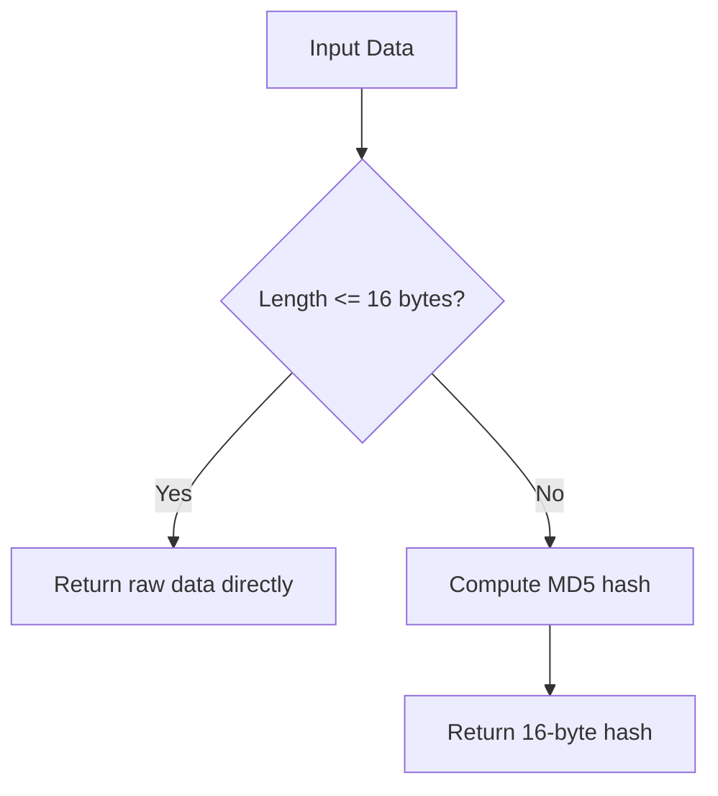

# @1-/hash : Length-bounded MD5 hash utility

## Features

This utility provides length-bounded MD5 hashing:

- Returns raw data directly if the input length is 16 bytes or less.
- Returns a 16-byte MD5 hash if the input length exceeds 16 bytes.

Guarantees the output binary length is always 16 bytes or less. Useful for shortening long keys, optimizing database index storage, and generating compact identifiers.

## Usage

### Hashing Strings

```javascript
import strmd5 from "@1-/hash/strmd5.js";

// Length <= 16 bytes: returns raw string as a Uint8Array/Buffer
const res1 = strmd5("1234567890123456");
// Returns Buffer: <12 34 56 78 90 12 34 56> (16 bytes)

// Length > 16 bytes: returns MD5 hash Buffer
const res2 = strmd5("12345678901234567");
// Returns 16-byte MD5 hash Buffer of the input
```

### Hashing Buffers

```javascript
import bufmd5 from "@1-/hash/bufmd5.js";

// Length <= 16 bytes: returns original Buffer reference
const buf1 = Buffer.alloc(10);
const res1 = bufmd5(buf1); // res1 === buf1

// Length > 16 bytes: computes and returns MD5 hash Buffer
const buf2 = Buffer.alloc(100);
const res2 = bufmd5(buf2); // Returns 16-byte MD5 Buffer
```

## Design Concept

Data processing workflow:



By enforcing this boundary, short keys retain their original values and readability, while long keys are compressed. This design achieves both efficiency and compactness.

## Tech Stack

- Node.js `node:crypto`
- Bun (test runner)
- `@3-/utf8` (high-performance UTF-8 encoder)

## Code Structure

```text
src/
├── bufmd5.js  # Binary hashing logic
└── strmd5.js  # String hashing logic
```

## History

MD5 (Message-Digest Algorithm 5) was designed by Ronald Rivest in 1991 to succeed MD4. Although cryptographic weaknesses (such as collision attacks) were demonstrated by Xiaoyun Wang and other researchers in 2004, MD5 remains widely adopted for non-cryptographic tasks. In checksum verification, caching, and identifier generation, MD5 continues to be a standard tool because of its fast computation and compact 16-byte output. This project extends that pragmatic approach by applying MD5 conditionally.
