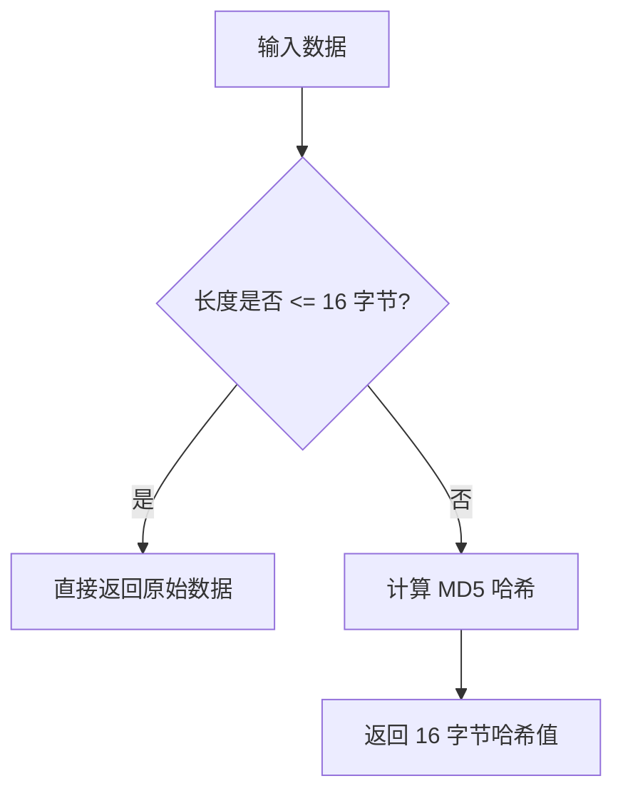

# @1-/hash : 长度受限的 MD5 哈希工具

## 功能介绍

本工具提供长度受限的 MD5 哈希计算：

- 输入数据长度不大于 16 字节时，直接返回原始数据。
- 输入数据长度大于 16 字节时，返回 16 字节的 MD5 哈希值。

保证输出结果的二进制长度始终不大于 16 字节。适用于缩短超长键值、优化数据库索引存储及生成紧凑标识符等场景。

## 使用演示

### 字符串哈希

```javascript
import strmd5 from "@1-/hash/strmd5.js";

// 长度不大于 16 字节，返回原始字符串的 Uint8Array/Buffer
const res1 = strmd5("1234567890123456");
// 返回 Buffer: <12 34 56 78 90 12 34 56> (16 字节)

// 长度大于 16 字节，返回 MD5 哈希 Buffer
const res2 = strmd5("12345678901234567");
// 返回 MD5(12345678901234567) 后的 16 字节 Buffer
```

### 二进制哈希

```javascript
import bufmd5 from "@1-/hash/bufmd5.js";

// 长度不大于 16 字节，直接返回原 Buffer 引用
const buf1 = Buffer.alloc(10);
const res1 = bufmd5(buf1); // res1 === buf1

// 长度大于 16 字节，计算并返回 MD5 哈希 Buffer
const buf2 = Buffer.alloc(100);
const res2 = bufmd5(buf2); // 返回 16 字节 MD5 Buffer
```

## 设计思路

数据处理流程：



通过这一限制，既能对短键名保留其可读性和原始值，又能确保长键名在索引或存储时不会占用过多空间，从而兼顾效率与紧凑性。

## 技术栈

- Node.js `node:crypto`
- Bun (测试运行器)
- `@3-/utf8` (高性能 UTF-8 编码器)

## 代码结构

```text
src/
├── bufmd5.js  # 二进制数据哈希逻辑
└── strmd5.js  # 字符串数据哈希逻辑
```

## 历史故事

MD5（Message-Digest Algorithm 5）由密码学家 Ronald Rivest 于 1991 年设计，用以取代存在安全缺陷的 MD4。尽管王小云教授等学者在 2004 年证明了 MD5 碰撞漏洞，使其不再适用于高安全性加密场景，但在数据校验、唯一标识生成等非加密领域，MD5 凭借 16 字节的紧凑输出和优秀的计算性能，依然被广泛应用。本项目继承并延伸了这一实用主义设计。
