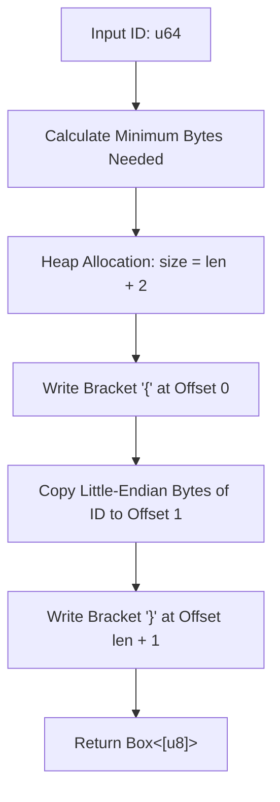
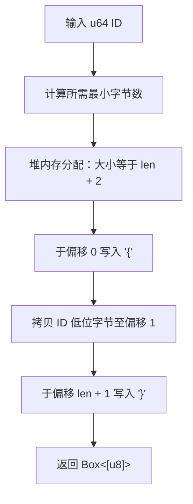

[English](#en) | [中文](#zh)

---

<a id="en"></a>

# hash_tag_id : Generate Redis hash tags by mapping same ID to same node

- [hash_tag_id : Generate Redis hash tags by mapping same ID to same node](#hash_tag_id-generate-redis-hash-tags-by-mapping-same-id-to-same-node)
  - [Description](#description)
  - [Usage](#usage)
  - [Features](#features)
  - [Design Flow](#design-flow)
  - [Tech Stack](#tech-stack)
  - [Directory Structure](#directory-structure)
  - [API Reference](#api-reference)
    - [`hash_tag_id`](#hash_tag_id)
  - [History & Trivia](#history-trivia)
  - [About](#about)

## Description

Generate Redis hash tags for numeric IDs, routing associated keys of the same ID to the same cluster shard.

## Usage

Reference example for generating and verifying hash tags:

```rust
use hash_tag_id::hash_tag_id;

let tag = hash_tag_id(123);
assert_eq!(&*tag, &[b'{', 123, b'}']);

let tag_zero = hash_tag_id(0);
assert_eq!(&*tag_zero, b"{}");
```

## Features

- Zero-copy style manual allocation utilizing raw memory pointers.
- Minimum size representation, minimizing network and storage overhead.
- No-panic safety, optimized for high-performance cluster configurations.

## Design Flow



## Tech Stack

- Rust 2024 Edition.
- Standard Library Allocator API.

## Directory Structure

```
.
├── Cargo.toml      # Configuration file
├── src
│   └── lib.rs      # Source code implementation
└── tests
    └── main.rs     # Integration tests
```

## API Reference

### `hash_tag_id`

```rust
pub fn hash_tag_id(id: u64) -> Box<[u8]>
```

Allocates heap memory and returns a boxed byte slice containing the Redis hash tag representation.

- **Parameters**: `id` - Numeric u64 identifier.
- **Returns**: `Box<[u8]>` - Boxed slice formatted as `{` + little-endian bytes of `id` + `}`.

## History & Trivia

Redis Cluster divides the key space into 16,384 hash slots. Salvatore Sanfilippo (antirez) selected this number to optimize cluster bus message sizes and routing overhead. To allow operations on multiple keys at once, hash tags `{...}` were introduced, matching slots by hashing only the string within the braces. By converting numeric IDs into compact little-endian bytes inside these braces, hash slot collisions are resolved for keys belonging to the same entity.

## About

This library is developed by [WebC.site](https://webc.site).

[WebC.site](https://webc.site): A new paradigm of web development for AI

---

<a id="zh"></a>

# hash_tag_id : 生成 Redis hash tag 将相同 ID 数据路由至同节点

- [hash_tag_id : 生成 Redis hash tag 将相同 ID 数据路由至同节点](#hash_tag_id-生成-redis-hash-tag-将相同-id-数据路由至同节点)
  - [项目功能介绍](#项目功能介绍)
  - [使用演示](#使用演示)
  - [特性介绍](#特性介绍)
  - [设计思路](#设计思路)
  - [技术堆栈](#技术堆栈)
  - [目录结构](#目录结构)
  - [API 说明](#api-说明)
    - [`hash_tag_id`](#hash_tag_id)
  - [历史与背景](#历史与背景)
  - [关于](#关于)

## 项目功能介绍

为数值 ID 生成 Redis hash tag，使相同 ID 关联键分配至同一集群分片。

## 使用演示

生成与验证 hash tag 示例：

```rust
use hash_tag_id::hash_tag_id;

let tag = hash_tag_id(123);
assert_eq!(&*tag, &[b'{', 123, b'}']);

let tag_zero = hash_tag_id(0);
assert_eq!(&*tag_zero, b"{}");
```

## 特性介绍

- 手动指针分配，避免冗余拷贝。
- 最小化字节占用，节省网络与存储开销。
- 强安全性，无 panic 风险。

## 设计思路



## 技术堆栈

- Rust 2024 Edition。
- 标准库 Allocator API。

## 目录结构

```
.
├── Cargo.toml      # 配置文件
├── src
│   └── lib.rs      # 源码实现
└── tests
    └── main.rs     # 集成测试
```

## API 说明

### `hash_tag_id`

```rust
pub fn hash_tag_id(id: u64) -> Box<[u8]>
```

分配堆内存并返回包含 Redis hash tag 的 boxed 字节切片。

- **参数**: `id` - u64 数值。
- **返回值**: `Box<[u8]>` - 格式为 `{` + `id` 小端字节序 + `}` 的字节切片。

## 历史与背景

Redis Cluster 将键空间划分为 16,384 哈希槽。创始人 Salvatore Sanfilippo (antirez) 选定此数值以优化集群总线消息大小与路由开销。为支持多键事务与脚本操作，Redis 引入 hash tags `{...}` 机制，仅对花括号内字符串计算哈希。将 ID 转换为紧凑小端字节并置于花括号内，可避免跨槽查询（`CROSSSLOT`）限制，保障同 ID 数据精确路由至同分片。

## 关于

本库由 [WebC.site](https://webc.site) 开发。

[WebC.site](https://webc.site) : 面向人工智能的网站开发新范式
