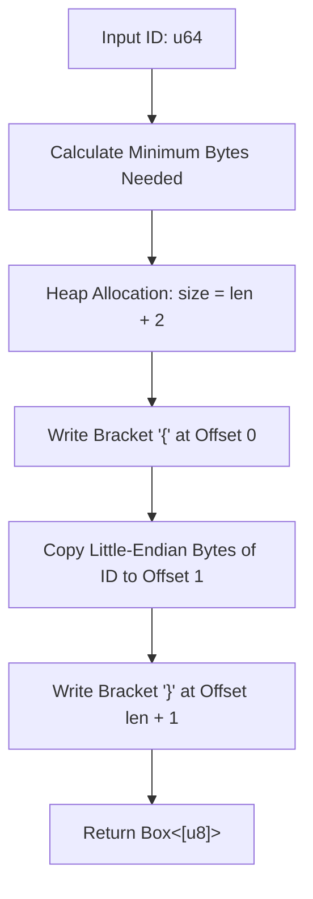

# hash_tag_id : Generate Redis hash tags by mapping same ID to same node

## Description
Generate Redis hash tags for numeric IDs, routing associated keys of the same ID to the same cluster shard.

## Usage
Reference example for generating and verifying hash tags:

```rust
use hash_tag_id::hash_tag_id;

let tag = hash_tag_id(123);
assert_eq!(&*tag, &[b'{', 123, b'}']);

let tag_zero = hash_tag_id(0);
assert_eq!(&*tag_zero, b"{}");
```

## Features
- Zero-copy style manual allocation utilizing raw memory pointers.
- Minimum size representation, minimizing network and storage overhead.
- No-panic safety, optimized for high-performance cluster configurations.

## Design Flow


## Tech Stack
- Rust 2024 Edition.
- Standard Library Allocator API.

## Directory Structure
```
.
├── Cargo.toml      # Configuration file
├── src
│   └── lib.rs      # Source code implementation
└── tests
    └── main.rs     # Integration tests
```

## API Reference
### `hash_tag_id`
```rust
pub fn hash_tag_id(id: u64) -> Box<[u8]>
```
Allocates heap memory and returns a boxed byte slice containing the Redis hash tag representation.
- **Parameters**: `id` - Numeric u64 identifier.
- **Returns**: `Box<[u8]>` - Boxed slice formatted as `{` + little-endian bytes of `id` + `}`.

## History & Trivia
Redis Cluster divides the key space into 16,384 hash slots. Salvatore Sanfilippo (antirez) selected this number to optimize cluster bus message sizes and routing overhead. To allow operations on multiple keys at once, hash tags `{...}` were introduced, matching slots by hashing only the string within the braces. By converting numeric IDs into compact little-endian bytes inside these braces, hash slot collisions are resolved for keys belonging to the same entity.