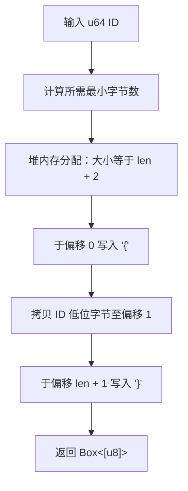

# hash_tag_id : 生成 Redis hash tag 将相同 ID 数据路由至同节点

## 项目功能介绍

为数值 ID 生成 Redis hash tag，使相同 ID 关联键分配至同一集群分片。

## 使用演示

生成与验证 hash tag 示例：

```rust
use hash_tag_id::hash_tag_id;

let tag = hash_tag_id(123);
assert_eq!(&*tag, &[b'{', 123, b'}']);

let tag_zero = hash_tag_id(0);
assert_eq!(&*tag_zero, b"{}");
```

## 特性介绍

- 手动指针分配，避免冗余拷贝。
- 最小化字节占用，节省网络与存储开销。
- 强安全性，无 panic 风险。

## 设计思路



## 技术堆栈

- Rust 2024 Edition。
- 标准库 Allocator API。

## 目录结构

```
.
├── Cargo.toml      # 配置文件
├── src
│   └── lib.rs      # 源码实现
└── tests
    └── main.rs     # 集成测试
```

## API 说明

### `hash_tag_id`

```rust
pub fn hash_tag_id(id: u64) -> Box<[u8]>
```

分配堆内存并返回包含 Redis hash tag 的 boxed 字节切片。

- **参数**: `id` - u64 数值。
- **返回值**: `Box<[u8]>` - 格式为 `{` + `id` 小端字节序 + `}` 的字节切片。

## 历史与背景

Redis Cluster 将键空间划分为 16,384 哈希槽。创始人 Salvatore Sanfilippo (antirez) 选定此数值以优化集群总线消息大小与路由开销。为支持多键事务与脚本操作，Redis 引入 hash tags `{...}` 机制，仅对花括号内字符串计算哈希。将 ID 转换为紧凑小端字节并置于花括号内，可避免跨槽查询（`CROSSSLOT`）限制，保障同 ID 数据精确路由至同分片。
