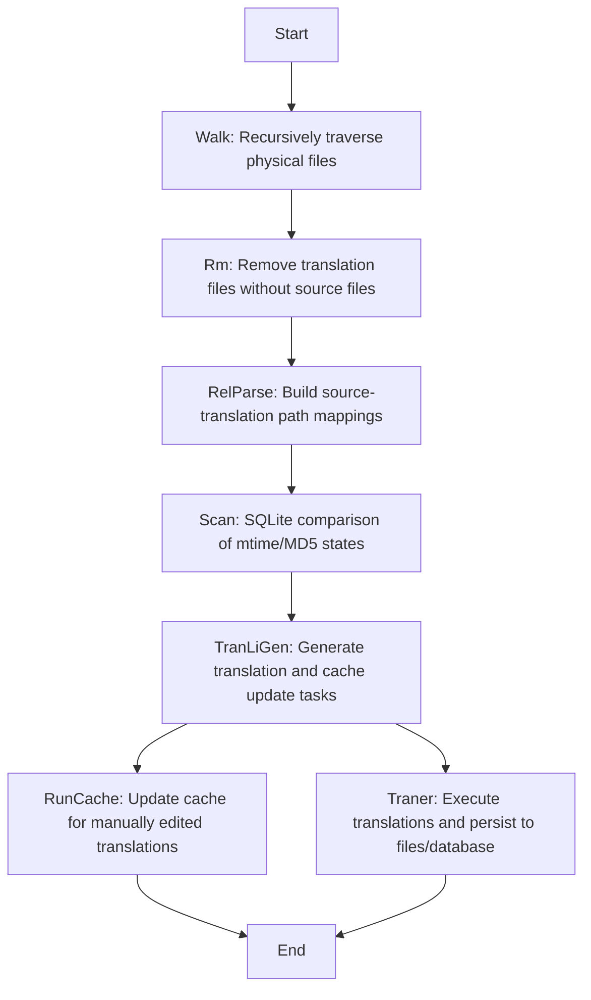
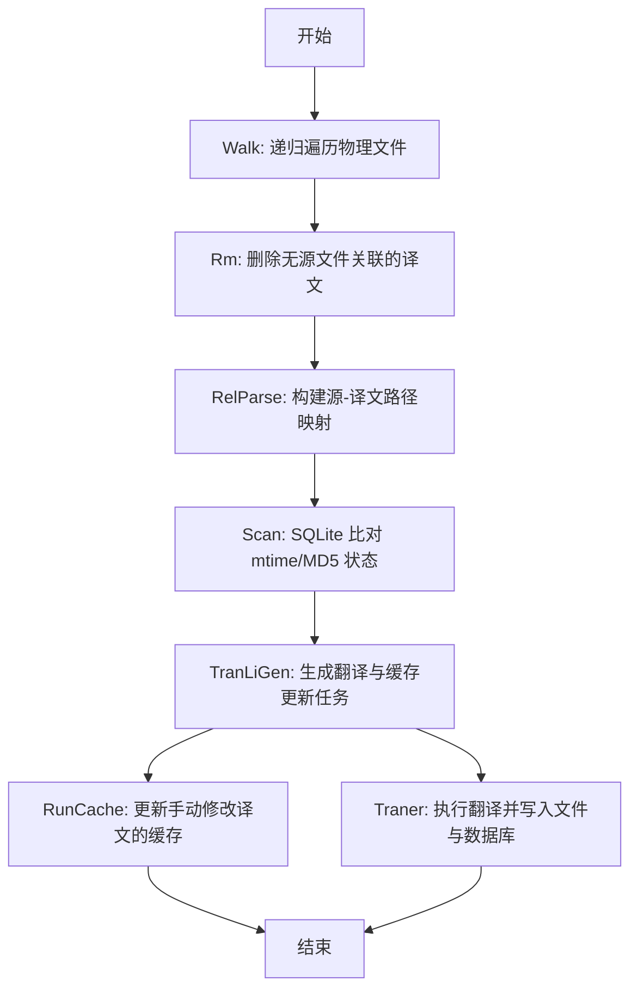

[English](#en) | [中文](#zh)

---

<a id="en"></a>
# @1-/i18n_scan : Incremental Document Translation Scanner & Synchronizer

- [@1-/i18n_scan : Incremental Document Translation Scanner & Synchronizer](#1-i18n_scan-incremental-document-translation-scanner-synchronizer)
  - [Features](#features)
  - [Usage](#usage)
  - [Design](#design)
  - [Tech Stack](#tech-stack)
  - [Code Structure](#code-structure)
  - [History](#history)
  - [About](#about)

## Features

`@1-/i18n_scan` is a specialized tool for synchronizing multilingual documentation. It precisely identifies source file changes using persistent SQLite state, automatically cleans redundant translations, and executes updates only where necessary.

Core capabilities:

- **Precise Incremental Detection**: Compares stored mtime and MD5 checksums in SQLite to process only source files with actual content changes or manually edited translation files
- **Redundant Translation Cleanup**: Physically deletes orphaned translation files (e.g., `docs/en/guide.md` without corresponding `docs/zh/guide.md`)\n- **Manual Edit Detection**: When a translation file is modified, triggers cache update to refresh its dependency on source content MD5
- **State Persistence**: All scan states are stored in `src.sqlite` database with schema `scan(path TEXT PRIMARY KEY, md5 BINARY(16))`, ensuring cross-execution consistency

## Usage

Install:

```bash
npm install @1-/i18n_scan
# or
bun add @1-/i18n_scan
```

Basic usage:

```javascript
import i18nScan from "@1-/i18n_scan";
import { join } from "node:path";

const root = "./my-project";
const dbDir = join(root, ".cache/scan/tran");

// Cache update callback: invoked when translations are manually edited
const updateCache = async (ext, fromLang, toLang, txt, srcMd5, log) => {
  log(`Updating cache: ${fromLang} → ${toLang}, extension: ${ext}`);
};

// Translation execution callback: returns translated text
const translate = async (ext, fromLang, toLang, txt, log) => {
  log(`Translating: ${fromLang} → ${toLang}`);
  return "translated text";
};

await i18nScan(
  root,
  dbDir,
  "zh", // source language
  ["en", "ja"], // target languages
  updateCache,
  translate,
  ["doc", "docs", "i18n"], // translation directory names (supports doc/docs/i18n)
  ["md", "yml"], // file extensions
);
```

## Design

The system implements a pipeline architecture to ensure precise state tracking, safe operations, and full traceability:



## Tech Stack

- **Runtime**: Bun / Node.js
- **Database**: SQLite (via `@1-/sqlite`, table `scan(path, md5)`)
- **File System**: `@1-/walk`, `@1-/scan`, `@1-/read`
- **Hashing**: `@1-/md5`
- **CLI**: `cli-progress`

## Code Structure

```
src/
├── _.js           # Main entry: orchestrates full pipeline, manages progress bar & resource disposal
├── scan.js        # Coordinates walk, rm, relParse and SQLite state management
├── walk.js        # Physical file traversal to identify source and translation paths (supports doc/docs/i18n)
├── rm.js          # Physically deletes redundant translation files (parallel Promise.all)
├── relParse.js    # Builds mapping relationships between source files and translations (Map<prefix, Map<rel, to_lang[]>>)
├── md5Collect.js  # Collects source file content and MD5 checksums (with internal read caching)
├── dbOpen.js      # SQLite connection management, state loading & garbage collection (deletes orphaned rows)
├── exec.js        # Safe execution wrapper for translation and cache update callbacks (error capture + logging)
├── tranLiGen.js   # Generates translation task lists and cache update lists (file-granularity)
├── traner.js      # Executes multi-language translation for a single file (serial per language)
├── run.js         # Concurrent control and progress bar orchestration (file-level concurrency)
├── bar.js         # CLI progress bar wrapper
├── ok.js          # Promise safety wrapper (returns 1 or error)
└── langPath.js    # Multi-language file path construction utility (prefix/lang/rel)
```

## History

In the 1980s, Digital Equipment Corporation faced severe inefficiencies translating VMS operating system manuals into multiple languages. Every minor English change required manual comparison across tens of thousands of pages, resulting in frequent desynchronization between language versions.

`@1-/i18n_scan` solves this historic problem. By binding each document node to a lightweight SQLite database, it makes every change fully observable, bringing documentation translation into a true incremental era.


## About

This library is developed by [WebC.site](https://webc.site).

[WebC.site](https://webc.site): A new paradigm of web development for AI


---

<a id="zh"></a>
# @1-/i18n_scan : 增量式文档翻译状态扫描与同步工具

- [@1-/i18n_scan : 增量式文档翻译状态扫描与同步工具](#1-i18n_scan-增量式文档翻译状态扫描与同步工具)
  - [功能介绍](#功能介绍)
  - [使用演示](#使用演示)
  - [设计思路](#设计思路)
  - [技术栈](#技术栈)
  - [代码结构](#代码结构)
  - [历史故事](#历史故事)
  - [关于](#关于)

## 功能介绍

`@1-/i18n_scan` 解决多语言文档同步中的核心痛点：避免全量重译、消除冗余译文、精确识别变更。它基于 SQLite 持久化状态，实现真正的增量处理。

核心能力：

- **精确增量检测**：通过 SQLite 存储的文件 mtime 和 MD5 校验码比对，仅处理内容实际变更的源文件或手动修改的译文文件
- **冗余译文清理**：物理删除无对应源文件的孤立翻译文件（如 `docs/en/guide.md` 但无 `docs/zh/guide.md`）
- **手动编辑感知**：当译文文件自身被修改时，自动触发缓存更新流程，确保其依赖的源内容校验码同步刷新
- **状态持久化**：所有扫描状态存储于 `src.sqlite` 数据库，表结构为 `scan(path TEXT PRIMARY KEY, md5 BINARY(16))`，保障跨运行一致性

## 使用演示

安装：

```bash
npm install @1-/i18n_scan
# 或
bun add @1-/i18n_scan
```

基础用法：

```javascript
import i18nScan from "@1-/i18n_scan";
import { join } from "node:path";

const root = "./my-project";
const dbDir = join(root, ".cache/scan/tran");

// 缓存更新回调：当译文被手动修改时调用
const updateCache = async (ext, fromLang, toLang, txt, srcMd5, log) => {
  log(`更新缓存: ${fromLang} → ${toLang}, 扩展名: ${ext}`);
};

// 翻译执行回调：返回译文文本
const translate = async (ext, fromLang, toLang, txt, log) => {
  log(`执行翻译: ${fromLang} → ${toLang}`);
  return "译文内容";
};

await i18nScan(
  root,
  dbDir,
  "zh", // 源语言
  ["en", "ja"], // 目标语言
  updateCache,
  translate,
  ["doc", "docs", "i18n"], // 翻译目录名（支持 doc/docs/i18n）
  ["md", "yml"], // 文件扩展名
);
```

## 设计思路

系统采用流水线架构，确保状态精确、操作安全、流程可追溯：



## 技术栈

- **Runtime**: Bun / Node.js
- **Database**: SQLite（通过 `@1-/sqlite`，表 `scan(path, md5)`）
- **File System**: `@1-/walk`, `@1-/scan`, `@1-/read`
- **Hashing**: `@1-/md5`
- **CLI**: `cli-progress`

## 代码结构

```
src/
├── _.js           # 主入口：协调全流程执行，管理进度条与资源释放
├── scan.js        # 协调 walk、rm、relParse 与 SQLite 状态管理
├── walk.js        # 物理文件遍历，识别源与译文路径（支持 doc/docs/i18n）
├── rm.js          # 物理删除冗余译文文件（并行 Promise.all）
├── relParse.js    # 构建源文件与各目标语言译文的映射关系（Map<prefix, Map<rel, to_lang[]>>）
├── md5Collect.js  # 收集待翻译源文件内容及 MD5 校验码（带内部读取缓存）
├── dbOpen.js      # SQLite 连接管理、状态加载与垃圾回收（删除 orphaned rows）
├── exec.js        # 安全封装翻译与缓存更新回调执行（错误捕获 + 日志）
├── tranLiGen.js   # 生成翻译任务列表与缓存更新列表（按文件粒度）
├── traner.js      # 执行单文件多语言翻译（串行处理各目标语言）
├── run.js         # 并发控制与进度条驱动（按文件并发）
├── bar.js         # CLI 进度条封装
├── ok.js          # Promise 异常安全包装器（返回 1 或 err）
└── langPath.js    # 多语言文件路径拼接工具（prefix/lang/rel）
```

## 历史故事

1980 年代，DEC 公司在翻译 VMS 操作系统手册时，每次英文原文微小调整都要求翻译人员手动比对数万页活页文档。这种低效且易错的流程导致多语言手册长期脱节。

`@1-/i18n_scan` 终结了这一历史困境。它将每个文档节点与轻量 SQLite 数据库绑定，使工具对任意粒度的变更完全可知，推动文档翻译进入真正的 incremental 时代。


## 关于

本库由 [WebC.site](https://webc.site) 开发。

[WebC.site](https://webc.site) : 面向人工智能的网站开发新范式

