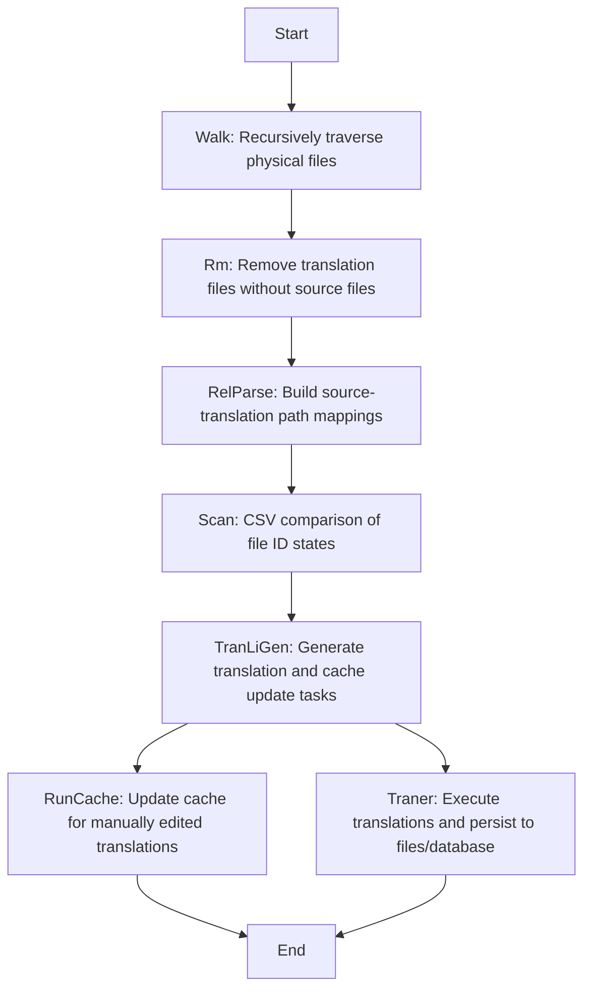

# @1-/i18n_scan : Incremental Document Translation Scanner & Synchronizer

## Features

`@1-/i18n_scan` is a specialized tool for synchronizing multilingual documentation. It precisely identifies source file changes using persistent CSV state, automatically cleans redundant translations, and executes updates only where necessary.

Core capabilities:

- **Precise Incremental Detection**: Compares stored file IDs in CSV to process only source files with actual content changes or manually edited translation files
- **Redundant Translation Cleanup**: Physically deletes orphaned translation files (e.g., `docs/en/guide.md` without corresponding `docs/zh/guide.md`)
- **Manual Edit Detection**: When a translation file is modified, triggers cache update to refresh its dependency on source content ID
- **State Persistence**: All scan states are stored in `src.csv` file with format `path,src_id`, ensuring cross-execution consistency

## Usage

Install:

```bash
npm install @1-/i18n_scan
# or
bun add @1-/i18n_scan
```

Basic usage:

```javascript
import i18nScan from "@1-/i18n_scan";
import { join } from "node:path";

const root = "./my-project";
const dbDir = join(root, ".cache/scan/tran");

// Cache update callback: invoked when translations are manually edited
const updateCache = async (prefix, rel, fromLang, toLang, txt, srcId, log) => {
  log(`Updating cache: ${fromLang} → ${toLang}, path: ${prefix}/${rel}`);
};

// Translation execution callback: returns translated text and source file ID
const translate = async (prefix, rel, fromLang, toLang, txt, log) => {
  log(`Translating: ${fromLang} → ${toLang}`);
  return ["translated text", 12345]; // Return [text, src_id]
};

await i18nScan(
  root,
  dbDir,
  "zh", // source language
  ["en", "ja"], // target languages
  updateCache,
  translate,
  ["doc", "docs", "i18n"], // translation directory names (supports doc/docs/i18n)
  ["md", "yml"] // file extensions
);
```

## Design

The system implements a pipeline architecture to ensure precise state tracking, safe operations, and full traceability:



## Tech Stack

- **Runtime**: Bun / Node.js
- **Database**: CSV file (via `@1-/csv`, format `path,src_id`)
- **File System**: `@1-/walk`, `@1-/read`
- **CLI**: Custom progress bar implementation

## Code Structure

```
src/
├── _.js           # Main entry: orchestrates full pipeline, manages progress bar & resource disposal
├── scan.js        # Coordinates walk, rm, relParse and CSV state management
├── walk.js        # Physical file traversal to identify source and translation paths (supports doc/docs/i18n)
├── rm.js          # Physically deletes redundant translation files (parallel Promise.all)
├── relParse.js    # Builds mapping relationships between source files and translations (Map<prefix, Map<rel, to_lang[]>>)
├── idCollect.js   # Collects source file content and IDs (with internal read caching)
├── dbOpen.js      # CSV connection management, state loading & garbage collection (deletes orphaned rows)
├── exec.js        # Safe execution wrapper for translation and cache update callbacks (error capture + logging)
├── tranLiGen.js   # Generates translation task lists and cache update lists (file-granularity)
├── traner.js      # Executes multi-language translation for a single file (serial per language)
├── run.js         # Concurrent control and progress bar orchestration (file-level concurrency)
├── bar.js         # CLI progress bar wrapper
├── ok.js          # Promise safety wrapper (returns 1 or error)
└── langPath.js    # Multi-language file path construction utility (prefix/lang/rel)
```

## History

In the 1980s, Digital Equipment Corporation faced severe inefficiencies translating VMS operating system manuals into multiple languages. Every minor English change required manual comparison across tens of thousands of pages, resulting in frequent desynchronization between language versions.

`@1-/i18n_scan` solves this historic problem. By binding each document node to a lightweight CSV database, it makes every change fully observable, bringing documentation translation into a true incremental era.
