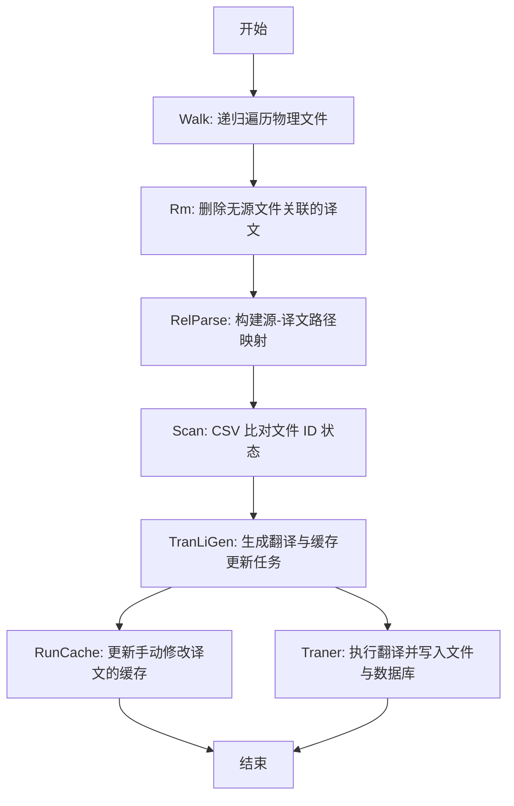

# @1-/i18n_scan : 增量式文档翻译状态扫描与同步工具

## 功能介绍

`@1-/i18n_scan` 解决多语言文档同步中的核心痛点：避免全量重译、消除冗余译文、精确识别变更。它基于 CSV 文件持久化状态，实现真正的增量处理。

核心能力：

- **精确增量检测**：通过 CSV 存储的文件 ID 比对，仅处理内容实际变更的源文件或手动修改的译文文件
- **冗余译文清理**：物理删除无对应源文件的孤立翻译文件（如 `docs/en/guide.md` 但无 `docs/zh/guide.md`）
- **手动编辑感知**：当译文文件自身被修改时，自动触发缓存更新流程，确保其依赖的源内容 ID 同步刷新
- **状态持久化**：所有扫描状态存储于 `src.csv` 文件，格式为 `path,src_id`，保障跨运行一致性

## 使用演示

安装：

```bash
npm install @1-/i18n_scan
# 或
bun add @1-/i18n_scan
```

基础用法：

```javascript
import i18nScan from "@1-/i18n_scan";
import { join } from "node:path";

const root = "./my-project";
const dbDir = join(root, ".cache/scan/tran");

// 缓存更新回调：当译文被手动修改时调用
const updateCache = async (prefix, rel, fromLang, toLang, txt, srcId, log) => {
  log(`更新缓存: ${fromLang} → ${toLang}, 路径: ${prefix}/${rel}`);
};

// 翻译执行回调：返回译文文本及源文件 ID
const translate = async (prefix, rel, fromLang, toLang, txt, log) => {
  log(`执行翻译: ${fromLang} → ${toLang}`);
  return ["译文内容", 12345]; // 返回 [译文, src_id]
};

await i18nScan(
  root,
  dbDir,
  "zh", // 源语言
  ["en", "ja"], // 目标语言
  updateCache,
  translate,
  ["doc", "docs", "i18n"], // 翻译目录名（支持 doc/docs/i18n）
  ["md", "yml"], // 文件扩展名
);
```

## 设计思路

系统采用流水线架构，确保状态精确、操作安全、流程可追溯：



## 技术栈

- **Runtime**: Bun / Node.js
- **Database**: CSV 文件（通过 `@1-/csv`，格式 `path,src_id`）
- **File System**: `@1-/walk`, `@1-/read`
- **CLI**: 自定义进度条实现

## 代码结构

```
src/
├── _.js           # 主入口：协调全流程执行，管理进度条与资源释放
├── scan.js        # 协调 walk、rm、relParse 与 CSV 状态管理
├── walk.js        # 物理文件遍历，识别源与译文路径（支持 doc/docs/i18n）
├── rm.js          # 物理删除冗余译文文件（并行 Promise.all）
├── relParse.js    # 构建源文件与各目标语言译文的映射关系（Map<prefix, Map<rel, to_lang[]>>）
├── idCollect.js   # 收集待翻译源文件内容及 ID（带内部读取缓存）
├── dbOpen.js      # CSV 连接管理、状态加载与垃圾回收（删除 orphaned rows）
├── exec.js        # 安全封装翻译与缓存更新回调执行（错误捕获 + 日志）
├── tranLiGen.js   # 生成翻译任务列表与缓存更新列表（按文件粒度）
├── traner.js      # 执行单文件多语言翻译（串行处理各目标语言）
├── run.js         # 并发控制与进度条驱动（按文件并发）
├── bar.js         # CLI 进度条封装
├── ok.js          # Promise 异常安全包装器（返回 1 或 err）
└── langPath.js    # 多语言文件路径拼接工具（prefix/lang/rel）
```

## 历史故事

1980 年代，DEC 公司在翻译 VMS 操作系统手册时，每次英文原文微小调整都要求翻译人员手动比对数万页活页文档。这种低效且易错的流程导致多语言手册长期脱节。

`@1-/i18n_scan` 终结了这一历史困境。它将每个文档节点与轻量 CSV 数据库绑定，使工具对任意粒度的变更完全可知，推动文档翻译进入真正的 incremental 时代。
