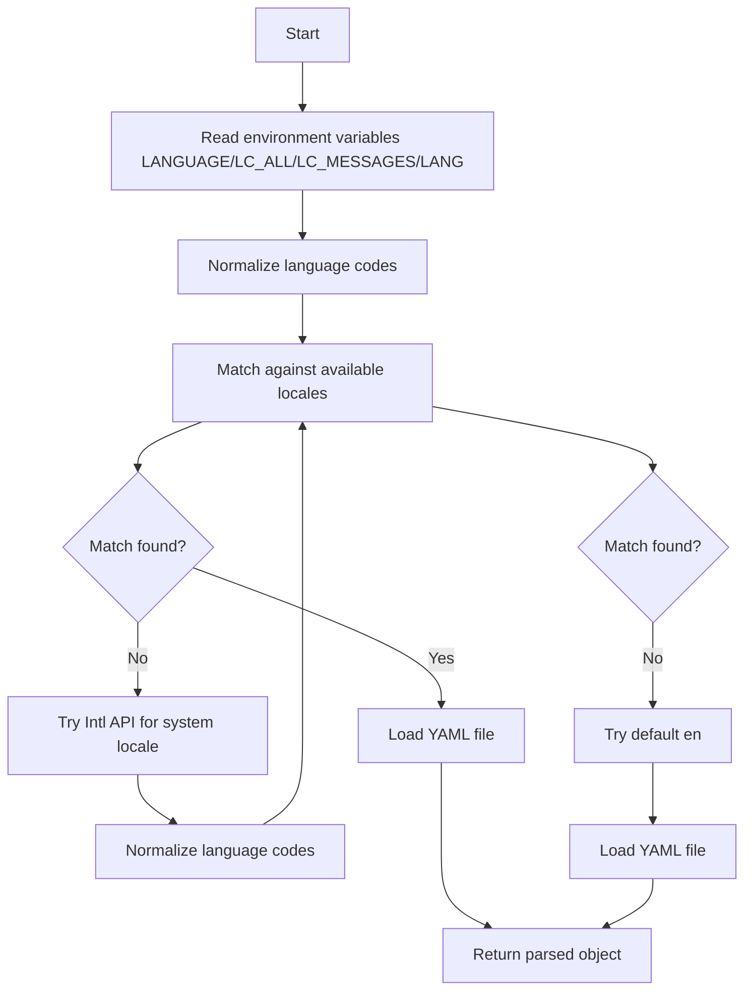
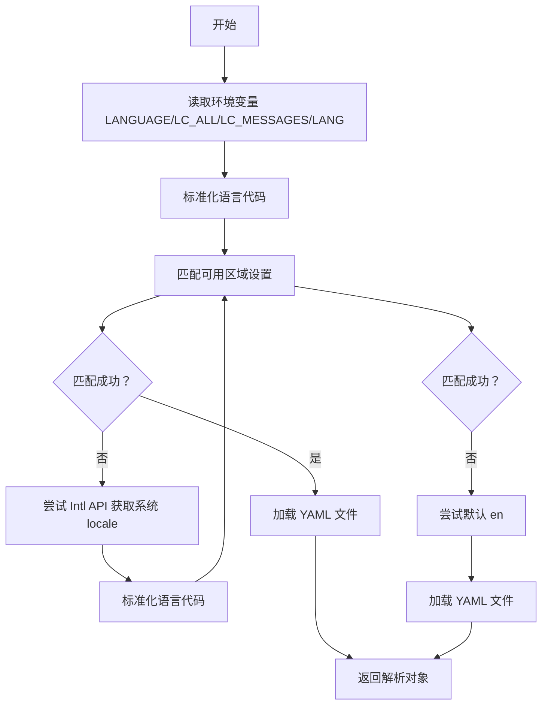

[English](#en) | [中文](#zh)

---

<a id="en"></a>

# @1-/i18nyml : Load YAML localization files by system language preference

- [@1-/i18nyml : Load YAML localization files by system language preference](#1-i18nyml-load-yaml-localization-files-by-system-language-preference)
  - [Functionality](#functionality)
  - [Usage demonstration](#usage-demonstration)
  - [Design思路](#design思路)
  - [Technology stack](#technology-stack)
  - [Code structure](#code-structure)
  - [Historical context](#historical-context)
  - [About](#about)

## Functionality

Load YAML localization files according to system language preferences. Automatically detect available locales and load the most appropriate translation file based on the user's system language settings, supporting environment variable priority order (LANGUAGE, LC_ALL, LC_MESSAGES, LANG) and Intl API fallback.

## Usage demonstration

```bash
npm install @1-/i18nyml
```

```javascript
import i18nyml from "@1-/i18nyml";

// Load messages.yml from locales directory
const messages = i18nyml("./locales", "messages");
console.log(messages);
```

Directory structure expected:

```
locales/
├── en/
│   └── messages.yml
├── zh-CN/
│   └── messages.yml
├── zh/
│   └── messages.yml
└── ja/
    └── messages.yml
```

## Design思路

The library implements a precise three-phase locale matching strategy:

1. Read language preferences from environment variables LANGUAGE, LC_ALL, LC_MESSAGES, LANG
2. Fall back to Intl.DateTimeFormat().resolvedOptions().locale
3. Final default to "en"

Each phase's language code is normalized (e.g., "zh_CN" → "zh-cn") before exact matching against available locales.



## Technology stack

- Node.js runtime
- @1-/oslang for language detection and preference ordering
- @1-/yml for YAML parsing
- Standard Node.js filesystem APIs

## Code structure

```
src/
└── _.js          # Main export function implementing locale loading logic
```

Dependencies:

- @1-/oslang: Language detection and normalization (via all.js and match.js)
- @1-/yml: Lightweight YAML parser (via load.js and loads.js)

## Historical context

YAML emerged in 2001 as a human-readable data serialization format designed to be more intuitive than XML or JSON for configuration files. Its emphasis on readability made it particularly suitable for localization files where translators need to work with plain text. The i18nyml library builds on this foundation by combining YAML's simplicity with modern JavaScript's internationalization capabilities to provide a concise YAML localization file loading solution, using a functional programming paradigm with no external dependencies beyond Node.js built-in modules.

## About

This library is developed by [WebC.site](https://webc.site).

[WebC.site](https://webc.site): A new paradigm of web development for AI

---

<a id="zh"></a>

# @1-/i18nyml : 根据系统语言偏好加载 YAML 本地化文件

- [@1-/i18nyml : 根据系统语言偏好加载 YAML 本地化文件](#1-i18nyml-根据系统语言偏好加载-yaml-本地化文件)
  - [功能介绍](#功能介绍)
  - [使用演示](#使用演示)
  - [设计思路](#设计思路)
  - [技术栈](#技术栈)
  - [代码结构](#代码结构)
  - [历史故事](#历史故事)
  - [关于](#关于)

## 功能介绍

根据系统语言偏好自动加载 YAML 本地化文件。检测可用区域设置并基于用户系统语言设置加载最合适的翻译文件，支持环境变量 LANGUAGE, LC_ALL, LC_MESSAGES, LANG 的优先级顺序，以及 Intl API 回退。

## 使用演示

```bash
npm install @1-/i18nyml
```

```javascript
import i18nyml from "@1-/i18nyml";

// 从 locales 目录加载 messages.yml
const messages = i18nyml("./locales", "messages");
console.log(messages);
```

预期目录结构：

```
locales/
├── en/
│   └── messages.yml
├── zh-CN/
│   └── messages.yml
├── zh/
│   └── messages.yml
└── ja/
    └── messages.yml
```

## 设计思路

该库采用精确的三阶段区域设置匹配策略：

1. 从环境变量 LANGUAGE, LC_ALL, LC_MESSAGES, LANG 读取语言偏好
2. 回退到 Intl.DateTimeFormat().resolvedOptions().locale
3. 最终默认为 "en"

每个阶段的语言代码经过标准化处理（如 "zh_CN" → "zh-cn"），然后与可用区域设置进行精确匹配。



## 技术栈

- Node.js 运行时
- @1-/oslang 用于语言检测与偏好排序
- @1-/yml 用于 YAML 解析
- 标准 Node.js 文件系统 API

## 代码结构

```
src/
└── _.js          # 主导出函数，实现区域设置加载逻辑
```

依赖项：

- @1-/oslang：语言检测与规范化（通过 all.js 和 match.js）
- @1-/yml：轻量级 YAML 解析器（通过 load.js 和 loads.js）

## 历史故事

YAML 于 2001 年问世，作为一种人类可读的数据序列化格式，旨在比 XML 或 JSON 更直观易用。其强调可读性的特点使其特别适合本地化文件，因为译员需要直接处理纯文本。i18nyml 库在此基础上结合了现代 JavaScript 的国际化能力，提供简洁的 YAML 本地化文件加载方案，采用函数式编程范式，无外部依赖，仅使用 Node.js 内置模块。

## 关于

本库由 [WebC.site](https://webc.site) 开发。

[WebC.site](https://webc.site) : 面向人工智能的网站开发新范式
