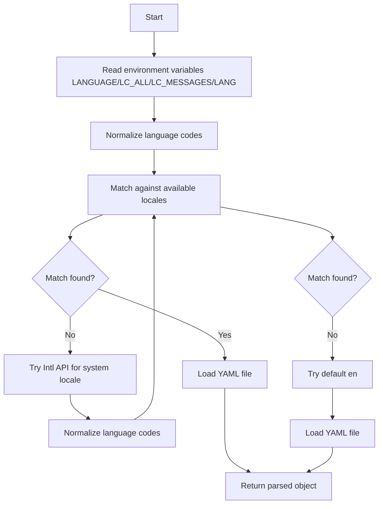

# @1-/i18nyml : Load YAML localization files by system language preference

## Functionality

Load YAML localization files according to system language preferences. Automatically detect available locales and load the most appropriate translation file based on the user's system language settings, supporting environment variable priority order (LANGUAGE, LC_ALL, LC_MESSAGES, LANG) and Intl API fallback.

## Usage demonstration

```bash
npm install @1-/i18nyml
```

```javascript
import i18nyml from "@1-/i18nyml";

// Load messages.yml from locales directory
const messages = i18nyml("./locales", "messages");
console.log(messages);
```

Directory structure expected:

```
locales/
├── en/
│   └── messages.yml
├── zh-CN/
│   └── messages.yml
├── zh/
│   └── messages.yml
└── ja/
    └── messages.yml
```

## Design思路

The library implements a precise three-phase locale matching strategy:

1. Read language preferences from environment variables LANGUAGE, LC_ALL, LC_MESSAGES, LANG
2. Fall back to Intl.DateTimeFormat().resolvedOptions().locale
3. Final default to "en"

Each phase's language code is normalized (e.g., "zh_CN" → "zh-cn") before exact matching against available locales.



## Technology stack

- Node.js runtime
- @1-/oslang for language detection and preference ordering
- @1-/yml for YAML parsing
- Standard Node.js filesystem APIs

## Code structure

```
src/
└── _.js          # Main export function implementing locale loading logic
```

Dependencies:

- @1-/oslang: Language detection and normalization (via all.js and match.js)
- @1-/yml: Lightweight YAML parser (via load.js and loads.js)

## Historical context

YAML emerged in 2001 as a human-readable data serialization format designed to be more intuitive than XML or JSON for configuration files. Its emphasis on readability made it particularly suitable for localization files where translators need to work with plain text. The i18nyml library builds on this foundation by combining YAML's simplicity with modern JavaScript's internationalization capabilities to provide a concise YAML localization file loading solution, using a functional programming paradigm with no external dependencies beyond Node.js built-in modules.
