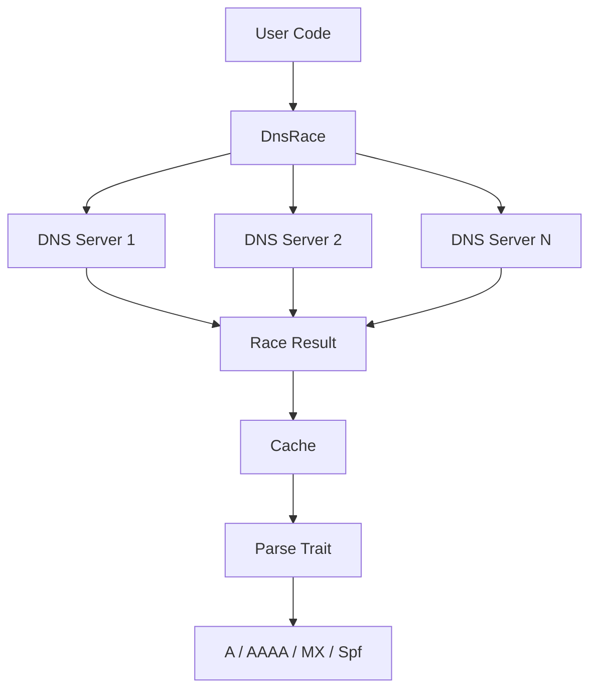
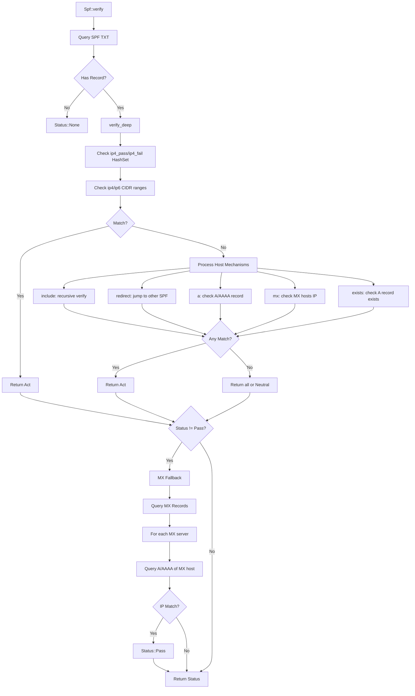
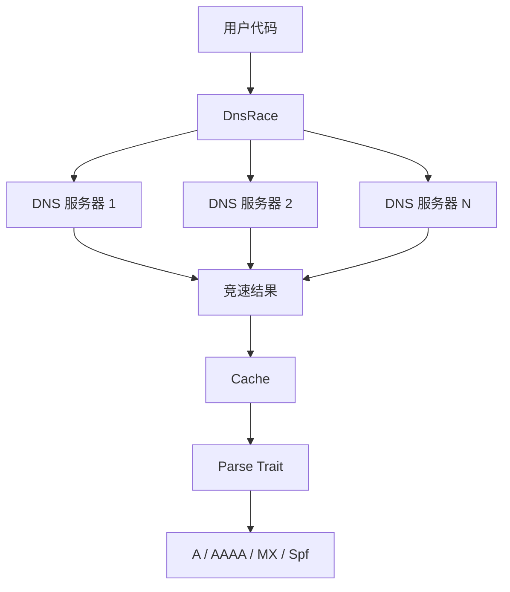
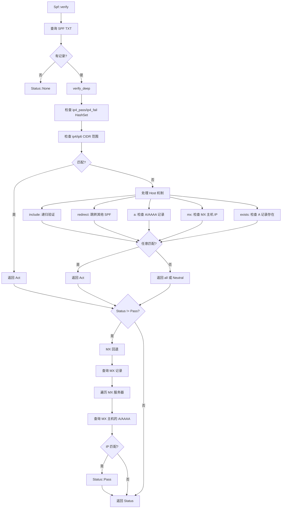

[English](#en) | [中文](#zh)

---

<a id="en"></a>

# idns : Fast DNS Record Parsing with Racing Query

- [idns : Fast DNS Record Parsing with Racing Query](#idns-fast-dns-record-parsing-with-racing-query)
  - [Table of Contents](#table-of-contents)
  - [Features](#features)
  - [Installation](#installation)
  - [Usage](#usage)
    - [Query DNS Records](#query-dns-records)
    - [SPF Verification](#spf-verification)
  - [API Reference](#api-reference)
    - [Structs](#structs)
    - [Enums](#enums)
    - [Traits](#traits)
  - [Architecture](#architecture)
    - [SPF Verification Flow](#spf-verification-flow)
    - [Caching](#caching)
  - [Project Structure](#project-structure)
  - [Tech Stack](#tech-stack)
  - [History](#history)
  - [About](#about)

DNS record parsing library with racing query support. Works with [idoq](https://crates.io/crates/idoq) (DNS over QUIC), [idot](https://crates.io/crates/idot) (DNS over TLS) and [idoh](https://crates.io/crates/idoh) (DNS over HTTPS).

## Table of Contents

- [Features](#features)
- [Installation](#installation)
- [Usage](#usage)
- [API Reference](#api-reference)
- [Architecture](#architecture)
- [Project Structure](#project-structure)
- [Tech Stack](#tech-stack)
- [History](#history)

## Features

- Racing DNS queries across multiple servers for optimal latency
- Automatic server weight adjustment based on response time
- Built-in caching with TTL support
- Parse A, AAAA, MX, TXT records
- SPF record verification (IPv4/IPv6)
- Async/await support

## Installation

```toml
[dependencies]
idns = { version = "0.2", features = ["spf"] }
```

Available features:

- `a` - A record parsing
- `aaaa` - AAAA record parsing
- `mx` - MX record parsing
- `spf` - SPF verification (includes a, aaaa, mx)
- `cache` - Response caching (enabled by default)

## Usage

### Query DNS Records

```rust
use idns::{DnsRace, Query, Spf};

let dns = DnsRace::new(dns_servers);

// Query SPF record
if let Some(records) = dns.query::<Spf>("gmail.com").await? {
  for spf in records {
    println!("{spf:?}");
  }
}
```

### SPF Verification

```rust
use std::net::IpAddr;
use idns::{Spf, spf::Status};

let ip: IpAddr = "209.85.220.41".parse()?;
let status = Spf::verify(&dns, "gmail.com", ip).await?;

match status {
  Status::Pass => println!("Accept"),
  Status::Fail => println!("Reject"),
  Status::SoftFail => println!("Mark as suspicious"),
  Status::Neutral => println!("No policy"),
  Status::None => println!("No SPF record"),
}
```

## API Reference

### Structs

| Name         | Description                                                  |
| ------------ | ------------------------------------------------------------ |
| `DnsRace<Q>` | Racing DNS client that queries multiple servers concurrently |
| `Cache<P>`   | TTL-based cache for DNS records                              |
| `Answer`     | Raw DNS answer containing name, value, type_id, ttl          |
| `A`          | Parsed A record (IPv4)                                       |
| `Aaaa`       | Parsed AAAA record (IPv6)                                    |
| `Mx`         | Parsed MX record with priority and server                    |
| `Spf`        | Parsed SPF record with IP ranges and mechanisms              |

### Enums

| Name          | Description                                                   |
| ------------- | ------------------------------------------------------------- |
| `QType`       | DNS record types (A, AAAA, MX, TXT, etc.)                     |
| `spf::Status` | SPF verification result (Pass, Fail, SoftFail, Neutral, None) |
| `spf::Act`    | SPF mechanism action                                          |

### Traits

| Name    | Description                  |
| ------- | ---------------------------- |
| `Query` | DNS query interface          |
| `Parse` | DNS record parsing interface |

## Architecture



### SPF Verification Flow

`Spf::verify` performs multi-stage verification:

1. Query domain's SPF record (TXT)
2. Check if IP matches ip4/ip6 ranges in record
3. Process host mechanisms (include, redirect, a, mx, exists)
4. If no match, fallback to MX record check - query domain's MX servers and verify if IP belongs to any MX host
5. Return final status



MX fallback ensures emails from legitimate mail servers pass verification even without explicit SPF authorization.

### Caching

Each record type has independent cache with configurable TTL:

| Record | TTL  | Description   |
| ------ | ---- | ------------- |
| A      | 300s | IPv4 address  |
| AAAA   | 300s | IPv6 address  |
| MX     | 600s | Mail exchange |
| SPF    | 600s | SPF record    |

During SPF verification, A/AAAA/MX queries are cached. When processing `include` or `redirect` mechanisms that reference the same domain, cached results are reused. This avoids redundant DNS queries and parsing.

Cache uses [papaya](https://crates.io/crates/papaya) HashMap for concurrent read/write access, suitable for high-concurrency scenarios.

## Project Structure

```
src/
├── lib.rs        # Public exports
├── error.rs      # Error definitions
├── qtype.rs      # DNS record types
├── dns_race.rs   # Racing DNS client
├── cache.rs      # TTL cache
└── parse/
    ├── mod.rs    # Parse trait
    ├── a.rs      # A record
    ├── aaaa.rs   # AAAA record
    ├── mx.rs     # MX record
    └── spf.rs    # SPF record & verification
```

## Tech Stack

- [thiserror](https://crates.io/crates/thiserror) - Error handling
- [papaya](https://crates.io/crates/papaya) - Concurrent hashmap
- [static_init](https://crates.io/crates/static_init) - Lazy static initialization

## History

SPF (Sender Policy Framework) was first proposed in 2003 by Meng Weng Wong to combat email spoofing. The protocol allows domain owners to specify which mail servers are authorized to send email on their behalf.

Before SPF, anyone could send email claiming to be from any domain. This made phishing attacks trivially easy. SPF introduced a simple TXT record format that lists authorized IP addresses and mechanisms.

The "v=spf1" prefix you see in SPF records stands for "version SPF 1". Despite being over 20 years old, this remains the only version in widespread use. The protocol was standardized as RFC 7208 in 2014.

Racing DNS queries, as implemented in this library, is a technique popularized by Google's "Happy Eyeballs" algorithm (RFC 6555). The idea is simple: send queries to multiple servers simultaneously and use the first response. This dramatically reduces latency in unreliable network conditions.

## About

This library is developed by [WebC.site](https://webc.site).

[WebC.site](https://webc.site): A new paradigm of web development for AI

---

<a id="zh"></a>

# idns : 竞速查询的 DNS 记录解析库

- [idns : 竞速查询的 DNS 记录解析库](#idns-竞速查询的-dns-记录解析库)
  - [目录](#目录)
  - [特性](#特性)
  - [安装](#安装)
  - [使用](#使用)
    - [查询 DNS 记录](#查询-dns-记录)
    - [SPF 验证](#spf-验证)
  - [API 参考](#api-参考)
    - [结构体](#结构体)
    - [枚举](#枚举)
    - [Trait](#trait)
  - [架构](#架构)
    - [SPF 验证流程](#spf-验证流程)
    - [缓存机制](#缓存机制)
  - [项目结构](#项目结构)
  - [技术栈](#技术栈)
  - [历史](#历史)
  - [关于](#关于)

支持竞速查询的 DNS 记录解析库。可配合 [idoq](https://crates.io/crates/idoq)（DNS over QUIC）、[idot](https://crates.io/crates/idot)（DNS over TLS）和 [idoh](https://crates.io/crates/idoh)（DNS over HTTPS）使用。

## 目录

- [特性](#特性)
- [安装](#安装)
- [使用](#使用)
- [API 参考](#api-参考)
- [架构](#架构)
- [项目结构](#项目结构)
- [技术栈](#技术栈)
- [历史](#历史)

## 特性

- 多服务器竞速查询，获取最优延迟
- 根据响应时间自动调整服务器权重
- 内置 TTL 缓存
- 解析 A、AAAA、MX、TXT 记录
- SPF 记录验证（支持 IPv4/IPv6）
- 异步支持

## 安装

```toml
[dependencies]
idns = { version = "0.2", features = ["spf"] }
```

可用特性：

- `a` - A 记录解析
- `aaaa` - AAAA 记录解析
- `mx` - MX 记录解析
- `spf` - SPF 验证（包含 a、aaaa、mx）
- `cache` - 响应缓存（默认启用）

## 使用

### 查询 DNS 记录

```rust
use idns::{DnsRace, Query, Spf};

let dns = DnsRace::new(dns_servers);

// 查询 SPF 记录
if let Some(records) = dns.query::<Spf>("gmail.com").await? {
  for spf in records {
    println!("{spf:?}");
  }
}
```

### SPF 验证

```rust
use std::net::IpAddr;
use idns::{Spf, spf::Status};

let ip: IpAddr = "209.85.220.41".parse()?;
let status = Spf::verify(&dns, "gmail.com", ip).await?;

match status {
  Status::Pass => println!("接受"),
  Status::Fail => println!("拒绝"),
  Status::SoftFail => println!("标记为可疑"),
  Status::Neutral => println!("无策略"),
  Status::None => println!("无 SPF 记录"),
}
```

## API 参考

### 结构体

| 名称         | 说明                                          |
| ------------ | --------------------------------------------- |
| `DnsRace<Q>` | 竞速 DNS 客户端，并发查询多服务器             |
| `Cache<P>`   | 基于 TTL 的 DNS 记录缓存                      |
| `Answer`     | 原始 DNS 应答，包含 name、value、type_id、ttl |
| `A`          | 解析后的 A 记录（IPv4）                       |
| `Aaaa`       | 解析后的 AAAA 记录（IPv6）                    |
| `Mx`         | 解析后的 MX 记录，含优先级和服务器            |
| `Spf`        | 解析后的 SPF 记录，含 IP 范围和机制           |

### 枚举

| 名称          | 说明                                                |
| ------------- | --------------------------------------------------- |
| `QType`       | DNS 记录类型（A、AAAA、MX、TXT 等）                 |
| `spf::Status` | SPF 验证结果（Pass、Fail、SoftFail、Neutral、None） |
| `spf::Act`    | SPF 机制动作                                        |

### Trait

| 名称    | 说明             |
| ------- | ---------------- |
| `Query` | DNS 查询接口     |
| `Parse` | DNS 记录解析接口 |

## 架构



### SPF 验证流程

`Spf::verify` 执行多阶段验证：

1. 查询域名的 SPF 记录（TXT）
2. 检查 IP 是否匹配记录中的 ip4/ip6 范围
3. 处理 host 机制（include、redirect、a、mx、exists）
4. 若无匹配，回退到 MX 记录检查 - 查询域名的 MX 服务器，验证 IP 是否属于任意 MX 主机
5. 返回最终状态



MX 回退机制确保来自合法邮件服务器的邮件即使没有显式 SPF 授权也能通过验证。

### 缓存机制

每种记录类型有独立缓存，TTL 可配置：

| 记录 | TTL  | 说明      |
| ---- | ---- | --------- |
| A    | 300s | IPv4 地址 |
| AAAA | 300s | IPv6 地址 |
| MX   | 600s | 邮件交换  |
| SPF  | 600s | SPF 记录  |

SPF 验证过程中，A/AAAA/MX 查询结果会被缓存。处理 `include` 或 `redirect` 机制时若引用相同域名，直接复用缓存结果，避免重复 DNS 查询和解析。

缓存使用 [papaya](https://crates.io/crates/papaya) HashMap 实现并发读写，适用于高并发场景。

## 项目结构

```
src/
├── lib.rs        # 公开导出
├── error.rs      # 错误定义
├── qtype.rs      # DNS 记录类型
├── dns_race.rs   # 竞速 DNS 客户端
├── cache.rs      # TTL 缓存
└── parse/
    ├── mod.rs    # Parse trait
    ├── a.rs      # A 记录
    ├── aaaa.rs   # AAAA 记录
    ├── mx.rs     # MX 记录
    └── spf.rs    # SPF 记录与验证
```

## 技术栈

- [thiserror](https://crates.io/crates/thiserror) - 错误处理
- [papaya](https://crates.io/crates/papaya) - 并发哈希表
- [static_init](https://crates.io/crates/static_init) - 延迟静态初始化

## 历史

SPF（发件人策略框架）由 Meng Weng Wong 于 2003 年提出，用于对抗邮件伪造。该协议允许域名所有者指定哪些邮件服务器有权代表其发送邮件。

在 SPF 出现之前，任何人都可以发送声称来自任意域名的邮件，这使得钓鱼攻击极为容易。SPF 引入了简单的 TXT 记录格式，列出授权的 IP 地址和机制。

SPF 记录中的 "v=spf1" 前缀表示 "SPF 版本 1"。尽管已有 20 多年历史，这仍是唯一广泛使用的版本。该协议于 2014 年标准化为 RFC 7208。

本库实现的竞速 DNS 查询技术源自 Google 的 "Happy Eyeballs" 算法（RFC 6555）。原理很简单：同时向多个服务器发送查询，使用最先返回的响应。这在不稳定的网络环境下能显著降低延迟。

## 关于

本库由 [WebC.site](https://webc.site) 开发。

[WebC.site](https://webc.site) : 面向人工智能的网站开发新范式
