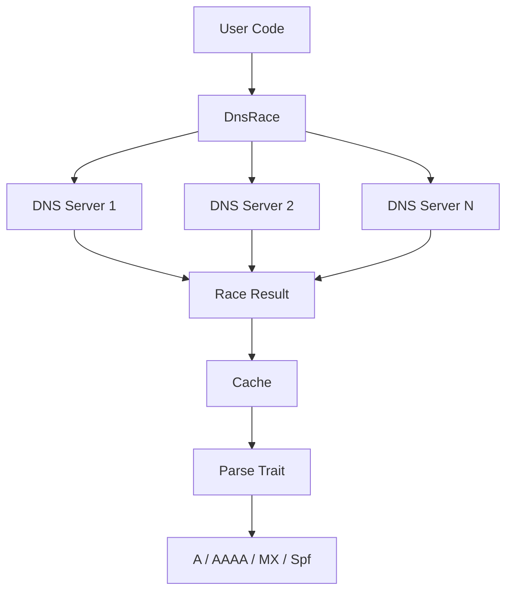
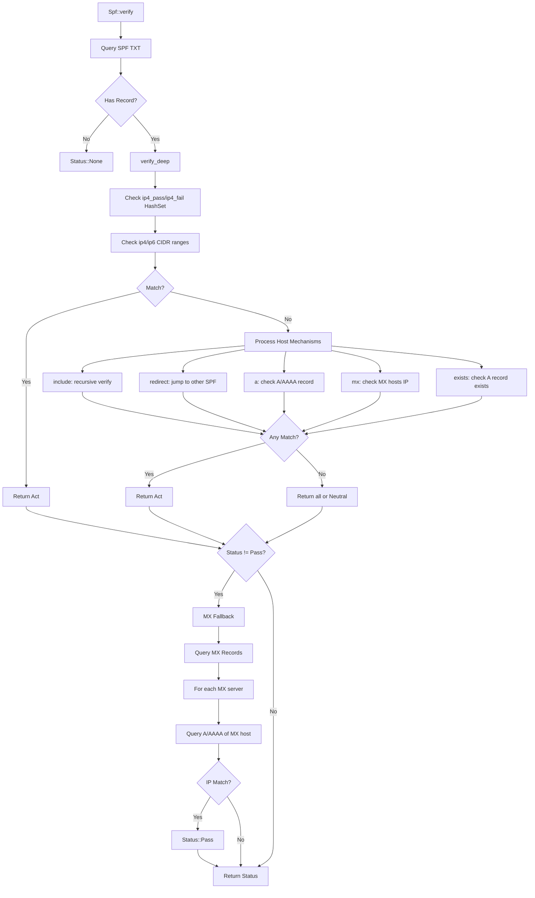

# idns : Fast DNS Record Parsing with Racing Query

DNS record parsing library with racing query support. Works with [idoq](https://crates.io/crates/idoq) (DNS over QUIC), [idot](https://crates.io/crates/idot) (DNS over TLS) and [idoh](https://crates.io/crates/idoh) (DNS over HTTPS).

## Table of Contents

- [Features](#features)
- [Installation](#installation)
- [Usage](#usage)
- [API Reference](#api-reference)
- [Architecture](#architecture)
- [Project Structure](#project-structure)
- [Tech Stack](#tech-stack)
- [History](#history)

## Features

- Racing DNS queries across multiple servers for optimal latency
- Automatic server weight adjustment based on response time
- Built-in caching with TTL support
- Parse A, AAAA, MX, TXT records
- SPF record verification (IPv4/IPv6)
- Async/await support

## Installation

```toml
[dependencies]
idns = { version = "0.2", features = ["spf"] }
```

Available features:

- `a` - A record parsing
- `aaaa` - AAAA record parsing
- `mx` - MX record parsing
- `spf` - SPF verification (includes a, aaaa, mx)
- `cache` - Response caching (enabled by default)

## Usage

### Query DNS Records

```rust
use idns::{DnsRace, Query, Spf};

let dns = DnsRace::new(dns_servers);

// Query SPF record
if let Some(records) = dns.query::<Spf>("gmail.com").await? {
  for spf in records {
    println!("{spf:?}");
  }
}
```

### SPF Verification

```rust
use std::net::IpAddr;
use idns::{Spf, spf::Status};

let ip: IpAddr = "209.85.220.41".parse()?;
let status = Spf::verify(&dns, "gmail.com", ip).await?;

match status {
  Status::Pass => println!("Accept"),
  Status::Fail => println!("Reject"),
  Status::SoftFail => println!("Mark as suspicious"),
  Status::Neutral => println!("No policy"),
  Status::None => println!("No SPF record"),
}
```

## API Reference

### Structs

| Name         | Description                                                  |
| ------------ | ------------------------------------------------------------ |
| `DnsRace<Q>` | Racing DNS client that queries multiple servers concurrently |
| `Cache<P>`   | TTL-based cache for DNS records                              |
| `Answer`     | Raw DNS answer containing name, value, type_id, ttl          |
| `A`          | Parsed A record (IPv4)                                       |
| `Aaaa`       | Parsed AAAA record (IPv6)                                    |
| `Mx`         | Parsed MX record with priority and server                    |
| `Spf`        | Parsed SPF record with IP ranges and mechanisms              |

### Enums

| Name          | Description                                                   |
| ------------- | ------------------------------------------------------------- |
| `QType`       | DNS record types (A, AAAA, MX, TXT, etc.)                     |
| `spf::Status` | SPF verification result (Pass, Fail, SoftFail, Neutral, None) |
| `spf::Act`    | SPF mechanism action                                          |

### Traits

| Name    | Description                  |
| ------- | ---------------------------- |
| `Query` | DNS query interface          |
| `Parse` | DNS record parsing interface |

## Architecture



### SPF Verification Flow

`Spf::verify` performs multi-stage verification:

1. Query domain's SPF record (TXT)
2. Check if IP matches ip4/ip6 ranges in record
3. Process host mechanisms (include, redirect, a, mx, exists)
4. If no match, fallback to MX record check - query domain's MX servers and verify if IP belongs to any MX host
5. Return final status



MX fallback ensures emails from legitimate mail servers pass verification even without explicit SPF authorization.

### Caching

Each record type has independent cache with configurable TTL:

| Record | TTL  | Description   |
| ------ | ---- | ------------- |
| A      | 300s | IPv4 address  |
| AAAA   | 300s | IPv6 address  |
| MX     | 600s | Mail exchange |
| SPF    | 600s | SPF record    |

During SPF verification, A/AAAA/MX queries are cached. When processing `include` or `redirect` mechanisms that reference the same domain, cached results are reused. This avoids redundant DNS queries and parsing.

Cache uses [papaya](https://crates.io/crates/papaya) HashMap for concurrent read/write access, suitable for high-concurrency scenarios.

## Project Structure

```
src/
├── lib.rs        # Public exports
├── error.rs      # Error definitions
├── qtype.rs      # DNS record types
├── dns_race.rs   # Racing DNS client
├── cache.rs      # TTL cache
└── parse/
    ├── mod.rs    # Parse trait
    ├── a.rs      # A record
    ├── aaaa.rs   # AAAA record
    ├── mx.rs     # MX record
    └── spf.rs    # SPF record & verification
```

## Tech Stack

- [thiserror](https://crates.io/crates/thiserror) - Error handling
- [papaya](https://crates.io/crates/papaya) - Concurrent hashmap
- [static_init](https://crates.io/crates/static_init) - Lazy static initialization

## History

SPF (Sender Policy Framework) was first proposed in 2003 by Meng Weng Wong to combat email spoofing. The protocol allows domain owners to specify which mail servers are authorized to send email on their behalf.

Before SPF, anyone could send email claiming to be from any domain. This made phishing attacks trivially easy. SPF introduced a simple TXT record format that lists authorized IP addresses and mechanisms.

The "v=spf1" prefix you see in SPF records stands for "version SPF 1". Despite being over 20 years old, this remains the only version in widespread use. The protocol was standardized as RFC 7208 in 2014.

Racing DNS queries, as implemented in this library, is a technique popularized by Google's "Happy Eyeballs" algorithm (RFC 6555). The idea is simple: send queries to multiple servers simultaneously and use the first response. This dramatically reduces latency in unreliable network conditions.
