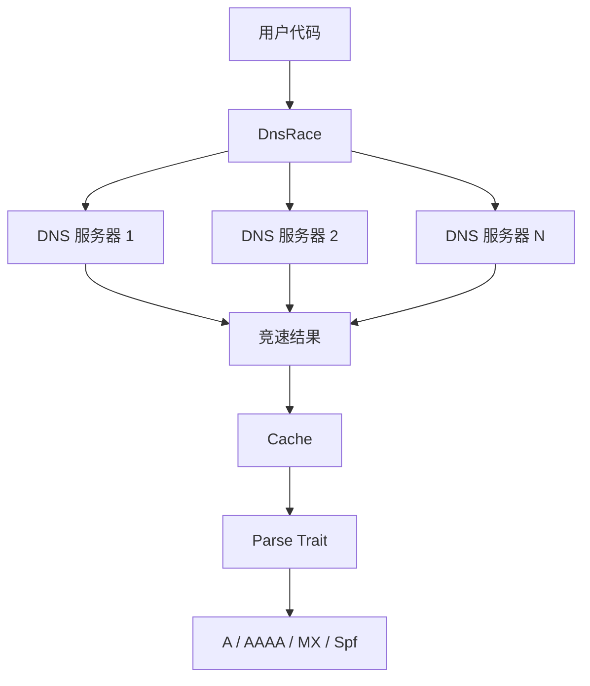
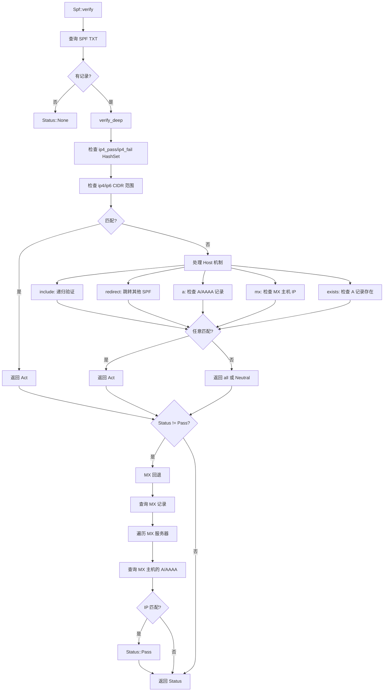

# idns : 竞速查询的 DNS 记录解析库

支持竞速查询的 DNS 记录解析库。可配合 [idoq](https://crates.io/crates/idoq)（DNS over QUIC）、[idot](https://crates.io/crates/idot)（DNS over TLS）和 [idoh](https://crates.io/crates/idoh)（DNS over HTTPS）使用。

## 目录

- [特性](#特性)
- [安装](#安装)
- [使用](#使用)
- [API 参考](#api-参考)
- [架构](#架构)
- [项目结构](#项目结构)
- [技术栈](#技术栈)
- [历史](#历史)

## 特性

- 多服务器竞速查询，获取最优延迟
- 根据响应时间自动调整服务器权重
- 内置 TTL 缓存
- 解析 A、AAAA、MX、TXT 记录
- SPF 记录验证（支持 IPv4/IPv6）
- 异步支持

## 安装

```toml
[dependencies]
idns = { version = "0.2", features = ["spf"] }
```

可用特性：

- `a` - A 记录解析
- `aaaa` - AAAA 记录解析
- `mx` - MX 记录解析
- `spf` - SPF 验证（包含 a、aaaa、mx）
- `cache` - 响应缓存（默认启用）

## 使用

### 查询 DNS 记录

```rust
use idns::{DnsRace, Query, Spf};

let dns = DnsRace::new(dns_servers);

// 查询 SPF 记录
if let Some(records) = dns.query::<Spf>("gmail.com").await? {
  for spf in records {
    println!("{spf:?}");
  }
}
```

### SPF 验证

```rust
use std::net::IpAddr;
use idns::{Spf, spf::Status};

let ip: IpAddr = "209.85.220.41".parse()?;
let status = Spf::verify(&dns, "gmail.com", ip).await?;

match status {
  Status::Pass => println!("接受"),
  Status::Fail => println!("拒绝"),
  Status::SoftFail => println!("标记为可疑"),
  Status::Neutral => println!("无策略"),
  Status::None => println!("无 SPF 记录"),
}
```

## API 参考

### 结构体

| 名称         | 说明                                          |
| ------------ | --------------------------------------------- |
| `DnsRace<Q>` | 竞速 DNS 客户端，并发查询多服务器             |
| `Cache<P>`   | 基于 TTL 的 DNS 记录缓存                      |
| `Answer`     | 原始 DNS 应答，包含 name、value、type_id、ttl |
| `A`          | 解析后的 A 记录（IPv4）                       |
| `Aaaa`       | 解析后的 AAAA 记录（IPv6）                    |
| `Mx`         | 解析后的 MX 记录，含优先级和服务器            |
| `Spf`        | 解析后的 SPF 记录，含 IP 范围和机制           |

### 枚举

| 名称          | 说明                                                |
| ------------- | --------------------------------------------------- |
| `QType`       | DNS 记录类型（A、AAAA、MX、TXT 等）                 |
| `spf::Status` | SPF 验证结果（Pass、Fail、SoftFail、Neutral、None） |
| `spf::Act`    | SPF 机制动作                                        |

### Trait

| 名称    | 说明             |
| ------- | ---------------- |
| `Query` | DNS 查询接口     |
| `Parse` | DNS 记录解析接口 |

## 架构



### SPF 验证流程

`Spf::verify` 执行多阶段验证：

1. 查询域名的 SPF 记录（TXT）
2. 检查 IP 是否匹配记录中的 ip4/ip6 范围
3. 处理 host 机制（include、redirect、a、mx、exists）
4. 若无匹配，回退到 MX 记录检查 - 查询域名的 MX 服务器，验证 IP 是否属于任意 MX 主机
5. 返回最终状态



MX 回退机制确保来自合法邮件服务器的邮件即使没有显式 SPF 授权也能通过验证。

### 缓存机制

每种记录类型有独立缓存，TTL 可配置：

| 记录 | TTL  | 说明      |
| ---- | ---- | --------- |
| A    | 300s | IPv4 地址 |
| AAAA | 300s | IPv6 地址 |
| MX   | 600s | 邮件交换  |
| SPF  | 600s | SPF 记录  |

SPF 验证过程中，A/AAAA/MX 查询结果会被缓存。处理 `include` 或 `redirect` 机制时若引用相同域名，直接复用缓存结果，避免重复 DNS 查询和解析。

缓存使用 [papaya](https://crates.io/crates/papaya) HashMap 实现并发读写，适用于高并发场景。

## 项目结构

```
src/
├── lib.rs        # 公开导出
├── error.rs      # 错误定义
├── qtype.rs      # DNS 记录类型
├── dns_race.rs   # 竞速 DNS 客户端
├── cache.rs      # TTL 缓存
└── parse/
    ├── mod.rs    # Parse trait
    ├── a.rs      # A 记录
    ├── aaaa.rs   # AAAA 记录
    ├── mx.rs     # MX 记录
    └── spf.rs    # SPF 记录与验证
```

## 技术栈

- [thiserror](https://crates.io/crates/thiserror) - 错误处理
- [papaya](https://crates.io/crates/papaya) - 并发哈希表
- [static_init](https://crates.io/crates/static_init) - 延迟静态初始化

## 历史

SPF（发件人策略框架）由 Meng Weng Wong 于 2003 年提出，用于对抗邮件伪造。该协议允许域名所有者指定哪些邮件服务器有权代表其发送邮件。

在 SPF 出现之前，任何人都可以发送声称来自任意域名的邮件，这使得钓鱼攻击极为容易。SPF 引入了简单的 TXT 记录格式，列出授权的 IP 地址和机制。

SPF 记录中的 "v=spf1" 前缀表示 "SPF 版本 1"。尽管已有 20 多年历史，这仍是唯一广泛使用的版本。该协议于 2014 年标准化为 RFC 7208。

本库实现的竞速 DNS 查询技术源自 Google 的 "Happy Eyeballs" 算法（RFC 6555）。原理很简单：同时向多个服务器发送查询，使用最先返回的响应。这在不稳定的网络环境下能显著降低延迟。
