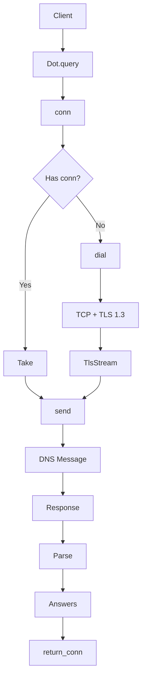

# idot : DNS over TLS Client for Rust

Based on [idns](https://crates.io/crates/idns). See idns for `DnsRace`, `Cache`, `Parse` trait, and more.

## Features

- RFC 7858 compliant DoT implementation
- Built-in DoT server list (Cloudflare, Google, Quad9, Alibaba DNS)
- Async/await with Tokio
- TLS 1.3
- A, AAAA, MX, TXT, NS, CNAME, PTR, SRV record types
- Connection reuse
- 9s timeout

## Installation

```toml
[dependencies]
idot = "0.1"
idns = "0.1"
```

## Usage

### DnsRace + Cache (Recommended)

Race multiple servers and cache results:

```rust
use idot::{DOT_LI, dot_li};
use idns::{Cache, DnsRace, Mx, Query};
use std::time::Instant;

#[tokio::main]
async fn main() {
  let race = DnsRace::new(dot_li(DOT_LI));
  let cache: Cache<Mx> = Cache::new(60); // 60s TTL

  // First query (cache miss)
  let t1 = Instant::now();
  let r1 = cache.query(&race, "gmail.com").await;
  let d1 = t1.elapsed();
  println!("First: {}ms", d1.as_millis());
  if let Some(mx_list) = &*r1.unwrap() {
    for mx in mx_list {
      println!("  {} {}", mx.priority, mx.server);
    }
  }

  // Second query (cache hit)
  let t2 = Instant::now();
  let _ = cache.query(&race, "gmail.com").await;
  let d2 = t2.elapsed();
  println!("Cache: {}μs", d2.as_micros());
}
```

### Basic Query

```rust
use idot::{Dot, host_ip, QType};
use idns::Query;

#[tokio::main]
async fn main() {
  let client = Dot::new(host_ip("cloudflare-dns.com", 1, 1, 1, 1));

  if let Ok(Some(answers)) = client.answer_li(QType::A, "example.com").await {
    for a in answers {
      println!("{} TTL={}", a.val, a.ttl);
    }
  }
}
```

### Custom Server

```rust
use idot::{Dot, host_ip, QType};
use idns::Query;

#[tokio::main]
async fn main() {
  let server = host_ip("dns.google", 8, 8, 8, 8);
  let client = Dot::new(server);

  if let Ok(Some(answers)) = client.answer_li(QType::AAAA, "google.com").await {
    for a in answers {
      println!("{}", a.val);
    }
  }
}
```

## API Reference

### Structs

#### `Dot`

DoT client with connection reuse. Implements `idns::Query` trait.

#### `HostIp`

Server configuration with `host: SmolStr` (TLS SNI) and `ip: IpAddr`.

### Functions

- `host_ip(host, a, b, c, d) -> HostIp` - Create HostIp from hostname and IPv4
- `dot_li(li: &[HostIp]) -> Vec<Dot>` - Create Dot clients from HostIp list

### Constants

#### `DOT_LI`

Pre-configured DoT servers:

| Server          | IP                        |
| --------------- | ------------------------- |
| Cloudflare      | 1.1.1.1, 1.0.0.1          |
| Google          | 8.8.8.8, 8.8.4.4          |
| Quad9           | 9.9.9.9                   |
| 360 DNS (China) | 101.226.4.6, 218.30.118.6 |
| TWNIC (Taiwan)  | 101.101.101.101           |
| IIJ DNS (Japan) | 103.2.57.5                |

#### `dns` module

Server hostname constants:

- `dns::CLOUDFLARE` - `"cloudflare-dns.com"`
- `dns::GOOGLE` - `"dns.google"`
- `dns::QUAD9` - `"dns.quad9.net"`
- `dns::DNS360` - `"dot.360.cn"`
- `dns::TWNIC` - `"101.101.101.101"`
- `dns::IIJ` - `"public.dns.iij.jp"`
- `dns::ALIDNS` - `"dns.alidns.com"` (disabled: incomplete TXT records)
- `dns::DNSPOD` - `"dot.pub"` (disabled: connection issues)

## Architecture



### Implementation Details

- Random DNS message ID (verified on response)
- 2-byte length prefix for framing (RFC 7858)
- EDNS OPT with 4096 byte payload
- `LazyLock` for TLS `ClientConfig`
- `RwLock<Option<TlsStream>>` for connection reuse
- TCP_NODELAY enabled
- 9s timeout

## Tech Stack

| Component | Library               |
| --------- | --------------------- |
| TLS       | rustls + tokio-rustls |
| Async     | tokio                 |
| Buffer    | bytes                 |
| Error     | thiserror             |
| DNS Parse | dns_parse             |

## DoT vs DoQ

| Feature               | DoT (idot) | DoQ (idoq) |
| --------------------- | ---------- | ---------- |
| Protocol              | TCP + TLS  | QUIC       |
| Port                  | 853        | 853        |
| Multiplexing          | No         | Yes        |
| 0-RTT                 | No         | Yes        |
| Head-of-line blocking | Yes        | No         |
| Maturity              | High       | Medium     |
