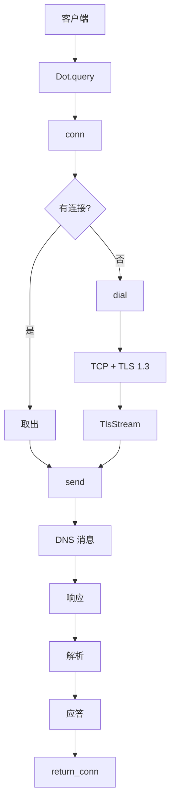

# idot : Rust DNS over TLS 客户端

基于 [idns](https://crates.io/crates/idns)。`DnsRace`、`Cache`、`Parse` trait 等更多功能请查看 idns。

## 特性

- 符合 RFC 7858 的 DoT 实现
- 内置 DoT 服务器列表 (Cloudflare、Google、Quad9、阿里 DNS)
- 基于 Tokio 异步
- TLS 1.3
- 支持 A、AAAA、MX、TXT、NS、CNAME、PTR、SRV 记录
- 连接复用
- 9 秒超时

## 安装

```toml
[dependencies]
idot = "0.1"
idns = "0.1"
```

## 使用

### DnsRace + Cache（推荐）

竞速查询多个服务器并缓存结果：

```rust
use idot::{DOT_LI, dot_li};
use idns::{Cache, DnsRace, Mx, Query};
use std::time::Instant;

#[tokio::main]
async fn main() {
  let race = DnsRace::new(dot_li(DOT_LI));
  let cache: Cache<Mx> = Cache::new(60); // 60 秒 TTL

  // 首次查询（缓存未命中）
  let t1 = Instant::now();
  let r1 = cache.query(&race, "gmail.com").await;
  let d1 = t1.elapsed();
  println!("首次: {}ms", d1.as_millis());
  if let Some(mx_list) = &*r1.unwrap() {
    for mx in mx_list {
      println!("  {} {}", mx.priority, mx.server);
    }
  }

  // 再次查询（缓存命中）
  let t2 = Instant::now();
  let _ = cache.query(&race, "gmail.com").await;
  let d2 = t2.elapsed();
  println!("缓存: {}μs", d2.as_micros());
}
```

### 基本查询

```rust
use idot::{Dot, host_ip, QType};
use idns::Query;

#[tokio::main]
async fn main() {
  let client = Dot::new(host_ip("cloudflare-dns.com", 1, 1, 1, 1));

  if let Ok(Some(answers)) = client.answer_li(QType::A, "example.com").await {
    for a in answers {
      println!("{} TTL={}", a.val, a.ttl);
    }
  }
}
```

### 自定义服务器

```rust
use idot::{Dot, host_ip, QType};
use idns::Query;

#[tokio::main]
async fn main() {
  let server = host_ip("dns.google", 8, 8, 8, 8);
  let client = Dot::new(server);

  if let Ok(Some(answers)) = client.answer_li(QType::AAAA, "google.com").await {
    for a in answers {
      println!("{}", a.val);
    }
  }
}
```

## API 参考

### 结构体

#### `Dot`

DoT 客户端，支持连接复用。实现 `idns::Query` trait。

#### `HostIp`

服务器配置，包含 `host: SmolStr`（TLS SNI）和 `ip: IpAddr`。

### 函数

- `host_ip(host, a, b, c, d) -> HostIp` - 从主机名和 IPv4 创建 HostIp
- `dot_li(li: &[HostIp]) -> Vec<Dot>` - 从 HostIp 列表创建 Dot 客户端

### 常量

#### `DOT_LI`

预配置 DoT 服务器：

| 服务器          | IP                        |
| --------------- | ------------------------- |
| Cloudflare      | 1.1.1.1, 1.0.0.1          |
| Google          | 8.8.8.8, 8.8.4.4          |
| Quad9           | 9.9.9.9                   |
| 360 DNS（中国） | 101.226.4.6, 218.30.118.6 |
| TWNIC（台湾）   | 101.101.101.101           |
| IIJ DNS（日本） | 103.2.57.5                |

#### `dns` 模块

服务器主机名常量：

- `dns::CLOUDFLARE` - `"cloudflare-dns.com"`
- `dns::GOOGLE` - `"dns.google"`
- `dns::QUAD9` - `"dns.quad9.net"`
- `dns::DNS360` - `"dot.360.cn"`
- `dns::TWNIC` - `"101.101.101.101"`
- `dns::IIJ` - `"public.dns.iij.jp"`
- `dns::ALIDNS` - `"dns.alidns.com"`（已禁用：TXT 记录不完整）
- `dns::DNSPOD` - `"dot.pub"`（已禁用：连接问题）

## 架构



### 实现细节

- 随机 DNS 消息 ID（响应时验证）
- 2 字节长度前缀分帧 (RFC 7858)
- EDNS OPT 4096 字节负载
- `LazyLock` 延迟初始化 TLS `ClientConfig`
- `RwLock<Option<TlsStream>>` 连接复用
- 启用 TCP_NODELAY
- 9 秒超时

## 技术栈

| 组件     | 库                    |
| -------- | --------------------- |
| TLS      | rustls + tokio-rustls |
| 异步     | tokio                 |
| 缓冲     | bytes                 |
| 错误     | thiserror             |
| DNS 解析 | dns_parse             |

## DoT vs DoQ

| 特性     | DoT (idot) | DoQ (idoq) |
| -------- | ---------- | ---------- |
| 协议     | TCP + TLS  | QUIC       |
| 端口     | 853        | 853        |
| 多路复用 | 否         | 是         |
| 0-RTT    | 否         | 是         |
| 队头阻塞 | 是         | 否         |
| 成熟度   | 高         | 中         |
