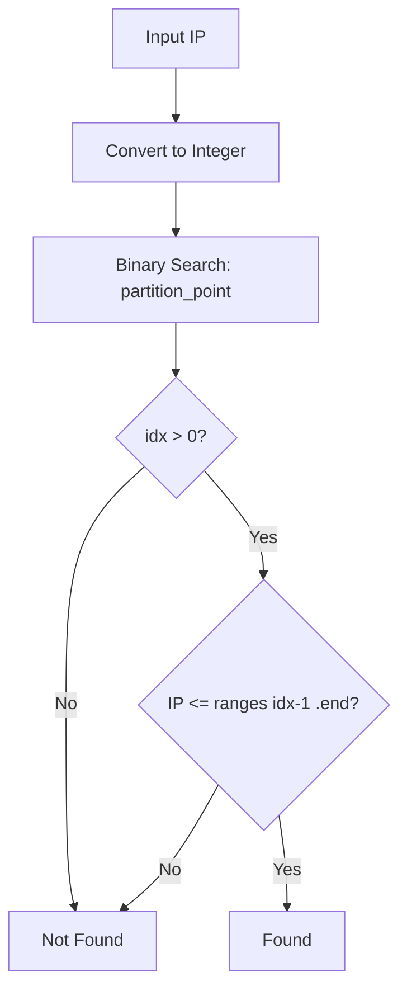
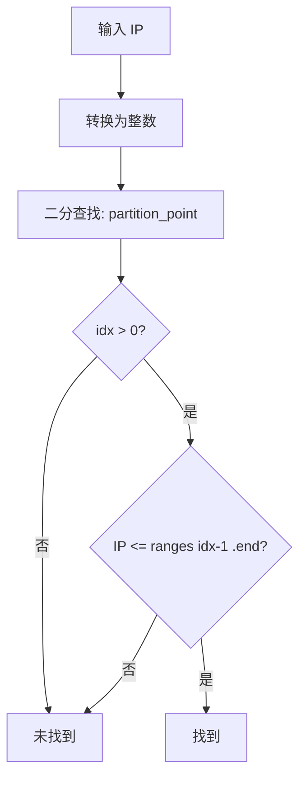

[English](#en) | [中文](#zh)

---

<a id="en"></a>
# ip_set : Fast IP Range Matching with Binary Search

- [ip_set : Fast IP Range Matching with Binary Search](#ip_set-fast-ip-range-matching-with-binary-search)
  - [Table of Contents](#table-of-contents)
  - [Introduction](#introduction)
  - [Features](#features)
  - [Installation](#installation)
  - [Usage](#usage)
  - [API Reference](#api-reference)
    - [Traits](#traits)
    - [Structs](#structs)
    - [Type Aliases](#type-aliases)
  - [Design](#design)
    - [Why Binary Search Over Trie?](#why-binary-search-over-trie)
    - [Lookup Flow](#lookup-flow)
    - [CIDR to Range Conversion](#cidr-to-range-conversion)
  - [Tech Stack](#tech-stack)
  - [Project Structure](#project-structure)
  - [History](#history)
    - [The Birth of CIDR](#the-birth-of-cidr)
    - [Binary Search: A 1946 Algorithm](#binary-search-a-1946-algorithm)
  - [About](#about)

## Table of Contents

- [Introduction](#introduction)
- [Features](#features)
- [Installation](#installation)
- [Usage](#usage)
- [API Reference](#api-reference)
- [Design](#design)
- [Tech Stack](#tech-stack)
- [Project Structure](#project-structure)
- [History](#history)

## Introduction

`ip_set` is a Rust library for efficient IP address range matching using sorted arrays and binary search.

Unlike trie-based solutions (e.g., prefix trees), this approach excels when dealing with small to medium IP sets. It's ideal for SPF record validation, IP allowlist/blocklist checking, and similar use cases.

## Features

- IPv4 and IPv6 support
- CIDR notation parsing
- O(log n) lookup via binary search
- Zero dependencies
- Human-readable `Debug` and `Display` output
- Auto-sorted on insertion
- IP map with associated values (`IpMap`)

## Installation

```sh
cargo add ip_set
```

## Usage

```rust
use std::net::Ipv4Addr;
use ip_set::Ipv4Set;

let mut set = Ipv4Set::new();

// Add single IP
set.add(Ipv4Addr::new(192, 168, 1, 100));

// Add CIDR range
set.add_cidr(Ipv4Addr::new(10, 0, 0, 0), 24);

// Check membership (auto-sorted on insert, no manual sort needed)
assert!(set.contains(Ipv4Addr::new(10, 0, 0, 1)));
assert!(!set.contains(Ipv4Addr::new(10, 0, 1, 0)));

// Display
println!("{set}");  // [10.0.0.0-10.0.0.255 / 192.168.1.100]
```

IP map with associated values:

```rust
use std::net::Ipv4Addr;
use ip_set::Ipv4Map;

let mut map = Ipv4Map::new();
map.add_cidr(Ipv4Addr::new(10, 0, 0, 0), 24, "internal");
map.add_cidr(Ipv4Addr::new(192, 168, 0, 0), 16, "private");

assert_eq!(map.get(Ipv4Addr::new(10, 0, 0, 1)), Some("internal"));
assert_eq!(map.get(Ipv4Addr::new(8, 8, 8, 8)), None);
```

Quick CIDR check without building a set:

```rust
use std::net::Ipv4Addr;
use ip_set::IpRange;

let in_range = Ipv4Addr::in_cidr(
  Ipv4Addr::new(192, 168, 0, 0),
  16,
  Ipv4Addr::new(192, 168, 1, 1)
);
assert!(in_range);
```

## API Reference

### Traits

`IpRange` - Trait for IP address types

- `to_int()` - Convert IP to integer
- `from_cidr(addr, prefix)` - Create range from CIDR
- `in_cidr(net, prefix, addr)` - Check if addr is in CIDR

### Structs

`Range<T>` - Generic integer range

- `start: T` - Range start (inclusive)
- `end: T` - Range end (inclusive)
- `contains(val)` - Check if value is in range

`IpSet<T>` - Sorted IP set with binary search

- `new()` - Create empty set
- `add(addr)` - Add single IP
- `add_cidr(addr, prefix)` - Add CIDR range
- `contains(addr)` - Check if IP is in set
- `len()` - Number of ranges
- `is_empty()` - Check if empty
- `iter()` - Iterator

`IpMap<T, V>` - Sorted IP map with binary search

- `new()` - Create empty map
- `add(addr, val)` - Add single IP with value
- `add_cidr(addr, prefix, val)` - Add CIDR range with value
- `get(addr)` - Get value for IP
- `len()` - Number of entries
- `is_empty()` - Check if empty
- `first()` - Get first entry
- `iter()` - Iterator

### Type Aliases

- `Ipv4Set` = `IpSet<Ipv4Addr>`
- `Ipv6Set` = `IpSet<Ipv6Addr>`
- `Ipv4Map<V>` = `IpMap<Ipv4Addr, V>`
- `Ipv6Map<V>` = `IpMap<Ipv6Addr, V>`
- `Ip4Range` = `Range<u32>`
- `Ip6Range` = `Range<u128>`

## Design

### Why Binary Search Over Trie?

Trie (prefix tree) is the classic choice for IP lookup. However, for small IP sets (< 1000 ranges), sorted array + binary search offers:

- Lower memory overhead
- Better cache locality
- Simpler implementation
- Auto-sorted on insertion, no extra sort step needed

### Lookup Flow



### CIDR to Range Conversion

CIDR `10.0.0.0/24` converts to:

1. IP → integer: `167772160`
2. Mask: `!0u32 << (32 - 24)` = `0xFFFFFF00`
3. Start: `167772160 & mask` = `167772160`
4. End: `start | !mask` = `167772415`

Result: `10.0.0.0` - `10.0.0.255`

## Tech Stack

- Language: Rust (Edition 2024)
- Dependencies: None (std only)

## Project Structure

```
ip_set/
├── src/
│   └── lib.rs      # Core implementation
├── tests/
│   └── main.rs     # Integration tests
├── readme/
│   ├── en.md       # English documentation
│   └── zh.md       # Chinese documentation
└── Cargo.toml
```

## History

### The Birth of CIDR

In 1993, the Internet was running out of IP addresses. The original classful addressing (Class A/B/C) wasted huge blocks. CIDR (Classless Inter-Domain Routing), defined in RFC 1518 and RFC 1519, introduced variable-length subnet masking.

The `/24` notation we use today was revolutionary—it allowed networks to be divided precisely, extending IPv4's lifespan by decades.

### Binary Search: A 1946 Algorithm

Binary search was first mentioned by John Mauchly in 1946, but the first bug-free implementation wasn't published until 1962. Even in 2006, Joshua Bloch found a bug in Java's `Arrays.binarySearch()` that had existed for 9 years.

The bug? Integer overflow in `(low + high) / 2`. The fix: `low + (high - low) / 2`.

Rust's `partition_point` uses this correct form internally.


## About

This library is developed by [WebC.site](https://webc.site).

[WebC.site](https://webc.site): A new paradigm of web development for AI


---

<a id="zh"></a>
# ip_set : 基于二分查找的高效 IP 范围匹配

- [ip_set : 基于二分查找的高效 IP 范围匹配](#ip_set-基于二分查找的高效-ip-范围匹配)
  - [目录](#目录)
  - [简介](#简介)
  - [特性](#特性)
  - [安装](#安装)
  - [使用](#使用)
  - [API 参考](#api-参考)
    - [Trait](#trait)
    - [结构体](#结构体)
    - [类型别名](#类型别名)
  - [设计思路](#设计思路)
    - [为何选择二分查找而非前缀树？](#为何选择二分查找而非前缀树)
    - [查找流程](#查找流程)
    - [CIDR 转范围](#cidr-转范围)
  - [技术栈](#技术栈)
  - [目录结构](#目录结构)
  - [历史](#历史)
    - [CIDR 的诞生](#cidr-的诞生)
    - [二分查找：1946 年的算法](#二分查找1946-年的算法)
  - [关于](#关于)

## 目录

- [简介](#简介)
- [特性](#特性)
- [安装](#安装)
- [使用](#使用)
- [API 参考](#api-参考)
- [设计思路](#设计思路)
- [技术栈](#技术栈)
- [目录结构](#目录结构)
- [历史](#历史)

## 简介

`ip_set` 是 Rust 库，使用排序数组和二分查找实现高效 IP 地址范围匹配。

相比前缀树 (Trie) 方案，本库在中小规模 IP 集合场景下性能更优。适用于 SPF 记录验证、IP 黑白名单检查等场景。

## 特性

- 支持 IPv4 和 IPv6
- 支持 CIDR 表示法
- O(log n) 查找复杂度
- 零依赖
- 人类可读的 `Debug` 和 `Display` 输出
- 插入时自动保持有序
- 支持带值的 IP 映射 (`IpMap`)

## 安装

```sh
cargo add ip_set
```

## 使用

```rust
use std::net::Ipv4Addr;
use ip_set::Ipv4Set;

let mut set = Ipv4Set::new();

// 添加单个 IP
set.add(Ipv4Addr::new(192, 168, 1, 100));

// 添加 CIDR 范围
set.add_cidr(Ipv4Addr::new(10, 0, 0, 0), 24);

// 检查是否包含（插入时自动排序，无需手动调用 sort）
assert!(set.contains(Ipv4Addr::new(10, 0, 0, 1)));
assert!(!set.contains(Ipv4Addr::new(10, 0, 1, 0)));

// 显示
println!("{set}");  // [10.0.0.0-10.0.0.255 / 192.168.1.100]
```

带值的 IP 映射：

```rust
use std::net::Ipv4Addr;
use ip_set::Ipv4Map;

let mut map = Ipv4Map::new();
map.add_cidr(Ipv4Addr::new(10, 0, 0, 0), 24, "internal");
map.add_cidr(Ipv4Addr::new(192, 168, 0, 0), 16, "private");

assert_eq!(map.get(Ipv4Addr::new(10, 0, 0, 1)), Some("internal"));
assert_eq!(map.get(Ipv4Addr::new(8, 8, 8, 8)), None);
```

快速 CIDR 检查（无需构建集合）：

```rust
use std::net::Ipv4Addr;
use ip_set::IpRange;

let in_range = Ipv4Addr::in_cidr(
  Ipv4Addr::new(192, 168, 0, 0),
  16,
  Ipv4Addr::new(192, 168, 1, 1)
);
assert!(in_range);
```

## API 参考

### Trait

`IpRange` - IP 地址类型特征

- `to_int()` - 转换为整数
- `from_cidr(addr, prefix)` - 从 CIDR 创建范围
- `in_cidr(net, prefix, addr)` - 检查 addr 是否在 CIDR 内

### 结构体

`Range<T>` - 通用整数范围

- `start: T` - 起始值（含）
- `end: T` - 结束值（含）
- `contains(val)` - 检查值是否在范围内

`IpSet<T>` - 排序的 IP 集合

- `new()` - 创建空集合
- `add(addr)` - 添加单个 IP
- `add_cidr(addr, prefix)` - 添加 CIDR 范围
- `contains(addr)` - 检查 IP 是否在集合中
- `len()` - 范围数量
- `is_empty()` - 是否为空
- `iter()` - 迭代器

`IpMap<T, V>` - 排序的 IP 映射

- `new()` - 创建空映射
- `add(addr, val)` - 添加单个 IP 及其值
- `add_cidr(addr, prefix, val)` - 添加 CIDR 范围及其值
- `get(addr)` - 获取 IP 对应的值
- `len()` - 条目数量
- `is_empty()` - 是否为空
- `first()` - 获取第一个条目
- `iter()` - 迭代器

### 类型别名

- `Ipv4Set` = `IpSet<Ipv4Addr>`
- `Ipv6Set` = `IpSet<Ipv6Addr>`
- `Ipv4Map<V>` = `IpMap<Ipv4Addr, V>`
- `Ipv6Map<V>` = `IpMap<Ipv6Addr, V>`
- `Ip4Range` = `Range<u32>`
- `Ip6Range` = `Range<u128>`

## 设计思路

### 为何选择二分查找而非前缀树？

前缀树是 IP 查找的经典方案。但对于中小规模 IP 集合（< 1000 范围），排序数组 + 二分查找具有：

- 更低内存开销
- 更好缓存局部性
- 更简单实现
- 插入时保持有序，无需额外排序步骤

### 查找流程



### CIDR 转范围

CIDR `10.0.0.0/24` 转换过程：

1. IP → 整数: `167772160`
2. 掩码: `!0u32 << (32 - 24)` = `0xFFFFFF00`
3. 起始: `167772160 & mask` = `167772160`
4. 结束: `start | !mask` = `167772415`

结果: `10.0.0.0` - `10.0.0.255`

## 技术栈

- 语言: Rust (Edition 2024)
- 依赖: 无（仅 std）

## 目录结构

```
ip_set/
├── src/
│   └── lib.rs      # 核心实现
├── tests/
│   └── main.rs     # 集成测试
├── readme/
│   ├── en.md       # 英文文档
│   └── zh.md       # 中文文档
└── Cargo.toml
```

## 历史

### CIDR 的诞生

1993 年，互联网面临 IP 地址耗尽危机。原有的分类寻址（A/B/C 类）浪费大量地址块。CIDR（无类别域间路由）在 RFC 1518 和 RFC 1519 中定义，引入可变长度子网掩码。

今天使用的 `/24` 表示法是革命性的——它允许精确划分网络，将 IPv4 的寿命延长了数十年。

### 二分查找：1946 年的算法

二分查找最早由 John Mauchly 在 1946 年提出，但首个无 bug 实现直到 1962 年才发表。2006 年，Joshua Bloch 发现 Java 的 `Arrays.binarySearch()` 存在长达 9 年的 bug。

问题在于 `(low + high) / 2` 的整数溢出。修复方案：`low + (high - low) / 2`。

Rust 的 `partition_point` 内部使用了正确的形式。


## 关于

本库由 [WebC.site](https://webc.site) 开发。

[WebC.site](https://webc.site) : 面向人工智能的网站开发新范式

