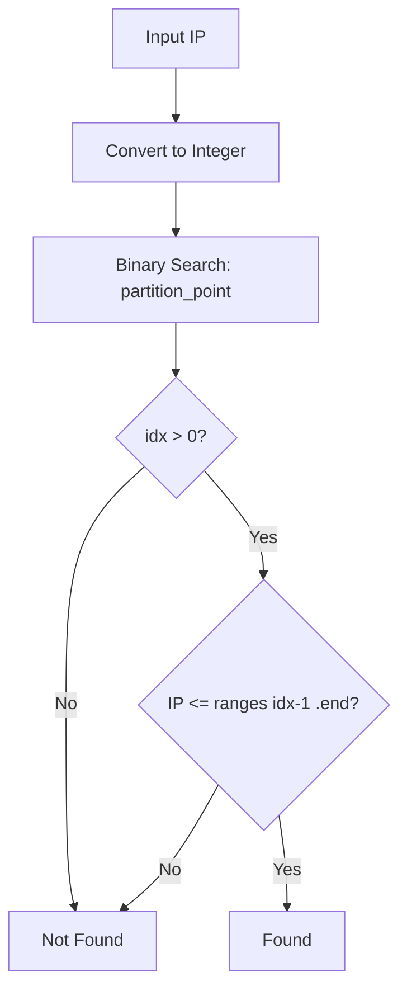

# ip_set : Fast IP Range Matching with Binary Search

## Table of Contents

- [Introduction](#introduction)
- [Features](#features)
- [Installation](#installation)
- [Usage](#usage)
- [API Reference](#api-reference)
- [Design](#design)
- [Tech Stack](#tech-stack)
- [Project Structure](#project-structure)
- [History](#history)

## Introduction

`ip_set` is a Rust library for efficient IP address range matching using sorted arrays and binary search.

Unlike trie-based solutions (e.g., prefix trees), this approach excels when dealing with small to medium IP sets. It's ideal for SPF record validation, IP allowlist/blocklist checking, and similar use cases.

## Features

- IPv4 and IPv6 support
- CIDR notation parsing
- O(log n) lookup via binary search
- Zero dependencies
- Human-readable `Debug` and `Display` output
- Auto-sorted on insertion
- IP map with associated values (`IpMap`)

## Installation

```sh
cargo add ip_set
```

## Usage

```rust
use std::net::Ipv4Addr;
use ip_set::Ipv4Set;

let mut set = Ipv4Set::new();

// Add single IP
set.add(Ipv4Addr::new(192, 168, 1, 100));

// Add CIDR range
set.add_cidr(Ipv4Addr::new(10, 0, 0, 0), 24);

// Check membership (auto-sorted on insert, no manual sort needed)
assert!(set.contains(Ipv4Addr::new(10, 0, 0, 1)));
assert!(!set.contains(Ipv4Addr::new(10, 0, 1, 0)));

// Display
println!("{set}");  // [10.0.0.0-10.0.0.255 / 192.168.1.100]
```

IP map with associated values:

```rust
use std::net::Ipv4Addr;
use ip_set::Ipv4Map;

let mut map = Ipv4Map::new();
map.add_cidr(Ipv4Addr::new(10, 0, 0, 0), 24, "internal");
map.add_cidr(Ipv4Addr::new(192, 168, 0, 0), 16, "private");

assert_eq!(map.get(Ipv4Addr::new(10, 0, 0, 1)), Some("internal"));
assert_eq!(map.get(Ipv4Addr::new(8, 8, 8, 8)), None);
```

Quick CIDR check without building a set:

```rust
use std::net::Ipv4Addr;
use ip_set::IpRange;

let in_range = Ipv4Addr::in_cidr(
  Ipv4Addr::new(192, 168, 0, 0),
  16,
  Ipv4Addr::new(192, 168, 1, 1)
);
assert!(in_range);
```

## API Reference

### Traits

`IpRange` - Trait for IP address types

- `to_int()` - Convert IP to integer
- `from_cidr(addr, prefix)` - Create range from CIDR
- `in_cidr(net, prefix, addr)` - Check if addr is in CIDR

### Structs

`Range<T>` - Generic integer range

- `start: T` - Range start (inclusive)
- `end: T` - Range end (inclusive)
- `contains(val)` - Check if value is in range

`IpSet<T>` - Sorted IP set with binary search

- `new()` - Create empty set
- `add(addr)` - Add single IP
- `add_cidr(addr, prefix)` - Add CIDR range
- `contains(addr)` - Check if IP is in set
- `len()` - Number of ranges
- `is_empty()` - Check if empty
- `iter()` - Iterator

`IpMap<T, V>` - Sorted IP map with binary search

- `new()` - Create empty map
- `add(addr, val)` - Add single IP with value
- `add_cidr(addr, prefix, val)` - Add CIDR range with value
- `get(addr)` - Get value for IP
- `len()` - Number of entries
- `is_empty()` - Check if empty
- `first()` - Get first entry
- `iter()` - Iterator

### Type Aliases

- `Ipv4Set` = `IpSet<Ipv4Addr>`
- `Ipv6Set` = `IpSet<Ipv6Addr>`
- `Ipv4Map<V>` = `IpMap<Ipv4Addr, V>`
- `Ipv6Map<V>` = `IpMap<Ipv6Addr, V>`
- `Ip4Range` = `Range<u32>`
- `Ip6Range` = `Range<u128>`

## Design

### Why Binary Search Over Trie?

Trie (prefix tree) is the classic choice for IP lookup. However, for small IP sets (< 1000 ranges), sorted array + binary search offers:

- Lower memory overhead
- Better cache locality
- Simpler implementation
- Auto-sorted on insertion, no extra sort step needed

### Lookup Flow



### CIDR to Range Conversion

CIDR `10.0.0.0/24` converts to:

1. IP → integer: `167772160`
2. Mask: `!0u32 << (32 - 24)` = `0xFFFFFF00`
3. Start: `167772160 & mask` = `167772160`
4. End: `start | !mask` = `167772415`

Result: `10.0.0.0` - `10.0.0.255`

## Tech Stack

- Language: Rust (Edition 2024)
- Dependencies: None (std only)

## Project Structure

```
ip_set/
├── src/
│   └── lib.rs      # Core implementation
├── tests/
│   └── main.rs     # Integration tests
├── readme/
│   ├── en.md       # English documentation
│   └── zh.md       # Chinese documentation
└── Cargo.toml
```

## History

### The Birth of CIDR

In 1993, the Internet was running out of IP addresses. The original classful addressing (Class A/B/C) wasted huge blocks. CIDR (Classless Inter-Domain Routing), defined in RFC 1518 and RFC 1519, introduced variable-length subnet masking.

The `/24` notation we use today was revolutionary—it allowed networks to be divided precisely, extending IPv4's lifespan by decades.

### Binary Search: A 1946 Algorithm

Binary search was first mentioned by John Mauchly in 1946, but the first bug-free implementation wasn't published until 1962. Even in 2006, Joshua Bloch found a bug in Java's `Arrays.binarySearch()` that had existed for 9 years.

The bug? Integer overflow in `(low + high) / 2`. The fix: `low + (high - low) / 2`.

Rust's `partition_point` uses this correct form internally.
