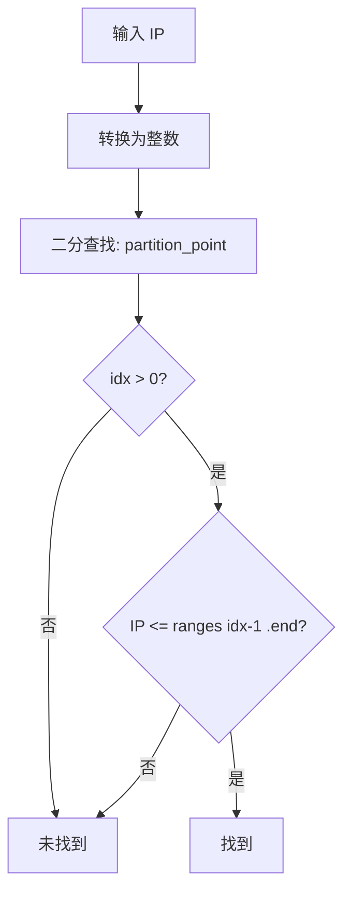

# ip_set : 基于二分查找的高效 IP 范围匹配

## 目录

- [简介](#简介)
- [特性](#特性)
- [安装](#安装)
- [使用](#使用)
- [API 参考](#api-参考)
- [设计思路](#设计思路)
- [技术栈](#技术栈)
- [目录结构](#目录结构)
- [历史](#历史)

## 简介

`ip_set` 是 Rust 库，使用排序数组和二分查找实现高效 IP 地址范围匹配。

相比前缀树 (Trie) 方案，本库在中小规模 IP 集合场景下性能更优。适用于 SPF 记录验证、IP 黑白名单检查等场景。

## 特性

- 支持 IPv4 和 IPv6
- 支持 CIDR 表示法
- O(log n) 查找复杂度
- 零依赖
- 人类可读的 `Debug` 和 `Display` 输出
- 插入时自动保持有序
- 支持带值的 IP 映射 (`IpMap`)

## 安装

```sh
cargo add ip_set
```

## 使用

```rust
use std::net::Ipv4Addr;
use ip_set::Ipv4Set;

let mut set = Ipv4Set::new();

// 添加单个 IP
set.add(Ipv4Addr::new(192, 168, 1, 100));

// 添加 CIDR 范围
set.add_cidr(Ipv4Addr::new(10, 0, 0, 0), 24);

// 检查是否包含（插入时自动排序，无需手动调用 sort）
assert!(set.contains(Ipv4Addr::new(10, 0, 0, 1)));
assert!(!set.contains(Ipv4Addr::new(10, 0, 1, 0)));

// 显示
println!("{set}");  // [10.0.0.0-10.0.0.255 / 192.168.1.100]
```

带值的 IP 映射：

```rust
use std::net::Ipv4Addr;
use ip_set::Ipv4Map;

let mut map = Ipv4Map::new();
map.add_cidr(Ipv4Addr::new(10, 0, 0, 0), 24, "internal");
map.add_cidr(Ipv4Addr::new(192, 168, 0, 0), 16, "private");

assert_eq!(map.get(Ipv4Addr::new(10, 0, 0, 1)), Some("internal"));
assert_eq!(map.get(Ipv4Addr::new(8, 8, 8, 8)), None);
```

快速 CIDR 检查（无需构建集合）：

```rust
use std::net::Ipv4Addr;
use ip_set::IpRange;

let in_range = Ipv4Addr::in_cidr(
  Ipv4Addr::new(192, 168, 0, 0),
  16,
  Ipv4Addr::new(192, 168, 1, 1)
);
assert!(in_range);
```

## API 参考

### Trait

`IpRange` - IP 地址类型特征

- `to_int()` - 转换为整数
- `from_cidr(addr, prefix)` - 从 CIDR 创建范围
- `in_cidr(net, prefix, addr)` - 检查 addr 是否在 CIDR 内

### 结构体

`Range<T>` - 通用整数范围

- `start: T` - 起始值（含）
- `end: T` - 结束值（含）
- `contains(val)` - 检查值是否在范围内

`IpSet<T>` - 排序的 IP 集合

- `new()` - 创建空集合
- `add(addr)` - 添加单个 IP
- `add_cidr(addr, prefix)` - 添加 CIDR 范围
- `contains(addr)` - 检查 IP 是否在集合中
- `len()` - 范围数量
- `is_empty()` - 是否为空
- `iter()` - 迭代器

`IpMap<T, V>` - 排序的 IP 映射

- `new()` - 创建空映射
- `add(addr, val)` - 添加单个 IP 及其值
- `add_cidr(addr, prefix, val)` - 添加 CIDR 范围及其值
- `get(addr)` - 获取 IP 对应的值
- `len()` - 条目数量
- `is_empty()` - 是否为空
- `first()` - 获取第一个条目
- `iter()` - 迭代器

### 类型别名

- `Ipv4Set` = `IpSet<Ipv4Addr>`
- `Ipv6Set` = `IpSet<Ipv6Addr>`
- `Ipv4Map<V>` = `IpMap<Ipv4Addr, V>`
- `Ipv6Map<V>` = `IpMap<Ipv6Addr, V>`
- `Ip4Range` = `Range<u32>`
- `Ip6Range` = `Range<u128>`

## 设计思路

### 为何选择二分查找而非前缀树？

前缀树是 IP 查找的经典方案。但对于中小规模 IP 集合（< 1000 范围），排序数组 + 二分查找具有：

- 更低内存开销
- 更好缓存局部性
- 更简单实现
- 插入时保持有序，无需额外排序步骤

### 查找流程



### CIDR 转范围

CIDR `10.0.0.0/24` 转换过程：

1. IP → 整数: `167772160`
2. 掩码: `!0u32 << (32 - 24)` = `0xFFFFFF00`
3. 起始: `167772160 & mask` = `167772160`
4. 结束: `start | !mask` = `167772415`

结果: `10.0.0.0` - `10.0.0.255`

## 技术栈

- 语言: Rust (Edition 2024)
- 依赖: 无（仅 std）

## 目录结构

```
ip_set/
├── src/
│   └── lib.rs      # 核心实现
├── tests/
│   └── main.rs     # 集成测试
├── readme/
│   ├── en.md       # 英文文档
│   └── zh.md       # 中文文档
└── Cargo.toml
```

## 历史

### CIDR 的诞生

1993 年，互联网面临 IP 地址耗尽危机。原有的分类寻址（A/B/C 类）浪费大量地址块。CIDR（无类别域间路由）在 RFC 1518 和 RFC 1519 中定义，引入可变长度子网掩码。

今天使用的 `/24` 表示法是革命性的——它允许精确划分网络，将 IPv4 的寿命延长了数十年。

### 二分查找：1946 年的算法

二分查找最早由 John Mauchly 在 1946 年提出，但首个无 bug 实现直到 1962 年才发表。2006 年，Joshua Bloch 发现 Java 的 `Arrays.binarySearch()` 存在长达 9 年的 bug。

问题在于 `(low + high) / 2` 的整数溢出。修复方案：`low + (high - low) / 2`。

Rust 的 `partition_point` 内部使用了正确的形式。
