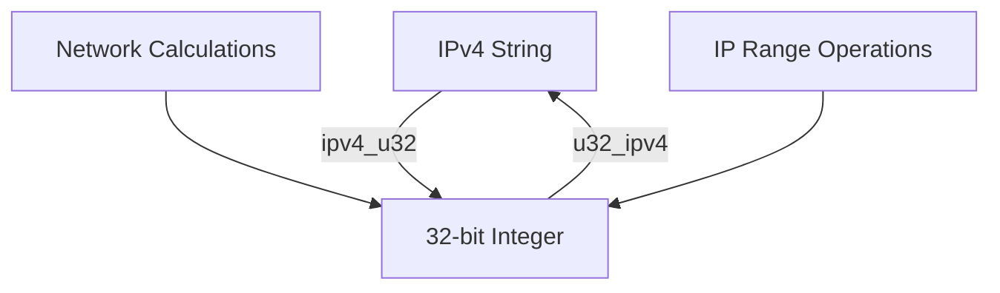
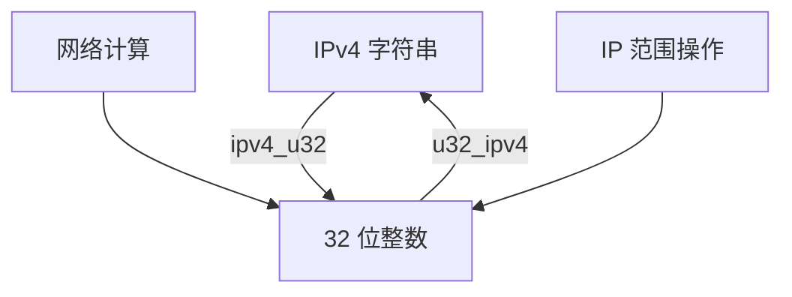

[English](#en) | [中文](#zh)

---

<a id="en"></a>
# @1-/ipv4 : Convert IPv4 addresses to and from 32-bit integers

- [@1-/ipv4 : Convert IPv4 addresses to and from 32-bit integers](#1-ipv4-convert-ipv4-addresses-to-and-from-32-bit-integers)
  - [Functionality](#functionality)
  - [Usage demonstration](#usage-demonstration)
  - [Design rationale](#design-rationale)
  - [Technology stack](#technology-stack)
  - [Code structure](#code-structure)
  - [Historical context](#historical-context)
  - [About](#about)

## Functionality
Convert IPv4 address strings to 32-bit unsigned integers and vice versa. Enables efficient IP address arithmetic, range calculations, and compact storage.

## Usage demonstration
Install the package:
```bash
npm install @1-/ipv4
```

Use in JavaScript modules:
```javascript
import ipv4ToU32 from '@1-/ipv4/ipv4_u32';
import u32ToIpv4 from '@1-/ipv4/u32_ipv4';

// Convert IPv4 string to integer
const ipInt = ipv4ToU32('192.168.1.1'); // 3232235777

// Convert integer back to IPv4 string
const ipStr = u32ToIpv4(3232235777); // '192.168.1.1'

// Perform IP address arithmetic
const networkStart = ipv4ToU32('192.168.0.0');
const networkEnd = ipv4ToU32('192.168.255.255');
const totalAddresses = networkEnd - networkStart + 1; // 65536
```

## Design rationale
The library uses bit manipulation for optimal performance:
- IPv4 string parsing splits by dots and converts each octet
- Bit shifting combines octets into 32-bit integer representation
- Bitwise AND operations extract octets from integer representation
- Uses unsigned right shift (`>>>`) to handle 32-bit integer boundaries correctly



## Technology stack
- JavaScript ES modules
- Node.js runtime
- @3-/int dependency for integer conversion

## Code structure
```
src/
├── ipv4_u32.js    # Converts IPv4 string → 32-bit integer
└── u32_ipv4.js    # Converts 32-bit integer → IPv4 string
```

## Historical context
The IPv4 addressing scheme was standardized in 1981 with RFC 791. Its 32-bit design allowed approximately 4.3 billion unique addresses, which seemed abundant at the time. The conversion between dotted-decimal notation and integer representation became essential for network programming, enabling efficient subnet calculations and routing table implementations. This library implements the fundamental conversion operations that underpin modern network infrastructure.

## About

This library is developed by [WebC.site](https://webc.site).

[WebC.site](https://webc.site): A new paradigm of web development for AI


---

<a id="zh"></a>
# @1-/ipv4 : IPv4 地址与 32 位整数双向转换

- [@1-/ipv4 : IPv4 地址与 32 位整数双向转换](#1-ipv4-ipv4-地址与-32-位整数双向转换)
  - [功能介绍](#功能介绍)
  - [使用演示](#使用演示)
  - [设计思路](#设计思路)
  - [技术栈](#技术栈)
  - [代码结构](#代码结构)
  - [历史故事](#历史故事)
  - [关于](#关于)

## 功能介绍
实现 IPv4 地址字符串与 32 位无符号整数之间的双向转换。支持高效 IP 地址算术运算、范围计算及紧凑存储。

## 使用演示
安装包：
```bash
npm install @1-/ipv4
```

在 JavaScript 模块中使用：
```javascript
import ipv4ToU32 from '@1-/ipv4/ipv4_u32';
import u32ToIpv4 from '@1-/ipv4/u32_ipv4';

// 将 IPv4 字符串转换为整数
const ipInt = ipv4ToU32('192.168.1.1'); // 3232235777

// 将整数转换回 IPv4 字符串
const ipStr = u32ToIpv4(3232235777); // '192.168.1.1'

// 执行 IP 地址算术运算
const networkStart = ipv4ToU32('192.168.0.0');
const networkEnd = ipv4ToU32('192.168.255.255');
const totalAddresses = networkEnd - networkStart + 1; // 65536
```

## 设计思路
库采用位操作实现最优性能：
- IPv4 字符串解析通过点号分割并转换各八位组
- 位移操作将八位组组合为 32 位整数表示
- 位与操作从整数表示中提取八位组
- 使用无符号右移（`>>>`）正确处理 32 位整数边界



## 技术栈
- JavaScript ES 模块
- Node.js 运行时
- @3-/int 依赖项用于整数转换

## 代码结构
```
src/
├── ipv4_u32.js    # IPv4 字符串 → 32 位整数转换
└── u32_ipv4.js    # 32 位整数 → IPv4 字符串转换
```

## 历史故事
IPv4 地址方案于 1981 年 RFC 791 标准化。其 32 位设计可提供约 43 亿个唯一地址，在当时看似充足。IPv4 点分十进制表示法与整数表示法之间的转换成为网络编程基础，支撑子网计算和路由表实现。本库实现了现代网络基础设施所依赖的核心转换操作。

## 关于

本库由 [WebC.site](https://webc.site) 开发。

[WebC.site](https://webc.site) : 面向人工智能的网站开发新范式

