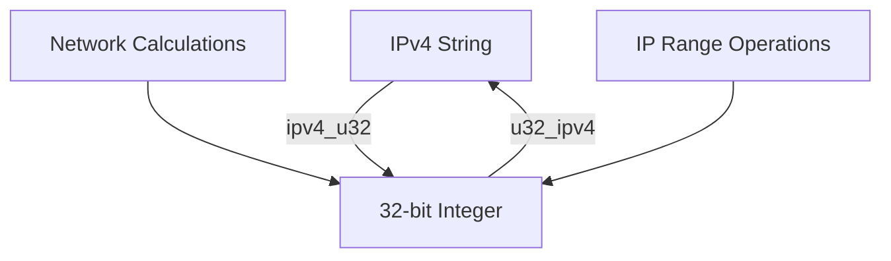

# @1-/ipv4 : Convert IPv4 addresses to and from 32-bit integers

## Functionality
Convert IPv4 address strings to 32-bit unsigned integers and vice versa. Enables efficient IP address arithmetic, range calculations, and compact storage.

## Usage demonstration
Install the package:
```bash
npm install @1-/ipv4
```

Use in JavaScript modules:
```javascript
import ipv4ToU32 from '@1-/ipv4/ipv4_u32';
import u32ToIpv4 from '@1-/ipv4/u32_ipv4';

// Convert IPv4 string to integer
const ipInt = ipv4ToU32('192.168.1.1'); // 3232235777

// Convert integer back to IPv4 string
const ipStr = u32ToIpv4(3232235777); // '192.168.1.1'

// Perform IP address arithmetic
const networkStart = ipv4ToU32('192.168.0.0');
const networkEnd = ipv4ToU32('192.168.255.255');
const totalAddresses = networkEnd - networkStart + 1; // 65536
```

## Design rationale
The library uses bit manipulation for optimal performance:
- IPv4 string parsing splits by dots and converts each octet
- Bit shifting combines octets into 32-bit integer representation
- Bitwise AND operations extract octets from integer representation
- Uses unsigned right shift (`>>>`) to handle 32-bit integer boundaries correctly



## Technology stack
- JavaScript ES modules
- Node.js runtime
- @3-/int dependency for integer conversion

## Code structure
```
src/
├── ipv4_u32.js    # Converts IPv4 string → 32-bit integer
└── u32_ipv4.js    # Converts 32-bit integer → IPv4 string
```

## Historical context
The IPv4 addressing scheme was standardized in 1981 with RFC 791. Its 32-bit design allowed approximately 4.3 billion unique addresses, which seemed abundant at the time. The conversion between dotted-decimal notation and integer representation became essential for network programming, enabling efficient subnet calculations and routing table implementations. This library implements the fundamental conversion operations that underpin modern network infrastructure.