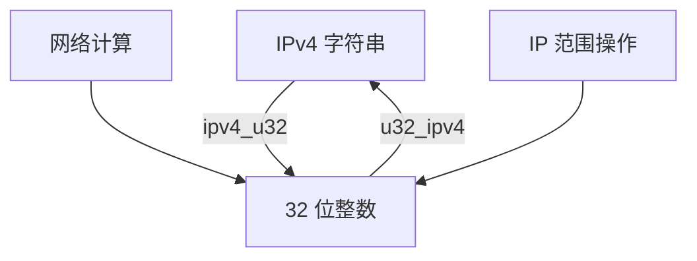

# @1-/ipv4 : IPv4 地址与 32 位整数双向转换

## 功能介绍
实现 IPv4 地址字符串与 32 位无符号整数之间的双向转换。支持高效 IP 地址算术运算、范围计算及紧凑存储。

## 使用演示
安装包：
```bash
npm install @1-/ipv4
```

在 JavaScript 模块中使用：
```javascript
import ipv4ToU32 from '@1-/ipv4/ipv4_u32';
import u32ToIpv4 from '@1-/ipv4/u32_ipv4';

// 将 IPv4 字符串转换为整数
const ipInt = ipv4ToU32('192.168.1.1'); // 3232235777

// 将整数转换回 IPv4 字符串
const ipStr = u32ToIpv4(3232235777); // '192.168.1.1'

// 执行 IP 地址算术运算
const networkStart = ipv4ToU32('192.168.0.0');
const networkEnd = ipv4ToU32('192.168.255.255');
const totalAddresses = networkEnd - networkStart + 1; // 65536
```

## 设计思路
库采用位操作实现最优性能：
- IPv4 字符串解析通过点号分割并转换各八位组
- 位移操作将八位组组合为 32 位整数表示
- 位与操作从整数表示中提取八位组
- 使用无符号右移（`>>>`）正确处理 32 位整数边界



## 技术栈
- JavaScript ES 模块
- Node.js 运行时
- @3-/int 依赖项用于整数转换

## 代码结构
```
src/
├── ipv4_u32.js    # IPv4 字符串 → 32 位整数转换
└── u32_ipv4.js    # 32 位整数 → IPv4 字符串转换
```

## 历史故事
IPv4 地址方案于 1981 年 RFC 791 标准化。其 32 位设计可提供约 43 亿个唯一地址，在当时看似充足。IPv4 点分十进制表示法与整数表示法之间的转换成为网络编程基础，支撑子网计算和路由表实现。本库实现了现代网络基础设施所依赖的核心转换操作。