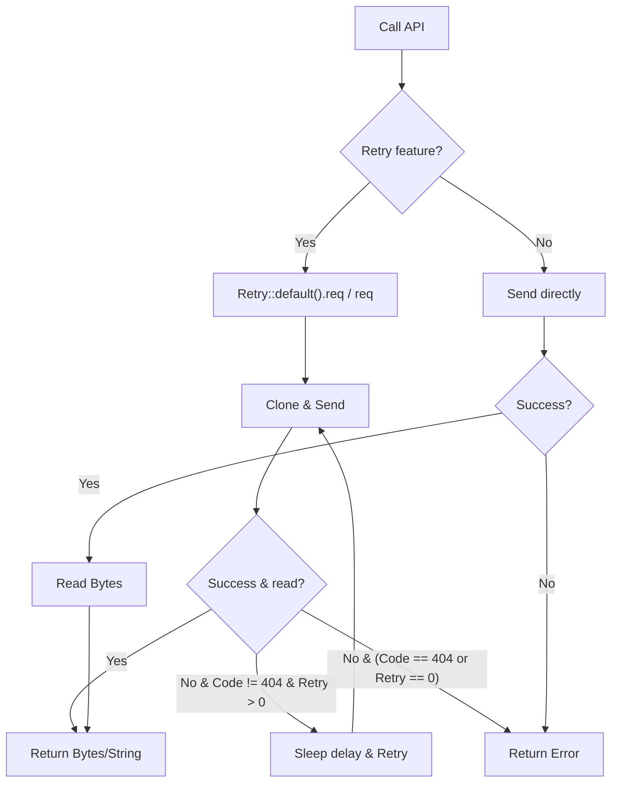
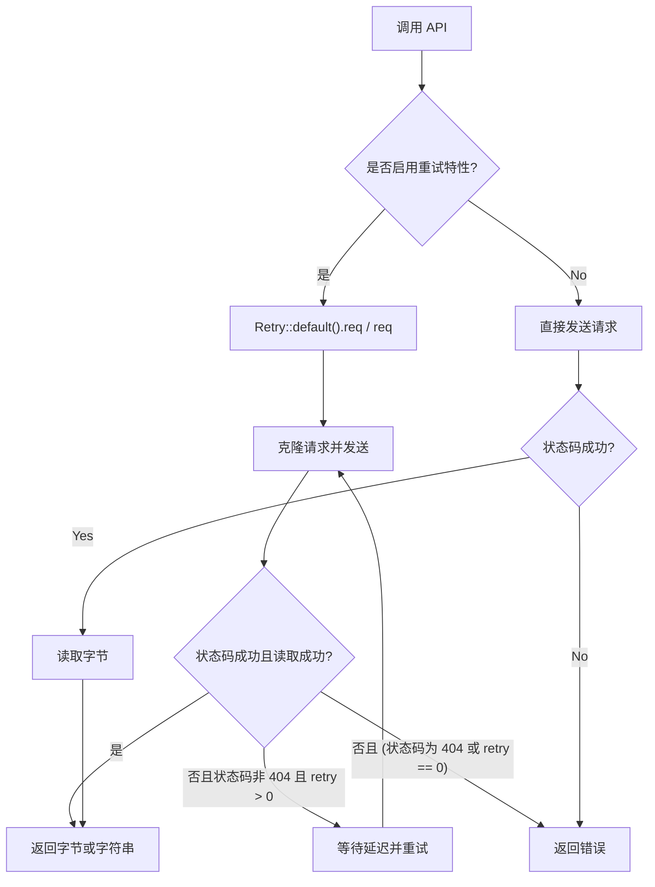

[English](#en) | [中文](#zh)

---

<a id="en"></a>
# ireq : Effortless HTTP requests for Rust

- [ireq : Effortless HTTP requests for Rust](#ireq-effortless-http-requests-for-rust)
  - [Features](#features)
  - [Usage](#usage)
  - [Design](#design)
  - [Tech Stack](#tech-stack)
  - [Directory Structure](#directory-structure)
  - [API Documentation](#api-documentation)
  - [Historical Trivia](#historical-trivia)
  - [About](#about)

## Features

- Global Client Instance: Avoids client creation overhead, maximizes connection reuse.
- Proxy Configuration: Automatically detects `HTTP_PROXY`, `HTTPS_PROXY`, and `ALL_PROXY` environment variables (requires `proxy` feature).
- Auto-Retry: Highly configurable automatic retry policy for transient failures (requires `retry` feature).
- Response Validation: Automatically filters successful status codes, reducing manual error handling.

## Usage

Add dependencies in Cargo.toml:

```toml
[dependencies]
ireq = "0.1"
tokio = { version = "1", features = ["full"] }
```

Example code:

```rust
use ireq::{get, post, Result};

#[tokio::main]
async fn main() -> Result<()> {
  // Send GET request and get string response
  let html = get("https://www.rust-lang.org").await?;
  println!("{}", html);

  // Send POST request with body
  let response = post("https://httpbin.org/post", "hello rust").await?;
  println!("{}", response);

  Ok(())
}
```

With retry configuration:

```rust
#[cfg(feature = "retry")]
{
  use ireq::retry::req;
  use std::time::Duration;
  let req_builder = ireq::REQ.get("https://www.rust-lang.org");
  let html_bytes = req(req_builder, 3, Duration::from_secs(1)).await?;
}
```

## Design



## Tech Stack

- Language: Rust 2024
- HTTP Core: `reqwest 0.13`
- Async Runtime: `tokio 1.52` (dev-dependency)
- Dependencies: `bytes`, `const-str`, `static_init`, `thiserror`, `tokio`

## Directory Structure

```
.
├── Cargo.toml
├── README.mdt
├── src
│   ├── error.rs
│   ├── lib.rs
│   ├── proxy.rs
│   └── retry.rs
└── tests
    └── main.rs
```

## API Documentation

- `Result<T>`: Type alias for `Result<T, Error>`.
- `Error`: Enum representing crate errors.
  - `Status(Box<reqwest::Response>)`: HTTP error status.
  - `Reqwest(reqwest::Error)`: Lower-level network/request error.
- `REQ`: Global static `Client` instance configured with gzip/brotli/zstd support, connection timeout of 9 seconds, and request timeout of 100 seconds.
- `SUCCESS_STATUS`: Constants representing HTTP success status codes.
- `async fn req(req: RequestBuilder) -> Result<Bytes>`: Executes request, automatically validating response status code. Auto-retries if `retry` feature is enabled.
- `async fn getbin(url: impl IntoUrl) -> Result<Bytes>`: Sends GET request, returning response bytes.
- `async fn get(url: impl IntoUrl) -> Result<String>`: Sends GET request, returning response body as String.
- `async fn post(url: impl IntoUrl, body: impl Into<Body>) -> Result<String>`: Sends POST request.
- `async fn put(url: impl IntoUrl, body: impl Into<Body>) -> Result<String>`: Sends PUT request.
- `async fn delete(url: impl IntoUrl, body: impl Into<Body>) -> Result<String>`: Sends DELETE request.
- `async fn patch(url: impl IntoUrl, body: impl Into<Body>) -> Result<String>`: Sends PATCH request.
- `retry` module (enabled via `retry` feature):
  - `Retry`: Struct containing retry configuration.
    - `Retry::new(retry: usize, delay: Duration) -> Self`: Creates instance with custom retry limit and delay.
    - `Retry::default() -> Self`: Creates instance using `IREQ_RETRY` and `IREQ_RETRY_DELAY` environment variables, defaulting to 3 retries and 0ms delay.
    - `req(&self, req: RequestBuilder) -> Result<Bytes>`: Executes request using self configuration.
  - `req(req: RequestBuilder, retry: usize, delay: Duration) -> Result<Bytes>`: Standalone function that executes request overriding retry limit and delay.

## Historical Trivia

**Fun Fact: The Origin of Reqwest**

The name `reqwest` is a playful fusion of `request` (the famous Python library) and the word `west` (as in "Go West"). The creator of `reqwest`, Sean McArthur, designed it to bring the simplicity of Python's `requests` library to the Rust ecosystem. Over time, it became the most widely used HTTP client library in the Rust community. `ireq` inherits this lineage, providing an even simpler, opinionated wrapper for rapid development.


## About

This library is developed by [WebC.site](https://webc.site).

[WebC.site](https://webc.site): A new paradigm of web development for AI


---

<a id="zh"></a>
# ireq : 极简 Rust HTTP 请求库

- [ireq : 极简 Rust HTTP 请求库](#ireq-极简-rust-http-请求库)
  - [特性介绍](#特性介绍)
  - [使用演示](#使用演示)
  - [设计思路](#设计思路)
  - [技术堆栈](#技术堆栈)
  - [Directory Structure](#directory-structure)
  - [API 说明](#api-说明)
  - [历史小故事](#历史小故事)
  - [关于](#关于)

## 特性介绍

- 全局客户端实例：免去重复创建开销，最大化复用连接。
- 代理配置：自动检测 `HTTP_PROXY`、`HTTPS_PROXY`、`ALL_PROXY` 环境变量（需启用 `proxy` 特性）。
- 自动重试：针对临时性故障提供可配置的重试机制（需启用 `retry` 特性）。
- 响应校验：自动过滤成功状态码，减少手动处理逻辑。

## 使用演示

在 Cargo.toml 中添加依赖：

```toml
[dependencies]
ireq = "0.1"
tokio = { version = "1", features = ["full"] }
```

示例代码：

```rust
use ireq::{get, post, Result};

#[tokio::main]
async fn main() -> Result<()> {
  // 发送 GET 请求并获取字符串响应
  let html = get("https://www.rust-lang.org").await?;
  println!("{}", html);

  // 发送带有主体的 POST 请求
  let response = post("https://httpbin.org/post", "hello rust").await?;
  println!("{}", response);

  Ok(())
}
```

启用重试配置：

```rust
#[cfg(feature = "retry")]
{
  use ireq::retry::req;
  use std::time::Duration;
  let req_builder = ireq::REQ.get("https://www.rust-lang.org");
  let html_bytes = req(req_builder, 3, Duration::from_secs(1)).await?;
}
```

## 设计思路



## 技术堆栈

- 开发语言：Rust 2024
- 核心网络库：`reqwest 0.13`
- 异步运行时：`tokio 1.52` (开发依赖)
- 关键依赖：`bytes`, `const-str`, `static_init`, `thiserror`, `tokio`

## Directory Structure

```
.
├── Cargo.toml
├── README.mdt
├── src
│   ├── error.rs
│   ├── lib.rs
│   ├── proxy.rs
│   └── retry.rs
└── tests
    └── main.rs
```

## API 说明

- `Result<T>`: `Result<T, Error>` 的类型别名。
- `Error`: 错误枚举。
  - `Status(Box<reqwest::Response>)`: HTTP 异常状态码错误。
  - `Reqwest(reqwest::Error)`: 底层网络及请求错误。
- `REQ`: 全局静态 `Client` 实例，默认开启 gzip/brotli/zstd，连接超时 9 秒，请求超时 100 秒。
- `SUCCESS_STATUS`: 成功状态码数组。
- `async fn req(req: RequestBuilder) -> Result<Bytes>`: 发送 HTTP 请求并校验状态码。启用 `retry` 特性时会自动重试。
- `async fn getbin(url: impl IntoUrl) -> Result<Bytes>`: 发送 GET 请求并返回字节。
- `async fn get(url: impl IntoUrl) -> Result<String>`: 发送 GET 请求并返回字符串。
- `async fn post(url: impl IntoUrl, body: impl Into<Body>) -> Result<String>`: 发送 POST 请求。
- `async fn put(url: impl IntoUrl, body: impl Into<Body>) -> Result<String>`: 发送 PUT 请求。
- `async fn delete(url: impl IntoUrl, body: impl Into<Body>) -> Result<String>`: 发送 DELETE 请求。
- `async fn patch(url: impl IntoUrl, body: impl Into<Body>) -> Result<String>`: 发送 PATCH 请求。
- `retry` 模块（启用 `retry` 特性时可用）：
  - `Retry`: 包含重试配置的结构体。
    - `Retry::new(retry: usize, delay: Duration) -> Self`: 创建指定重试次数限制与延迟的实例。
    - `Retry::default() -> Self`: 创建读取 `IREQ_RETRY` 与 `IREQ_RETRY_DELAY` 环境变量的实例，默认重试次数为 3，延迟为 0 毫秒。
    - `req(&self, req: RequestBuilder) -> Result<Bytes>`: 使用当前配置执行请求。
  - `req(req: RequestBuilder, retry: usize, delay: Duration) -> Result<Bytes>`: 独立函数，指定重试限制与延迟执行请求。

## 历史小故事

**技术趣闻：Reqwest 的诞生**

`reqwest` 的命名源于 Python 著名库 `requests` 与 “西（west）” 的谐音组合。作者 Sean McArthur 旨在为 Rust 生态系统带来如 Python `requests` 般简单易用的 HTTP 客户端体验。时至今日，它已成为 Rust 社区中使用最广泛的 HTTP 库。而 `ireq` 则是在此基础上的进一步精简包装，专为敏捷开发设计。


## 关于

本库由 [WebC.site](https://webc.site) 开发。

[WebC.site](https://webc.site) : 面向人工智能的网站开发新范式

