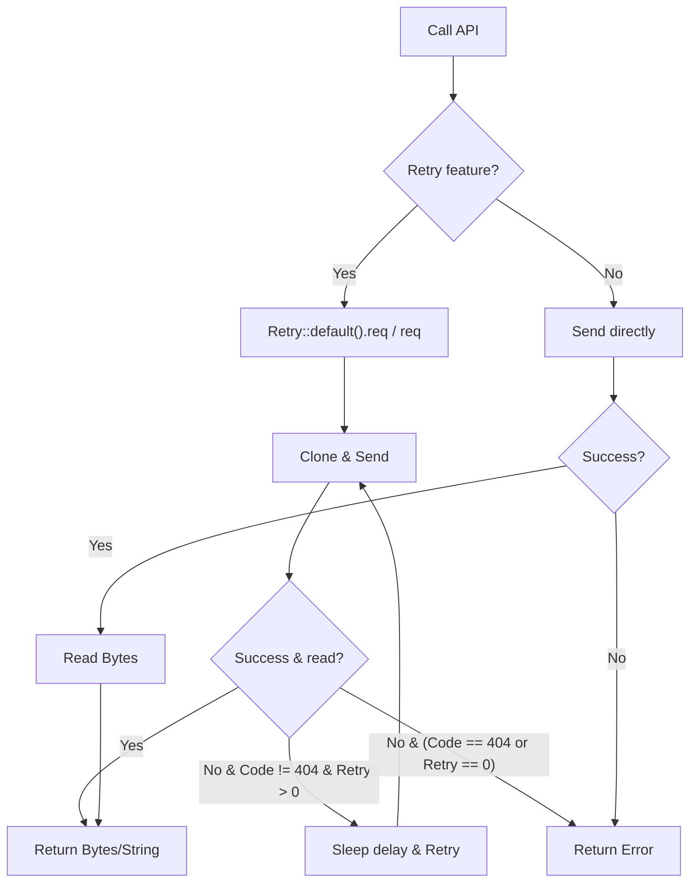

# ireq : Effortless HTTP requests for Rust

## Features

- Global Client Instance: Avoids client creation overhead, maximizes connection reuse.
- Proxy Configuration: Automatically detects `HTTP_PROXY`, `HTTPS_PROXY`, and `ALL_PROXY` environment variables (requires `proxy` feature).
- Auto-Retry: Highly configurable automatic retry policy for transient failures (requires `retry` feature).
- Response Validation: Automatically filters successful status codes, reducing manual error handling.

## Usage

Add dependencies in Cargo.toml:

```toml
[dependencies]
ireq = "0.1"
tokio = { version = "1", features = ["full"] }
```

Example code:

```rust
use ireq::{get, post, Result};

#[tokio::main]
async fn main() -> Result<()> {
  // Send GET request and get string response
  let html = get("https://www.rust-lang.org").await?;
  println!("{}", html);

  // Send POST request with body
  let response = post("https://httpbin.org/post", "hello rust").await?;
  println!("{}", response);

  Ok(())
}
```

With retry configuration:

```rust
#[cfg(feature = "retry")]
{
  use ireq::retry::req;
  use std::time::Duration;
  let req_builder = ireq::REQ.get("https://www.rust-lang.org");
  let html_bytes = req(req_builder, 3, Duration::from_secs(1)).await?;
}
```

## Design



## Tech Stack

- Language: Rust 2024
- HTTP Core: `reqwest 0.13`
- Async Runtime: `tokio 1.52` (dev-dependency)
- Dependencies: `bytes`, `const-str`, `static_init`, `thiserror`, `tokio`

## Directory Structure

```
.
├── Cargo.toml
├── README.mdt
├── src
│   ├── error.rs
│   ├── lib.rs
│   ├── proxy.rs
│   └── retry.rs
└── tests
    └── main.rs
```

## API Documentation

- `Result<T>`: Type alias for `Result<T, Error>`.
- `Error`: Enum representing crate errors.
  - `Status(Box<reqwest::Response>)`: HTTP error status.
  - `Reqwest(reqwest::Error)`: Lower-level network/request error.
- `REQ`: Global static `Client` instance configured with gzip/brotli/zstd support, connection timeout of 9 seconds, and request timeout of 100 seconds.
- `SUCCESS_STATUS`: Constants representing HTTP success status codes.
- `async fn req(req: RequestBuilder) -> Result<Bytes>`: Executes request, automatically validating response status code. Auto-retries if `retry` feature is enabled.
- `async fn getbin(url: impl IntoUrl) -> Result<Bytes>`: Sends GET request, returning response bytes.
- `async fn get(url: impl IntoUrl) -> Result<String>`: Sends GET request, returning response body as String.
- `async fn post(url: impl IntoUrl, body: impl Into<Body>) -> Result<String>`: Sends POST request.
- `async fn put(url: impl IntoUrl, body: impl Into<Body>) -> Result<String>`: Sends PUT request.
- `async fn delete(url: impl IntoUrl, body: impl Into<Body>) -> Result<String>`: Sends DELETE request.
- `async fn patch(url: impl IntoUrl, body: impl Into<Body>) -> Result<String>`: Sends PATCH request.
- `retry` module (enabled via `retry` feature):
  - `Retry`: Struct containing retry configuration.
    - `Retry::new(retry: usize, delay: Duration) -> Self`: Creates instance with custom retry limit and delay.
    - `Retry::default() -> Self`: Creates instance using `IREQ_RETRY` and `IREQ_RETRY_DELAY` environment variables, defaulting to 3 retries and 0ms delay.
    - `req(&self, req: RequestBuilder) -> Result<Bytes>`: Executes request using self configuration.
  - `req(req: RequestBuilder, retry: usize, delay: Duration) -> Result<Bytes>`: Standalone function that executes request overriding retry limit and delay.

## Historical Trivia

**Fun Fact: The Origin of Reqwest**

The name `reqwest` is a playful fusion of `request` (the famous Python library) and the word `west` (as in "Go West"). The creator of `reqwest`, Sean McArthur, designed it to bring the simplicity of Python's `requests` library to the Rust ecosystem. Over time, it became the most widely used HTTP client library in the Rust community. `ireq` inherits this lineage, providing an even simpler, opinionated wrapper for rapid development.
