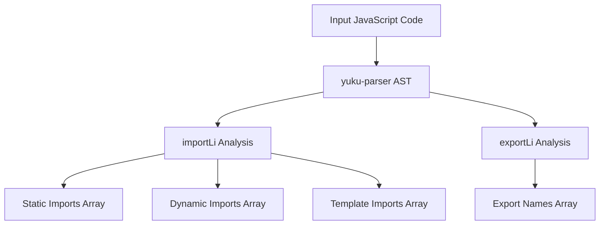
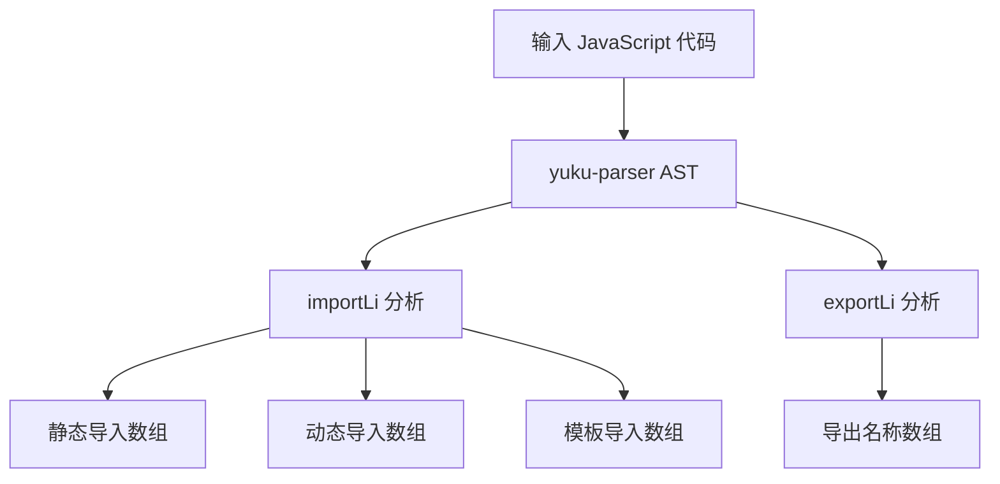

[English](#en) | [中文](#zh)

---

<a id="en"></a>
# @1-/jsparser : JavaScript module dependency analyzer

- [@1-/jsparser : JavaScript module dependency analyzer](#1-jsparser-javascript-module-dependency-analyzer)
  - [Functionality](#functionality)
  - [Usage demonstration](#usage-demonstration)
  - [Design approach](#design-approach)
  - [Technology stack](#technology-stack)
  - [Code structure](#code-structure)
  - [Historical background](#historical-background)
  - [About](#about)

## Functionality

Static analysis of JavaScript modules to precisely identify import and export declarations. Uses AST parsing technology to support static imports, dynamic imports (including template literals), default exports, named exports, destructuring exports, and namespace exports without executing code.

## Usage demonstration

Install as npm package:

```bash
npm install @1-/jsparser
```

Use in JavaScript:

```javascript
import importLi from '@1-/jsparser/importLi.js';
import exportLi from '@1-/jsparser/exportLi.js';

// Analyze imports in code string
const [staticImports, dynamicImports, templateImports] = importLi(`
  import a from 'a-module';
  import { b } from 'b-module';
  export { c } from 'c-module';
  export * from 'd-module';
  import('e-module');
  import(`f-module`);
  import(`g-module-${x}`);
`);
// Returns: [['a-module', 'b-module', 'c-module', 'd-module'], ['e-module', 'f-module'], [['g-module-', '']]]

// Analyze exports in file or code string
const exportNames = exportLi('./src/module.js');
// Or analyze code string directly
const exportNames2 = exportLi(`
  export default 123;
  export const a = 1, [b, c] = x;
  export const { d, e: f } = y;
  export function func() {}
  export class Cls {}
  export { u, v as w };
  export * as ns from 'mod';
  export * from 'mod2';
`);
// Returns: ['default', 'a', 'b', 'c', 'd', 'f', 'func', 'Cls', 'u', 'w', 'ns']
```

## Design approach

The library implements recursive AST traversal based on yuku-parser's output. The `importLi` function identifies `ImportDeclaration`, `ExportNamedDeclaration`, `ExportAllDeclaration`, and `ImportExpression` nodes, extracting module names from literals and simple template literals. The `exportLi` function recursively parses AST nodes to extract identifiers from `ExportDefaultDeclaration`, `ExportNamedDeclaration`, and `ExportAllDeclaration`, supporting destructuring, renamed exports, and namespace exports.



## Technology stack

- yuku-parser: High-performance JavaScript/TypeScript AST parser (native bindings)
- @3-/is_obj: Lightweight object type checking
- @3-/read: Simple file reading utility
- Node.js built-in filesystem APIs

## Code structure

```
src/
├── importLi.js    # AST-based import analysis, returns static, dynamic and template import module name arrays
├── exportLi.js    # AST-based export analysis, returns export names array (including 'default')
```

## Historical background

Module dependency analysis emerged with ES6 modules in 2015. Early tools like webpack needed accurate dependency graphs for bundling. Modern parsers like acorn and babel evolved to support this analysis, enabling sophisticated build tools and static analysis utilities. This library represents a lightweight, focused approach to dependency analysis using modern parser technology, with special optimization for complex export patterns.


## About

This library is developed by [WebC.site](https://webc.site).

[WebC.site](https://webc.site): A new paradigm of web development for AI


---

<a id="zh"></a>
# @1-/jsparser : JavaScript 模块依赖分析器

- [@1-/jsparser : JavaScript 模块依赖分析器](#1-jsparser-javascript-模块依赖分析器)
  - [功能介绍](#功能介绍)
  - [使用演示](#使用演示)
  - [设计思路](#设计思路)
  - [技术栈](#技术栈)
  - [代码结构](#代码结构)
  - [历史故事](#历史故事)
  - [关于](#关于)

## 功能介绍

静态分析 JavaScript 模块以精确识别导入和导出声明。采用 AST 解析技术，支持静态导入、动态导入（含模板字面量）、默认导出、命名导出、解构导出、命名空间导出，无需执行代码。

## 使用演示

作为 npm 包安装：

```bash
npm install @1-/jsparser
```

在 JavaScript 中使用：

```javascript
import importLi from '@1-/jsparser/importLi.js';
import exportLi from '@1-/jsparser/exportLi.js';

// 分析代码字符串中的导入
const [静态导入, 动态导入, 模板导入] = importLi(`
  import a from 'a-module';
  import { b } from 'b-module';
  export { c } from 'c-module';
  export * from 'd-module';
  import('e-module');
  import(`f-module`);
  import(`g-module-${x}`);
`);
// 返回: [['a-module', 'b-module', 'c-module', 'd-module'], ['e-module', 'f-module'], [['g-module-', '']]]

// 分析文件或代码字符串中的导出
const 导出名称列表 = exportLi('./src/module.js');
// 或直接分析代码字符串
const 导出名称列表2 = exportLi(`
  export default 123;
  export const a = 1, [b, c] = x;
  export const { d, e: f } = y;
  export function func() {}
  export class Cls {}
  export { u, v as w };
  export * as ns from 'mod';
  export * from 'mod2';
`);
// 返回: ['default', 'a', 'b', 'c', 'd', 'f', 'func', 'Cls', 'u', 'w', 'ns']
```

## 设计思路

该库基于 yuku-parser 的 AST 输出实现递归遍历。`importLi` 函数识别 `ImportDeclaration`、`ExportNamedDeclaration`、`ExportAllDeclaration` 和 `ImportExpression` 节点，从字面量和简单模板字面量中提取模块名称。`exportLi` 函数通过深度遍历 AST 节点，提取 `ExportDefaultDeclaration`、`ExportNamedDeclaration`、`ExportAllDeclaration` 中的导出标识符，支持解构赋值、重命名导出、命名空间导出等复杂语法。



## 技术栈

- yuku-parser：高性能 JavaScript/TypeScript AST 解析器（原生绑定）
- @3-/is_obj：轻量级对象类型检查工具
- @3-/read：简单文件读取工具
- Node.js 内置文件系统 API

## 代码结构

```
src/
├── importLi.js    # 基于 AST 遍历分析导入声明，返回静态导入、动态导入和模板导入模块名数组
├── exportLi.js    # 基于 AST 深度遍历分析导出声明，返回导出名称数组（含 'default'）
```

## 历史故事

模块依赖分析随着 ES6 模块标准在 2015 年推出而兴起。早期构建工具如 webpack 需要精确的依赖图进行打包。现代解析器如 acorn 和 babel 不断演进以支持此类分析，推动了高级构建工具和静态分析工具的发展。本库代表了一种轻量级、专注的依赖分析方法，采用现代解析器技术，特别优化了对复杂导出模式的支持。


## 关于

本库由 [WebC.site](https://webc.site) 开发。

[WebC.site](https://webc.site) : 面向人工智能的网站开发新范式

