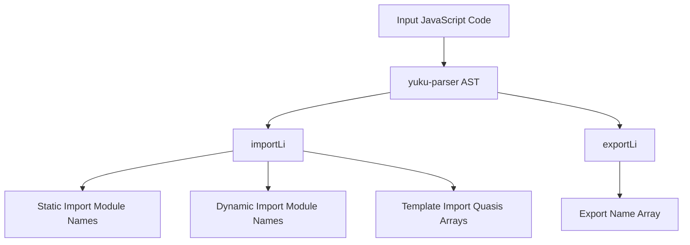

# @1-/jsparser : JavaScript Module Dependency Static Analyzer

## Functionality

Precisely identifies import and export declarations in JavaScript modules without code execution. Supports static imports, dynamic imports (including interpolation-free template literals), interpolated dynamic template imports, default exports, named exports, destructuring exports, renamed exports, and namespace exports (`export * as ns`).

## Usage demonstration

Install as an npm package:

```bash
npm install @1-/jsparser
```

Use in JavaScript:

```javascript
import importLi from '@1-/jsparser/importLi.js';
import exportLi from '@1-/jsparser/exportLi.js';

// Analyze imports in a code string
const [staticImports, dynamicImports, templateImports] = importLi(`
  import a from 'a-module';
  import { b } from 'b-module';
  export { c } from 'c-module';
  export * from 'd-module';
  import('e-module');
  import(`f-module`);
  import(`g-module-${x}`);
`);
// Returns: [['a-module', 'b-module', 'c-module', 'd-module'], ['e-module', 'f-module'], [['g-module-', '']]]

// Analyze exports in a file (path-only)
const exportNames = exportLi('./src/module.js');
// Returns undefined if file does not exist
```

## Design approach

Performs deep AST traversal using `yuku-parser`. `importLi` extracts module specifiers from `ImportDeclaration` (static imports), `ExportNamedDeclaration` and `ExportAllDeclaration` (static re-exports), and `ImportExpression` (dynamic imports); for template literals, interpolation-free ones go to `dynamicImports`, while interpolated ones go to `templateImports` as arrays of cooked quasis. `exportLi` traverses `ExportDefaultDeclaration` (`default`), `ExportNamedDeclaration` (identifiers from declarations and renamed specifiers), and `ExportAllDeclaration` (namespace name).



## Technology stack

- yuku-parser: JavaScript/TypeScript AST parser (no build config or type definitions)
- @3-/is_obj: Object type checking utility
- @3-/read: File reading utility
- Node.js built-in modules

## Code structure

```
src/
├── importLi.js    # Import analysis: returns [static, dynamic, template] triple
└── exportLi.js    # Export analysis: accepts file path, returns export name array (including 'default') or undefined
```

This library consists of exactly two plain JavaScript files — no abstractions, no extra dependencies, no type declarations.

## Historical background

The ES6 module standard was finalized in 2015, creating a strong demand for static dependency graphs. Build tools like webpack rely on precise import relationships for code splitting and tree-shaking. Modern parsers continue to evolve to support increasingly complex syntax, and this library adopts a lightweight design focused on reliably extracting inter-module references.