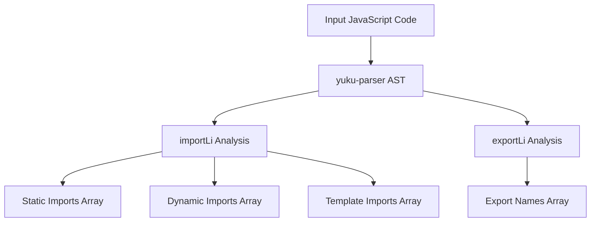

# @1-/jsparser : JavaScript module dependency analyzer

## Functionality

Static analysis of JavaScript modules to precisely identify import and export declarations. Uses AST parsing technology to support static imports, dynamic imports (including template literals), default exports, named exports, destructuring exports, and namespace exports without executing code.

## Usage demonstration

Install as npm package:

```bash
npm install @1-/jsparser
```

Use in JavaScript:

```javascript
import importLi from '@1-/jsparser/importLi.js';
import exportLi from '@1-/jsparser/exportLi.js';

// Analyze imports in code string
const [staticImports, dynamicImports, templateImports] = importLi(`
  import a from 'a-module';
  import { b } from 'b-module';
  export { c } from 'c-module';
  export * from 'd-module';
  import('e-module');
  import(`f-module`);
  import(`g-module-${x}`);
`);
// Returns: [['a-module', 'b-module', 'c-module', 'd-module'], ['e-module', 'f-module'], [['g-module-', '']]]

// Analyze exports in file or code string
const exportNames = exportLi('./src/module.js');
// Or analyze code string directly
const exportNames2 = exportLi(`
  export default 123;
  export const a = 1, [b, c] = x;
  export const { d, e: f } = y;
  export function func() {}
  export class Cls {}
  export { u, v as w };
  export * as ns from 'mod';
  export * from 'mod2';
`);
// Returns: ['default', 'a', 'b', 'c', 'd', 'f', 'func', 'Cls', 'u', 'w', 'ns']
```

## Design approach

The library implements recursive AST traversal based on yuku-parser's output. The `importLi` function identifies `ImportDeclaration`, `ExportNamedDeclaration`, `ExportAllDeclaration`, and `ImportExpression` nodes, extracting module names from literals and simple template literals. The `exportLi` function recursively parses AST nodes to extract identifiers from `ExportDefaultDeclaration`, `ExportNamedDeclaration`, and `ExportAllDeclaration`, supporting destructuring, renamed exports, and namespace exports.



## Technology stack

- yuku-parser: High-performance JavaScript/TypeScript AST parser (native bindings)
- @3-/is_obj: Lightweight object type checking
- @3-/read: Simple file reading utility
- Node.js built-in filesystem APIs

## Code structure

```
src/
├── importLi.js    # AST-based import analysis, returns static, dynamic and template import module name arrays
├── exportLi.js    # AST-based export analysis, returns export names array (including 'default')
```

## Historical background

Module dependency analysis emerged with ES6 modules in 2015. Early tools like webpack needed accurate dependency graphs for bundling. Modern parsers like acorn and babel evolved to support this analysis, enabling sophisticated build tools and static analysis utilities. This library represents a lightweight, focused approach to dependency analysis using modern parser technology, with special optimization for complex export patterns.