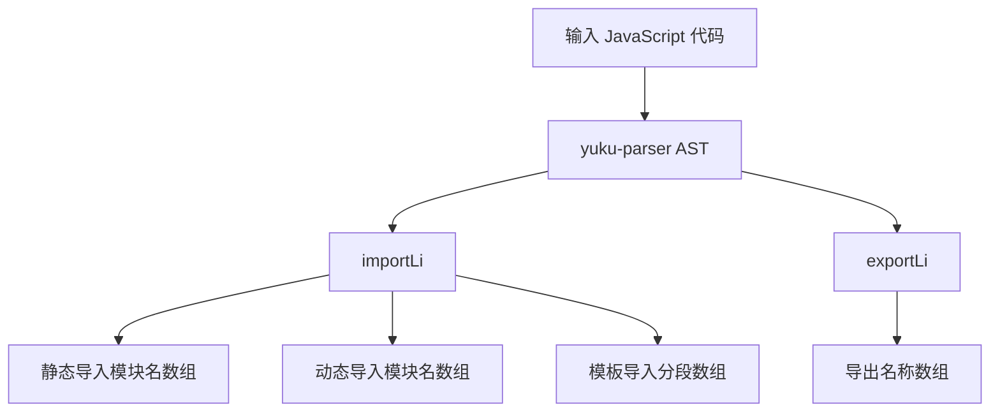

# @1-/jsparser : JavaScript 模块依赖静态分析器

## 功能介绍

精确识别 JavaScript 模块中的导入与导出声明，无需执行代码。支持静态导入、动态导入（含无插值模板字面量）、带插值的动态模板导入、默认导出、命名导出、解构导出、重命名导出、命名空间导出（`export * as ns`）。

## 使用演示

安装为 npm 包：

```bash
npm install @1-/jsparser
```

在 JavaScript 中使用：

```javascript
import importLi from '@1-/jsparser/importLi.js';
import exportLi from '@1-/jsparser/exportLi.js';

// 分析代码字符串中的导入
const [静态导入, 动态导入, 模板导入] = importLi(`
  import a from 'a-module';
  import { b } from 'b-module';
  export { c } from 'c-module';
  export * from 'd-module';
  import('e-module');
  import(`f-module`);
  import(`g-module-${x}`);
`);
// 返回: [['a-module', 'b-module', 'c-module', 'd-module'], ['e-module', 'f-module'], [['g-module-', '']]]

// 分析文件中的导出（仅接受文件路径）
const 导出名称列表 = exportLi('./src/module.js');
// 若文件不存在，返回 undefined
```

## 设计思路

基于 `yuku-parser` 生成的 AST 进行深度遍历。`importLi` 提取 `ImportDeclaration`（静态导入）、`ExportNamedDeclaration` 和 `ExportAllDeclaration`（静态 re-export）、`ImportExpression`（动态导入）节点中的模块源字符串；对模板字面量，区分无插值（归入动态导入）与含插值（归入模板导入）。`exportLi` 遍历导出节点，提取 `ExportDefaultDeclaration`（`default`）、`ExportNamedDeclaration`（声明体中的标识符及 `specifiers` 中的重命名名）、`ExportAllDeclaration`（命名空间名）。



## 技术栈

- yuku-parser：JavaScript/TypeScript AST 解析器（无构建配置或类型定义）
- @3-/is_obj：对象类型检查工具
- @3-/read：文件读取工具
- Node.js 内置模块

## 代码结构

```
src/
├── importLi.js    # 导入分析：返回 [静态导入, 动态导入, 模板导入] 三元组
└── exportLi.js    # 导出分析：接收文件路径，返回导出名称数组（含 'default'）或 undefined
```

本库由两个纯 JavaScript 文件构成，无抽象层、无额外依赖、无类型声明。

## 历史故事

ES6 模块标准于 2015 年正式确立，催生了对静态依赖图的刚性需求。构建工具如 webpack 依赖精确的导入关系实现代码分割与摇树优化。现代解析器持续演进以支撑更复杂的语法，本库采用轻量设计，专注解决模块间引用关系的可靠提取问题。