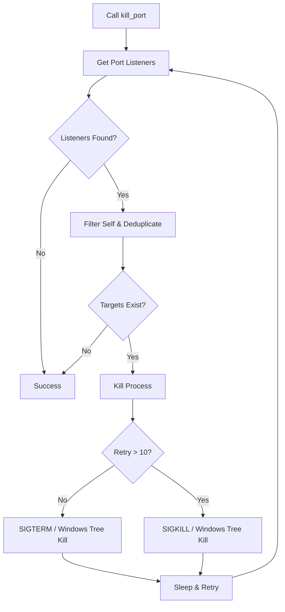
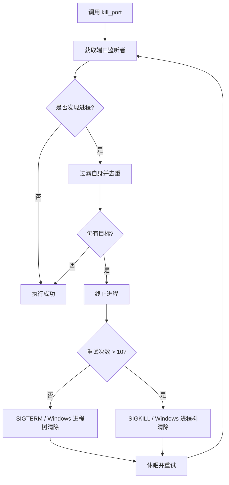

[English](#en) | [中文](#zh)

---

<a id="en"></a>

# kill_port : Terminate processes by port cross-platform

- [kill_port : Terminate processes by port cross-platform](#kill_port-terminate-processes-by-port-cross-platform)
  - [Usage](#usage)
  - [Features](#features)
  - [Design](#design)
  - [Tech Stack](#tech-stack)
  - [Project Structure](#project-structure)
  - [API](#api)
    - [`kill_port::kill_port`](#kill_portkill_port)
  - [History of Process Termination](#history-of-process-termination)
  - [About](#about)

Cross-platform utility to locate and terminate processes binding specified network ports. Designed for reliability and speed in development and automation workflows. Features dynamic PID deduplication.

## Usage

For runnable integration tests, refer to `tests/`.

```rust
use kill_port::kill_port;

fn main() -> std::io::Result<()> {
  // Terminate all processes listening on port 8080
  kill_port(8080)?;
  Ok(())
}
```

## Features

- **Robust PID Deduplication**: Uses a dynamically resized list for process deduplication, handling an arbitrary number of listeners without capacity limits.
- **Graceful Escalation**: Sends `SIGTERM` initially on Unix systems, upgrading to `SIGKILL` after 10 attempts. Executes process tree termination on Windows.
- **Self Exclusion**: Excludes the current process PID automatically to prevent self-termination.

## Design

1. **Discovery**: Queries active network listeners using the `listeners` crate.
2. **Filtering**: Deduplicates process PIDs using a dynamic list, filtering out the host PID.
3. **Termination**: Issues platform-specific termination commands.
4. **Verification**: Checks port status iteratively, waiting between retries.



## Tech Stack

- **Rust**: System programming language (Edition 2024).
- **listeners**: Cross-platform port listener query.
- **nix**: Unix signal management.
- **kill_tree**: Windows process tree deletion.
- **log**: Event diagnostics.

## Project Structure

```text
kill_port/
├── src/
│   ├── lib.rs       # Main entry
│   └── os/          # OS-specific backend
├── tests/
│   └── main.rs      # Integration tests
└── Cargo.toml       # Manifest
```

## API

### `kill_port::kill_port`

```rust
pub fn kill_port(port: u16) -> std::io::Result<()>
```

Locates and terminates processes binding the specified port.

- **Parameters**: `port` (u16) - Target port number.
- **Returns**: `std::io::Result<()>` - Ok if target port is cleared.

## History of Process Termination

The concept of process termination traces back to early Unix. The `kill` command was not designed strictly as an executor, but rather as a generalized signaler. `SIGKILL` (Signal 9) acts as an unblockable, uncatchable command that forces the kernel to destroy the process immediately, contrasting with `SIGTERM` (Signal 15) which gently requests exit.

Web developer environments frequently experience port collisions (`EADDRINUSE`) due to orphan development servers. Automated tools like `kill_port` eliminate manual lookup workflows by packing system signal logic into a single command.

## About

This library is developed by [WebC.site](https://webc.site).

[WebC.site](https://webc.site): A new paradigm of web development for AI

---

<a id="zh"></a>

# kill_port : 跨平台高效终止端口进程工具

- [kill_port : 跨平台高效终止端口进程工具](#kill_port-跨平台高效终止端口进程工具)
  - [使用演示](#使用演示)
  - [特性介绍](#特性介绍)
  - [设计思路](#设计思路)
  - [技术栈](#技术栈)
  - [目录结构](#目录结构)
  - [API 说明](#api-说明)
    - [`kill_port::kill_port`](#kill_portkill_port)
  - [历史小故事](#历史小故事)
  - [关于](#关于)

跨平台端口进程终止工具。定位并清除绑定指定端口的进程，保障开发与自动化工作流顺畅。提供安全可靠的进程去重设计。

## 使用演示

完整演示代码请参考 `tests/`。

```rust
use kill_port::kill_port;

fn main() -> std::io::Result<()> {
  // 终止占用 8080 端口的进程
  kill_port(8080)?;
  Ok(())
}
```

## 特性介绍

- **高效进程去重**：采用动态列表进行 PID 去重，消除固定大小数组的容量限制，支持任意数量监听进程的去重。
- **渐进式信号升级**：Unix 系统下优先发送 `SIGTERM`（优雅退出），重试 10 次无效后升级为 `SIGKILL`（强制杀死）。Windows 系统下直接执行进程树清除。
- **自我保护机制**：自动识别并排除当前调用进程 PID，防止进程自杀。

## 设计思路

1. **发现**: 通过 `listeners` 库获取目标端口的监听器。
2. **过滤**: 对进程 PID 进行去重并过滤掉调用进程的 PID。
3. **清除**: 视操作系统执行信号发送（Unix）或进程树杀死（Windows）。
4. **重试**: 若仍有残留进程，则休眠并重新获取状态，直至端口完全释放。



## 技术栈

- **Rust**: 开发语言 (Edition 2024)。
- **listeners**: 跨平台监听端口探测。
- **nix**: Unix 信号管理。
- **kill_tree**: Windows 进程树强制退出。
- **log**: 日志输出。

## 目录结构

```text
kill_port/
├── src/
│   ├── lib.rs       # 核心导出
│   └── os/          # 平台相关底层实现
├── tests/
│   └── main.rs      # 集成测试
└── Cargo.toml       # 项目清单
```

## API 说明

### `kill_port::kill_port`

```rust
pub fn kill_port(port: u16) -> std::io::Result<()>
```

定位并终止监听指定端口的进程。

- **参数**: `port` (u16) - 网络端口号。
- **返回值**: `std::io::Result<()>` - 执行结果。

## 历史小故事

“Kill”（杀死）一词最初源自 Multics 操作系统与早期的 Unix。虽然名字听起来充斥着毁灭感，但 `kill` 命令的设计初衷实则是传递“信号（Signal）”。`SIGKILL` (Signal 9) 作为系统内核的终极指令，无法被进程捕获、阻塞或忽略，因此能做到立竿见影的彻底查杀；而 `SIGTERM` (Signal 15) 则是请求进程自我清理后退出。

在当今开发环境中，由于热重载服务泛滥，僵尸开发进程强占端口（`EADDRINUSE`）屡见不鲜。以往手动使用 `lsof` 和 `kill -9` 的繁琐仪式，如今已由 `kill_port` 这种工具自动化接管，将底层的信号量控制逻辑妥善隐藏于精简的 API 之下。

## 关于

本库由 [WebC.site](https://webc.site) 开发。

[WebC.site](https://webc.site) : 面向人工智能的网站开发新范式
