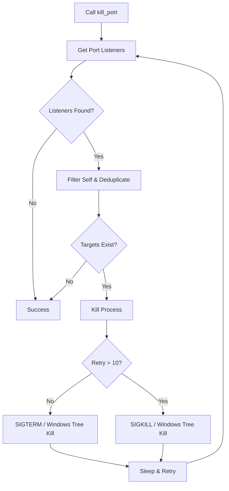

# kill_port : Terminate processes by port cross-platform

Cross-platform utility to locate and terminate processes binding specified network ports. Designed for reliability and speed in development and automation workflows. Features dynamic PID deduplication.

## Usage

For runnable integration tests, refer to `tests/`.

```rust
use kill_port::kill_port;

fn main() -> std::io::Result<()> {
  // Terminate all processes listening on port 8080
  kill_port(8080)?;
  Ok(())
}
```

## Features

- **Robust PID Deduplication**: Uses a dynamically resized list for process deduplication, handling an arbitrary number of listeners without capacity limits.
- **Graceful Escalation**: Sends `SIGTERM` initially on Unix systems, upgrading to `SIGKILL` after 10 attempts. Executes process tree termination on Windows.
- **Self Exclusion**: Excludes the current process PID automatically to prevent self-termination.

## Design

1. **Discovery**: Queries active network listeners using the `listeners` crate.
2. **Filtering**: Deduplicates process PIDs using a dynamic list, filtering out the host PID.
3. **Termination**: Issues platform-specific termination commands.
4. **Verification**: Checks port status iteratively, waiting between retries.



## Tech Stack

- **Rust**: System programming language (Edition 2024).
- **listeners**: Cross-platform port listener query.
- **nix**: Unix signal management.
- **kill_tree**: Windows process tree deletion.
- **log**: Event diagnostics.

## Project Structure

```text
kill_port/
├── src/
│   ├── lib.rs       # Main entry
│   └── os/          # OS-specific backend
├── tests/
│   └── main.rs      # Integration tests
└── Cargo.toml       # Manifest
```

## API

### `kill_port::kill_port`

```rust
pub fn kill_port(port: u16) -> std::io::Result<()>
```

Locates and terminates processes binding the specified port.

- **Parameters**: `port` (u16) - Target port number.
- **Returns**: `std::io::Result<()>` - Ok if target port is cleared.

## History of Process Termination

The concept of process termination traces back to early Unix. The `kill` command was not designed strictly as an executor, but rather as a generalized signaler. `SIGKILL` (Signal 9) acts as an unblockable, uncatchable command that forces the kernel to destroy the process immediately, contrasting with `SIGTERM` (Signal 15) which gently requests exit.

Web developer environments frequently experience port collisions (`EADDRINUSE`) due to orphan development servers. Automated tools like `kill_port` eliminate manual lookup workflows by packing system signal logic into a single command.
