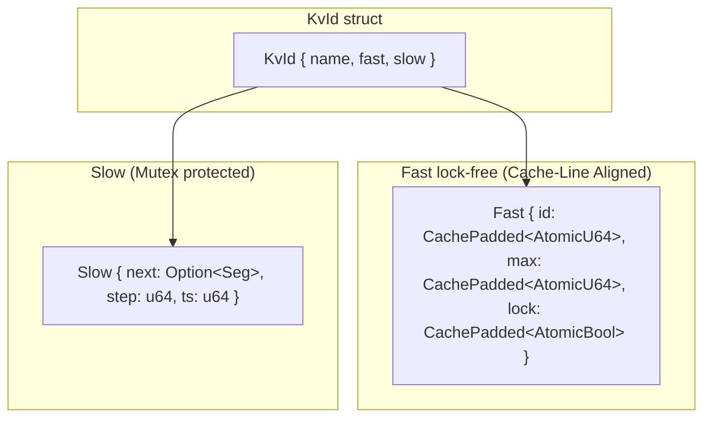
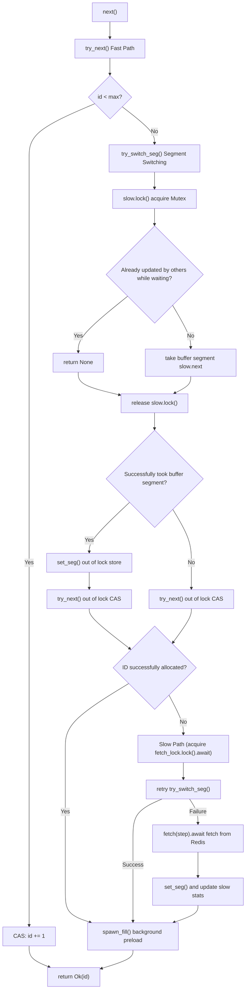
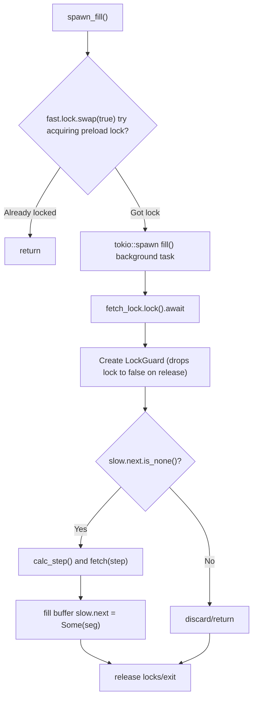
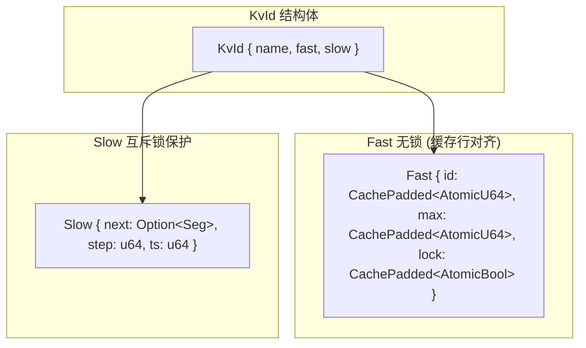
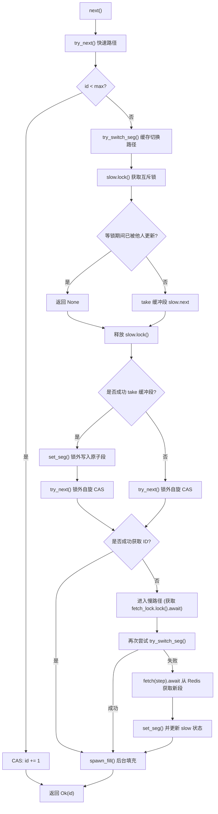
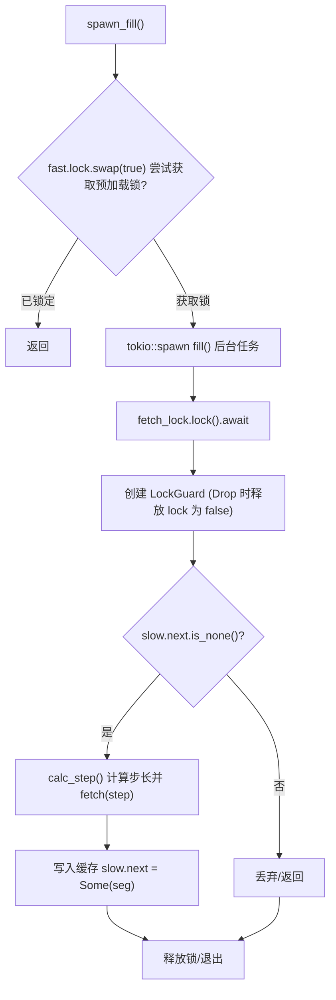

[English](#en) | [中文](#zh)

---

<a id="en"></a>

# kvid : Distributed ID Generator with Dual-Segment Preloading

- [kvid : Distributed ID Generator with Dual-Segment Preloading](#kvid-distributed-id-generator-with-dual-segment-preloading)
  - [Introduction](#introduction)
  - [Features](#features)
  - [Usage](#usage)
  - [API Reference](#api-reference)
    - [Constants](#constants)
    - [KvId](#kvid)
    - [Error](#error)
  - [Design](#design)
    - [Dual-Segment Architecture](#dual-segment-architecture)
    - [next() Flow](#next-flow)
    - [spawn_fill() Background Preload](#spawn_fill-background-preload)
    - [Data Structures](#data-structures)
    - [Dynamic Step Algorithm](#dynamic-step-algorithm)
    - [Redis Storage](#redis-storage)
  - [Tech Stack](#tech-stack)
  - [Directory Structure](#directory-structure)
  - [Competitors](#competitors)
  - [ID Generation Algorithms](#id-generation-algorithms)
  - [History](#history)
  - [About](#about)

- [Introduction](#introduction)
- [Features](#features)
- [Usage](#usage)
- [API Reference](#api-reference)
- [Design](#design)
- [Tech Stack](#tech-stack)
- [Directory Structure](#directory-structure)
- [Competitors](#competitors)
- [ID Generation Algorithms](#id-generation-algorithms)
- [History](#history)

## Introduction

kvid is a distributed unique ID generator based on Redis/Kvrocks. It uses dual-segment preloading + lock-free fast path + cache line alignment + out-of-lock CAS retries to achieve high throughput and low latency.

## Features

- **Global Uniqueness**: Atomic `HINCRBY` ensures no duplicate IDs across distributed nodes
- **Trend Increasing**: IDs increase monotonically within segments, friendly to database indexing
- **Lock-Free Fast Path**: CAS-based ID allocation, most requests bypass mutex entirely
- **Dual-Segment Preloading**: Background prefetch ensures seamless segment switching
- **Dynamic Step Adjustment**: Auto-tunes batch size based on consumption rate
- **Static Global Support**: Can be declared as `static` variable with `const_new`
- **Cache-Line Friendly**: 64-byte alignment (`CachePadded`) to prevent multi-core False Sharing
- **Ultra-low Lock Contention**: Lock critical sections minimized by moving CAS loops out of locks

## Usage

```rust
use kvid::KvId;

// declare as static global / 声明为静态全局变量
static USER_ID: KvId = KvId::const_new("user");

async fn create_user() -> kvid::Result<u64> {
  xboot::init().await?;
  USER_ID.next().await
}
```

Concurrent usage:

```rust
use std::time::Duration;
use kvid::{KVID_KEY, KvId};
use fred::interfaces::HashesInterface;
use xkv::R;

static KVID_TEST: KvId = KvId::const_new("test");

async fn demo() -> kvid::Result<()> {
  xboot::init().await?;

  let t1 = tokio::spawn(async {
    for _ in 0..50 {
      let id = KVID_TEST.next().await?;
      println!("t1: {id}");
      tokio::time::sleep(Duration::from_millis(10)).await;
    }
    Ok::<_, kvid::Error>(())
  });

  let t2 = tokio::spawn(async {
    for _ in 0..50 {
      let id = KVID_TEST.next().await?;
      println!("t2: {id}");
      tokio::time::sleep(Duration::from_millis(10)).await;
    }
    Ok::<_, kvid::Error>(())
  });

  t1.await.unwrap()?;
  t2.await.unwrap()?;

  // cleanup / 清理
  R.hdel::<(), _, _>(KVID_KEY, "test").await?;
  Ok(())
}
```

## API Reference

### Constants

| Constant      | Value     | Description                           |
| ------------- | --------- | ------------------------------------- |
| `PRELOAD_SEC` | 60        | Target duration (seconds) for segment |
| `STEP_MIN`    | 1         | Minimum step size                     |
| `STEP_MAX`    | 1,000,000 | Maximum step size                     |
| `KVID_KEY`    | "kvid"    | Redis hash key                        |

### KvId

Main struct for ID generation.

```rust
// const initialization for static / 静态变量用 const 初始化
pub const fn const_new(name: &'static str) -> Self

// runtime initialization / 运行时初始化
pub fn new(name: impl Into<HipStr<'static>>) -> Self

// generate next ID / Generate next ID
pub async fn next(&'static self) -> Result<u64>
```

### Error

```rust
pub enum Error {
  Kv(fred::error::Error), // Redis/Kvrocks error
}
```

## Design

### Dual-Segment Architecture



### next() Flow



### spawn_fill() Background Preload



### Data Structures

**Fast** (lock-free, 64-byte alignment to prevent false sharing):

- `id: CachePadded<AtomicU64>` - current allocated ID
- `max: CachePadded<AtomicU64>` - segment upper bound
- `lock: CachePadded<AtomicBool>` - fill lock to prevent duplicate prefetch

**Slow** (mutex protected):

- `next: Option<Seg>` - buffered segment
- `step: u64` - current batch size
- `ts: u64` - last fetch timestamp

### Dynamic Step Algorithm

```
new_step = prev_step * PRELOAD_SEC / elapsed
new_step = clamp(new_step, STEP_MIN, STEP_MAX)
```

High load → larger step → fewer network calls
Low load → smaller step → less ID waste

### Redis Storage

```
HSET kvid {name} {max_id}
HINCRBY kvid {name} {step}
```

## Tech Stack

- **Rust 2024** - core language
- **Redis / Kvrocks** - atomic counter backend
- **fred** - async Redis client
- **parking_lot** - efficient mutex
- **tokio** - async runtime
- **hipstr** - zero-copy inline string optimization

## Directory Structure

```
.
├── Cargo.toml
├── src/
│   ├── lib.rs      # public API, KvId struct
│   ├── impl.rs     # core implementation
│   └── error.rs    # error definitions
└── tests/
    └── main.rs     # integration tests
```

## Competitors

- **Baidu Uidgenerator**: Java, Snowflake variant. High performance but clock-dependent
- **Meituan Leaf**: Segment mode (DB) + Snowflake mode (ZooKeeper). Segment mode similar to kvid
- **Didi TinyID**: Java, segment mode only. Focus on HA and multi-DB

kvid advantages: Rust implementation, lock-free fast path, dual-segment preloading, static global support.

## ID Generation Algorithms

| Algorithm         | Pros                                  | Cons                                         |
| ----------------- | ------------------------------------- | -------------------------------------------- |
| UUID              | No coordination, simple               | 128-bit, unordered, bad for indexing         |
| DB Auto-increment | Simple, strictly ordered              | Single point failure, hard to scale          |
| Snowflake         | High perf, time-ordered, local        | Clock dependency, machine ID management      |
| Segment (kvid)    | No clock dependency, trend increasing | ID gaps on restart, central store dependency |

## History

Distributed ID generation emerged as web applications scaled beyond single databases. Twitter's Snowflake (2010) pioneered time-based ID generation but suffered from clock dependency. Flickr's Ticket Server introduced segment-based allocation, later refined by Meituan Leaf.

The segment approach trades small ID gaps for clock independence. kvid advances this pattern with Rust's zero-cost abstractions: lock-free fast path handles most requests, while dual-segment preloading eliminates blocking waits. The result is microsecond-level latency with guaranteed uniqueness.

Fun fact: Redis HINCRBY, the atomic operation kvid relies on, was added in Redis 2.0 (2010) - the same year Snowflake was released. Both solutions emerged from the same era of distributed systems challenges.

## About

This library is developed by [WebC.site](https://webc.site).

[WebC.site](https://webc.site): A new paradigm of web development for AI

---

<a id="zh"></a>

# kvid : 双号段预加载的分布式 ID 生成器

- [kvid : 双号段预加载的分布式 ID 生成器](#kvid-双号段预加载的分布式-id-生成器)
  - [项目介绍](#项目介绍)
  - [特性](#特性)
  - [使用演示](#使用演示)
  - [API 参考](#api-参考)
    - [常量](#常量)
    - [KvId](#kvid)
    - [Error](#error)
  - [设计思路](#设计思路)
    - [双号段架构](#双号段架构)
    - [next() 流程](#next-流程)
    - [spawn_fill() 后台预加载](#spawn_fill-后台预加载)
    - [数据结构](#数据结构)
    - [动态步长算法](#动态步长算法)
    - [Redis 存储](#redis-存储)
  - [技术栈](#技术栈)
  - [目录结构](#目录结构)
  - [竞品对比](#竞品对比)
  - [ID 生成算法对比](#id-生成算法对比)
  - [历史故事](#历史故事)
  - [关于](#关于)

- [项目介绍](#项目介绍)
- [特性](#特性)
- [使用演示](#使用演示)
- [API 参考](#api-参考)
- [设计思路](#设计思路)
- [技术栈](#技术栈)
- [目录结构](#目录结构)
- [竞品对比](#竞品对比)
- [ID 生成算法对比](#id-生成算法对比)
- [历史故事](#历史故事)

## 项目介绍

kvid 是基于 Redis/Kvrocks 的分布式唯一 ID 生成器。采用双号段预加载 + 无锁快速路径 + 缓存行对齐 + 锁外自旋 CAS 设计，实现极高吞吐、极低延迟的 ID 分配。

## 特性

- **全局唯一**: 原子 `HINCRBY` 确保分布式节点间无重复 ID
- **趋势递增**: 号段内 ID 单调递增，对数据库索引友好
- **无锁快速路径**: 基于 CAS 的 ID 分配，绝大多数请求无需加锁
- **双号段预加载**: 后台预取确保号段切换无缝衔接
- **动态步长调整**: 根据消费速率自动调节批量大小
- **静态全局支持**: 可用 `const_new` 声明为 `static` 变量
- **CPU 缓存友好**: 字段采用 64 字节对齐（`CachePadded`），防止多核伪共享（False Sharing）
- **超低锁竞争**: 慢路径临界区极小，将 CAS 自旋移至锁外，最大化并发吞吐

## 使用演示

```rust
use kvid::KvId;

// declare as static global / 声明为静态全局变量
static USER_ID: KvId = KvId::const_new("user");

async fn create_user() -> kvid::Result<u64> {
  xboot::init().await?;
  USER_ID.next().await
}
```

并发使用:

```rust
use std::time::Duration;
use kvid::{KVID_KEY, KvId};
use fred::interfaces::HashesInterface;
use xkv::R;

static KVID_TEST: KvId = KvId::const_new("test");

async fn demo() -> kvid::Result<()> {
  xboot::init().await?;

  let t1 = tokio::spawn(async {
    for _ in 0..50 {
      let id = KVID_TEST.next().await?;
      println!("t1: {id}");
      tokio::time::sleep(Duration::from_millis(10)).await;
    }
    Ok::<_, kvid::Error>(())
  });

  let t2 = tokio::spawn(async {
    for _ in 0..50 {
      let id = KVID_TEST.next().await?;
      println!("t2: {id}");
      tokio::time::sleep(Duration::from_millis(10)).await;
    }
    Ok::<_, kvid::Error>(())
  });

  t1.await.unwrap()?;
  t2.await.unwrap()?;

  // cleanup / 清理
  R.hdel::<(), _, _>(KVID_KEY, "test").await?;
  Ok(())
}
```

## API 参考

### 常量

| 常量          | 值        | 说明                   |
| ------------- | --------- | ---------------------- |
| `PRELOAD_SEC` | 60        | 号段目标持续时长（秒） |
| `STEP_MIN`    | 1         | 最小步长               |
| `STEP_MAX`    | 1,000,000 | 最大步长               |
| `KVID_KEY`    | "kvid"    | Redis 哈希键           |

### KvId

ID 生成器主结构体。

```rust
// const initialization for static / 静态变量用 const 初始化
pub const fn const_new(name: &'static str) -> Self

// runtime initialization / 运行时初始化
pub fn new(name: impl Into<HipStr<'static>>) -> Self

// generate next ID / 生成下个 ID
pub async fn next(&'static self) -> Result<u64>
```

### Error

```rust
pub enum Error {
  Kv(fred::error::Error), // Redis/Kvrocks 错误
}
```

## 设计思路

### 双号段架构



### next() 流程



### spawn_fill() 后台预加载



### 数据结构

**Fast** (无锁，64字节对齐，防伪共享):

- `id: CachePadded<AtomicU64>` - 当前已分配 ID
- `max: CachePadded<AtomicU64>` - 号段上界
- `lock: CachePadded<AtomicBool>` - 填充锁，防止重复预取

**Slow** (互斥锁保护):

- `next: Option<Seg>` - 缓冲号段
- `step: u64` - 当前批量大小
- `ts: u64` - 上次获取时间戳

### 动态步长算法

```
new_step = prev_step * PRELOAD_SEC / elapsed
new_step = clamp(new_step, STEP_MIN, STEP_MAX)
```

高负载 → 步长增大 → 减少网络调用
低负载 → 步长减小 → 减少 ID 浪费

### Redis 存储

```
HSET kvid {name} {max_id}
HINCRBY kvid {name} {step}
```

## 技术栈

- **Rust 2024** - 核心语言
- **Redis / Kvrocks** - 原子计数器后端
- **fred** - 异步 Redis 客户端
- **parking_lot** - 高效互斥锁
- **tokio** - 异步运行时
- **hipstr** - 零拷贝内联字符串优化

## 目录结构

```
.
├── Cargo.toml
├── src/
│   ├── lib.rs      # 公开 API，KvId 结构体
│   ├── impl.rs     # 核心实现
│   └── error.rs    # 错误定义
└── tests/
    └── main.rs     # 集成测试
```

## 竞品对比

- **百度 Uidgenerator**: Java，Snowflake 变种。高性能但依赖时钟
- **美团 Leaf**: 号段模式（DB）+ Snowflake 模式（ZooKeeper）。号段模式与 kvid 类似
- **滴滴 TinyID**: Java，仅号段模式。侧重高可用和多 DB 支持

kvid 优势：Rust 实现、无锁快速路径、双号段预加载、静态全局支持。

## ID 生成算法对比

| 算法            | 优点                       | 缺点                         |
| --------------- | -------------------------- | ---------------------------- |
| UUID            | 无需协调，简单             | 128 位，无序，索引性能差     |
| 数据库自增      | 简单，严格有序             | 单点故障，难扩展             |
| Snowflake       | 高性能，时间有序，本地生成 | 时钟依赖，机器 ID 管理       |
| 号段模式 (kvid) | 无时钟依赖，趋势递增       | 重启有 ID 空洞，依赖中心存储 |

## 历史故事

分布式 ID 生成随 Web 应用规模扩张而兴起。Twitter 的 Snowflake (2010) 开创了基于时间戳的 ID 生成，但受制于时钟依赖。Flickr 的 Ticket Server 引入号段分配模式，后被美团 Leaf 发扬光大。

号段模式以微小的 ID 空洞换取时钟无关性。kvid 借助 Rust 零成本抽象推进这一模式：无锁快速路径处理绝大多数请求，双号段预加载消除阻塞等待，实现微秒级延迟与唯一性保证。

趣闻：kvid 依赖的 Redis HINCRBY 命令在 Redis 2.0 (2010) 中引入——与 Snowflake 发布同年。两种方案诞生于分布式系统挑战的同一时代。

## 关于

本库由 [WebC.site](https://webc.site) 开发。

[WebC.site](https://webc.site) : 面向人工智能的网站开发新范式
