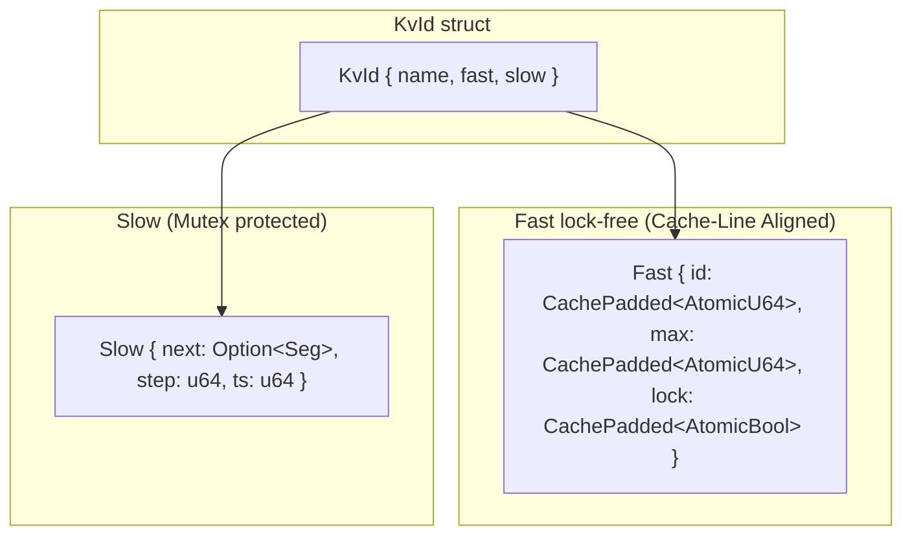
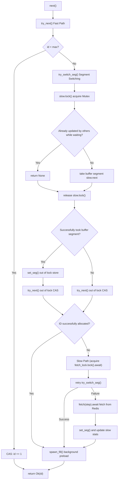
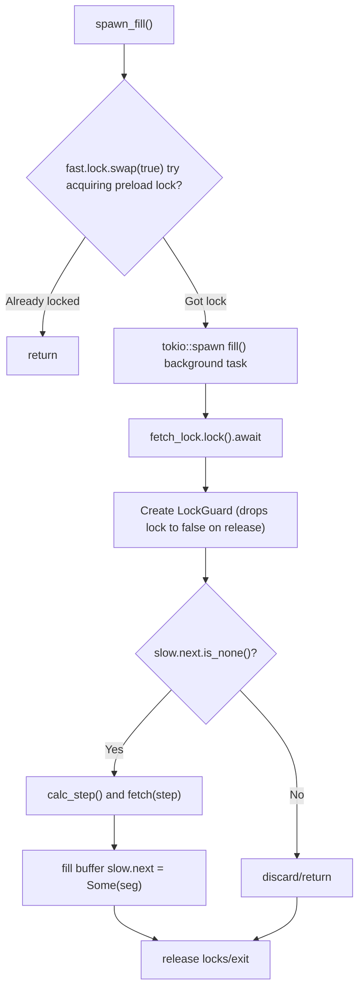

# kvid : Distributed ID Generator with Dual-Segment Preloading

- [Introduction](#introduction)
- [Features](#features)
- [Usage](#usage)
- [API Reference](#api-reference)
- [Design](#design)
- [Tech Stack](#tech-stack)
- [Directory Structure](#directory-structure)
- [Competitors](#competitors)
- [ID Generation Algorithms](#id-generation-algorithms)
- [History](#history)

## Introduction

kvid is a distributed unique ID generator based on Redis/Kvrocks. It uses dual-segment preloading + lock-free fast path + cache line alignment + out-of-lock CAS retries to achieve high throughput and low latency.

## Features

- **Global Uniqueness**: Atomic `HINCRBY` ensures no duplicate IDs across distributed nodes
- **Trend Increasing**: IDs increase monotonically within segments, friendly to database indexing
- **Lock-Free Fast Path**: CAS-based ID allocation, most requests bypass mutex entirely
- **Dual-Segment Preloading**: Background prefetch ensures seamless segment switching
- **Dynamic Step Adjustment**: Auto-tunes batch size based on consumption rate
- **Static Global Support**: Can be declared as `static` variable with `const_new`
- **Cache-Line Friendly**: 64-byte alignment (`CachePadded`) to prevent multi-core False Sharing
- **Ultra-low Lock Contention**: Lock critical sections minimized by moving CAS loops out of locks

## Usage

```rust
use kvid::KvId;

// declare as static global / 声明为静态全局变量
static USER_ID: KvId = KvId::const_new("user");

async fn create_user() -> kvid::Result<u64> {
  xboot::init().await?;
  USER_ID.next().await
}
```

Concurrent usage:

```rust
use std::time::Duration;
use kvid::{KVID_KEY, KvId};
use fred::interfaces::HashesInterface;
use xkv::R;

static KVID_TEST: KvId = KvId::const_new("test");

async fn demo() -> kvid::Result<()> {
  xboot::init().await?;

  let t1 = tokio::spawn(async {
    for _ in 0..50 {
      let id = KVID_TEST.next().await?;
      println!("t1: {id}");
      tokio::time::sleep(Duration::from_millis(10)).await;
    }
    Ok::<_, kvid::Error>(())
  });

  let t2 = tokio::spawn(async {
    for _ in 0..50 {
      let id = KVID_TEST.next().await?;
      println!("t2: {id}");
      tokio::time::sleep(Duration::from_millis(10)).await;
    }
    Ok::<_, kvid::Error>(())
  });

  t1.await.unwrap()?;
  t2.await.unwrap()?;

  // cleanup / 清理
  R.hdel::<(), _, _>(KVID_KEY, "test").await?;
  Ok(())
}
```

## API Reference

### Constants

| Constant      | Value     | Description                           |
| ------------- | --------- | ------------------------------------- |
| `PRELOAD_SEC` | 60        | Target duration (seconds) for segment |
| `STEP_MIN`    | 1         | Minimum step size                     |
| `STEP_MAX`    | 1,000,000 | Maximum step size                     |
| `KVID_KEY`    | "kvid"    | Redis hash key                        |

### KvId

Main struct for ID generation.

```rust
// const initialization for static / 静态变量用 const 初始化
pub const fn const_new(name: &'static str) -> Self

// runtime initialization / 运行时初始化
pub fn new(name: impl Into<HipStr<'static>>) -> Self

// generate next ID / Generate next ID
pub async fn next(&'static self) -> Result<u64>
```

### Error

```rust
pub enum Error {
  Kv(fred::error::Error), // Redis/Kvrocks error
}
```

## Design

### Dual-Segment Architecture



### next() Flow



### spawn_fill() Background Preload



### Data Structures

**Fast** (lock-free, 64-byte alignment to prevent false sharing):

- `id: CachePadded<AtomicU64>` - current allocated ID
- `max: CachePadded<AtomicU64>` - segment upper bound
- `lock: CachePadded<AtomicBool>` - fill lock to prevent duplicate prefetch

**Slow** (mutex protected):

- `next: Option<Seg>` - buffered segment
- `step: u64` - current batch size
- `ts: u64` - last fetch timestamp

### Dynamic Step Algorithm

```
new_step = prev_step * PRELOAD_SEC / elapsed
new_step = clamp(new_step, STEP_MIN, STEP_MAX)
```

High load → larger step → fewer network calls
Low load → smaller step → less ID waste

### Redis Storage

```
HSET kvid {name} {max_id}
HINCRBY kvid {name} {step}
```

## Tech Stack

- **Rust 2024** - core language
- **Redis / Kvrocks** - atomic counter backend
- **fred** - async Redis client
- **parking_lot** - efficient mutex
- **tokio** - async runtime
- **hipstr** - zero-copy inline string optimization

## Directory Structure

```
.
├── Cargo.toml
├── src/
│   ├── lib.rs      # public API, KvId struct
│   ├── impl.rs     # core implementation
│   └── error.rs    # error definitions
└── tests/
    └── main.rs     # integration tests
```

## Competitors

- **Baidu Uidgenerator**: Java, Snowflake variant. High performance but clock-dependent
- **Meituan Leaf**: Segment mode (DB) + Snowflake mode (ZooKeeper). Segment mode similar to kvid
- **Didi TinyID**: Java, segment mode only. Focus on HA and multi-DB

kvid advantages: Rust implementation, lock-free fast path, dual-segment preloading, static global support.

## ID Generation Algorithms

| Algorithm         | Pros                                  | Cons                                         |
| ----------------- | ------------------------------------- | -------------------------------------------- |
| UUID              | No coordination, simple               | 128-bit, unordered, bad for indexing         |
| DB Auto-increment | Simple, strictly ordered              | Single point failure, hard to scale          |
| Snowflake         | High perf, time-ordered, local        | Clock dependency, machine ID management      |
| Segment (kvid)    | No clock dependency, trend increasing | ID gaps on restart, central store dependency |

## History

Distributed ID generation emerged as web applications scaled beyond single databases. Twitter's Snowflake (2010) pioneered time-based ID generation but suffered from clock dependency. Flickr's Ticket Server introduced segment-based allocation, later refined by Meituan Leaf.

The segment approach trades small ID gaps for clock independence. kvid advances this pattern with Rust's zero-cost abstractions: lock-free fast path handles most requests, while dual-segment preloading eliminates blocking waits. The result is microsecond-level latency with guaranteed uniqueness.

Fun fact: Redis HINCRBY, the atomic operation kvid relies on, was added in Redis 2.0 (2010) - the same year Snowflake was released. Both solutions emerged from the same era of distributed systems challenges.
