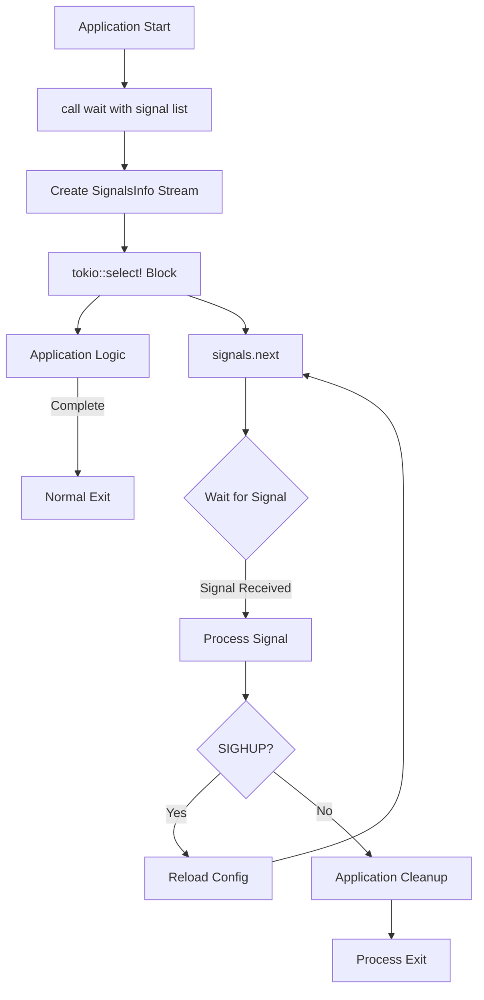
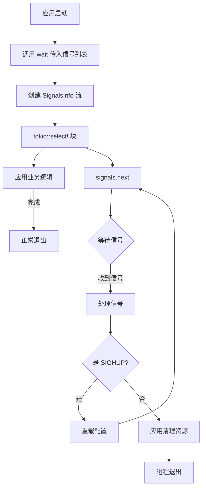

[English](#en) | [中文](#zh)

---

<a id="en"></a>
# listen_signal : Graceful Process Termination Made Simple

- [listen_signal : Graceful Process Termination Made Simple](#listen_signal-graceful-process-termination-made-simple)
  - [Table of Contents](#table-of-contents)
  - [Introduction](#introduction)
  - [Features](#features)
  - [Installation](#installation)
  - [Usage Example](#usage-example)
    - [Graceful Shutdown Pattern with Reload Support](#graceful-shutdown-pattern-with-reload-support)
  - [API Reference](#api-reference)
    - [Function: `wait()`](#function-wait)
    - [Constants](#constants)
      - [Signal Constants](#signal-constants)
      - [Pre-configured Signal Sets](#pre-configured-signal-sets)
  - [Design Philosophy](#design-philosophy)
    - [Signal Flow](#signal-flow)
    - [Architecture](#architecture)
  - [Technology Stack](#technology-stack)
  - [Project Structure](#project-structure)
  - [Signal Handling History](#signal-handling-history)
  - [About](#about)

## Table of Contents

- Introduction
- Features
- Installation
- Usage Example
- API Reference
- Design Philosophy
- Technology Stack
- Project Structure
- Signal Handling History

## Introduction

`listen_signal` is a lightweight Rust library that simplifies graceful shutdown for asynchronous applications. It provides stream-based signal handling for common termination signals (SIGTERM, SIGINT, SIGQUIT, SIGHUP) across Unix-like systems.

## Features

- **Stream-based design** - Returns async signal stream for flexible handling
- **Cross-platform** - Works on Linux, macOS, and Unix-like systems
- **Flexible configuration** - Pre-configured constants for common scenarios
- **Minimal dependencies** - Built on signal-hook ecosystem
- **Production-ready** - Clean API for graceful shutdown patterns

## Installation

Add to your `Cargo.toml`:

```toml
[dependencies]
listen_signal = "0.1"
tokio = { version = "1", features = ["rt-multi-thread", "macros"] }
futures = "0.3"
```

## Usage Example

```rust
use listen_signal::wait;
use futures::StreamExt;

#[tokio::main]
async fn main() {
    let mut signals = wait(&listen_signal::STOP);

    tokio::select! {
        signal = signals.next() => {
            println!("Received signal: {:?}", signal);
        }
        _ = run_application() => {
            println!("Application completed normally");
        }
    }
}

async fn run_application() {
    // Your application logic here
    loop {
        tokio::time::sleep(tokio::time::Duration::from_secs(1)).await;
    }
}
```

### Graceful Shutdown Pattern with Reload Support

```rust
use listen_signal::wait;
use futures::StreamExt;

#[tokio::main]
async fn main() {
    let mut signals = wait(&listen_signal::SINGAL_LI);

    loop {
        tokio::select! {
            signal = signals.next() => {
                match signal {
                    Some(listen_signal::SIGHUP) => {
                        println!("Reloading configuration...");
                        // Reload config without stopping
                    }
                    Some(_) => {
                        println!("Shutting down gracefully...");
                        break;
                    }
                    None => break,
                }
            }
            _ = run_server() => {}
        }
    }
}

async fn run_server() {
    // Server logic
}
```

## API Reference

### Function: `wait()`

```rust
pub fn wait(li: impl AsRef<[i32]>) -> SignalsInfo
```

Creates a signal stream that listens for the specified signals. Returns a `SignalsInfo` stream that yields signal numbers.

**Parameters:**

- `li` - List of signal numbers to monitor (can use predefined constants)

**Returns:**

- `SignalsInfo` - Async stream of received signals

**Panics:**

- If signal handler registration fails

### Constants

#### Signal Constants

```rust
pub use signal_hook::consts::{SIGHUP, SIGINT, SIGQUIT, SIGTERM};
```

Individual signal constants:

- `SIGTERM` (15) - Termination request (systemctl stop, docker stop, kill)
- `SIGINT` (2) - Interrupt from terminal (Ctrl+C)
- `SIGQUIT` (3) - Quit from terminal (Ctrl+\\)
- `SIGHUP` (1) - Hangup / Reload request (systemctl reload)

#### Pre-configured Signal Sets

```rust
pub const STOP: [i32; 3]
```

Standard termination signals: `[SIGTERM, SIGINT, SIGQUIT]`

```rust
pub const SINGAL_LI: [i32; 4]
```

Termination and reload signals: `[SIGTERM, SIGINT, SIGQUIT, SIGHUP]`

## Design Philosophy

### Signal Flow



### Architecture

The library implements a stream-based signal handling approach:

1. **Signal Registration** - Uses `signal-hook` to register OS signal handlers
2. **Stream Creation** - `wait()` returns a `SignalsInfo` stream via `signal-hook-tokio`
3. **Stream Processing** - Use `StreamExt::next()` to await signals asynchronously
4. **Flexible Handling** - Support multiple signals with different behaviors (reload vs stop)
5. **Integration** - Designed for `tokio::select!` macro for concurrent task management

## Technology Stack

- **Runtime** - Tokio async runtime
- **Signal Handling** - signal-hook 0.3 (low-level signal registration)
- **Async Bridge** - signal-hook-tokio 0.3 (Tokio integration with futures-v0_3)
- **Stream Processing** - futures crate for StreamExt trait

## Project Structure

```
listen_signal/
├── Cargo.toml           # Package manifest and dependencies
├── src/
│   └── lib.rs          # Main library implementation
├── tests/
│   └── main.rs         # Integration tests with signal injection
└── readme/
    ├── en.md           # English documentation
    └── zh.md           # Chinese documentation
```

## Signal Handling History

UNIX signals were introduced in Version 7 Unix (1979) by Dennis Ritchie and Ken Thompson. The signal mechanism provided a way for the kernel to notify processes of asynchronous events - from hardware exceptions to user interrupts.

The original signal API was notoriously difficult to use correctly due to race conditions and platform inconsistencies. POSIX.1-1990 standardized `sigaction()` to address these issues, introducing more reliable semantics.

SIGTERM (signal 15) was designed as the "polite" termination request - giving processes time to cleanup before exit. In contrast, SIGKILL (signal 9) forces immediate termination without cleanup. This distinction became crucial for containerized environments: Docker's `docker stop` sends SIGTERM, waits 10 seconds, then sends SIGKILL.

Modern async runtimes like Tokio brought new challenges to signal handling - signals are synchronous C callbacks, but Rust's async code requires thread-safe, future-aware notification. Projects like `signal-hook` emerged to bridge this gap, providing safe primitives for integrating UNIX signals with async ecosystems.

The principle of graceful shutdown - catching signals, closing connections, flushing buffers, saving state - has become a cornerstone of reliable distributed systems. What started as a kernel notification mechanism in 1979 now orchestrates the lifecycle of microservices across global infrastructure.


## About

This library is developed by [WebC.site](https://webc.site).

[WebC.site](https://webc.site): A new paradigm of web development for AI


---

<a id="zh"></a>
# listen_signal : 优雅终止进程的简洁方案

- [listen_signal : 优雅终止进程的简洁方案](#listen_signal-优雅终止进程的简洁方案)
  - [目录](#目录)
  - [项目介绍](#项目介绍)
  - [功能特性](#功能特性)
  - [安装配置](#安装配置)
  - [使用示例](#使用示例)
    - [支持重载的优雅关闭模式](#支持重载的优雅关闭模式)
  - [API 文档](#api-文档)
    - [函数: `wait()`](#函数-wait)
    - [常量](#常量)
      - [信号常量](#信号常量)
      - [预配置信号组](#预配置信号组)
  - [设计思路](#设计思路)
    - [信号流转](#信号流转)
    - [架构设计](#架构设计)
  - [技术栈](#技术栈)
  - [项目结构](#项目结构)
  - [信号处理历史](#信号处理历史)
  - [关于](#关于)

## 目录

- 项目介绍
- 功能特性
- 安装配置
- 使用示例
- API 文档
- 设计思路
- 技术栈
- 项目结构
- 信号处理历史

## 项目介绍

`listen_signal` 是轻量级 Rust 库，用于简化异步应用的优雅关闭流程。基于信号流（stream）模式处理常见终止信号（SIGTERM、SIGINT、SIGQUIT、SIGHUP），支持类 Unix 系统。

## 功能特性

- **基于流的设计** - 返回异步信号流以支持灵活处理
- **跨平台支持** - 兼容 Linux、macOS 及类 Unix 系统
- **灵活配置** - 提供常见场景的预配置常量
- **最小依赖** - 基于 signal-hook 生态构建
- **生产环境就绪** - 清晰的优雅关闭模式 API

## 安装配置

在 `Cargo.toml` 中添加依赖：

```toml
[dependencies]
listen_signal = "0.1"
tokio = { version = "1", features = ["rt-multi-thread", "macros"] }
futures = "0.3"
```

## 使用示例

```rust
use listen_signal::wait;
use futures::StreamExt;

#[tokio::main]
async fn main() {
    let mut signals = wait(&listen_signal::STOP);

    tokio::select! {
        signal = signals.next() => {
            println!("收到信号: {:?}", signal);
        }
        _ = run_application() => {
            println!("应用正常结束");
        }
    }
}

async fn run_application() {
    // 应用业务逻辑
    loop {
        tokio::time::sleep(tokio::time::Duration::from_secs(1)).await;
    }
}
```

### 支持重载的优雅关闭模式

```rust
use listen_signal::wait;
use futures::StreamExt;

#[tokio::main]
async fn main() {
    let mut signals = wait(&listen_signal::SINGAL_LI);

    loop {
        tokio::select! {
            signal = signals.next() => {
                match signal {
                    Some(listen_signal::SIGHUP) => {
                        println!("重新加载配置...");
                        // 重载配置而不停止服务
                    }
                    Some(_) => {
                        println!("开始优雅关闭...");
                        break;
                    }
                    None => break,
                }
            }
            _ = run_server() => {}
        }
    }
}

async fn run_server() {
    // 服务器逻辑
}
```

## API 文档

### 函数: `wait()`

```rust
pub fn wait(li: impl AsRef<[i32]>) -> SignalsInfo
```

创建一个监听指定信号的信号流。返回 `SignalsInfo` 流，该流会产生信号编号。

**参数：**

- `li` - 要监听的信号编号列表（可使用预定义常量）

**返回值：**

- `SignalsInfo` - 接收信号的异步流

**Panic：**

- 当信号处理器注册失败时

### 常量

#### 信号常量

```rust
pub use signal_hook::consts::{SIGHUP, SIGINT, SIGQUIT, SIGTERM};
```

独立信号常量：

- `SIGTERM` (15) - 终止请求（systemctl stop、docker stop、kill）
- `SIGINT` (2) - 终端中断（Ctrl+C）
- `SIGQUIT` (3) - 终端退出（Ctrl+\\）
- `SIGHUP` (1) - 挂起/重载请求（systemctl reload）

#### 预配置信号组

```rust
pub const STOP: [i32; 3]
```

标准终止信号：`[SIGTERM, SIGINT, SIGQUIT]`

```rust
pub const SINGAL_LI: [i32; 4]
```

终止和重载信号：`[SIGTERM, SIGINT, SIGQUIT, SIGHUP]`

## 设计思路

### 信号流转



### 架构设计

本库采用基于流的信号处理方案：

1. **信号注册** - 使用 `signal-hook` 注册操作系统信号处理器
2. **流创建** - `wait()` 通过 `signal-hook-tokio` 返回 `SignalsInfo` 流
3. **流处理** - 使用 `StreamExt::next()` 异步等待信号
4. **灵活处理** - 支持多信号不同行为（重载 vs 停止）
5. **集成方式** - 设计用于 `tokio::select!` 宏，支持并发任务管理

## 技术栈

- **运行时** - Tokio 异步运行时
- **信号处理** - signal-hook 0.3（底层信号注册）
- **异步桥接** - signal-hook-tokio 0.3（Tokio 集成，启用 futures-v0_3）
- **流处理** - futures 库提供 StreamExt trait

## 项目结构

```
listen_signal/
├── Cargo.toml           # 包清单和依赖配置
├── src/
│   └── lib.rs          # 主库实现
├── tests/
│   └── main.rs         # 集成测试（信号注入）
└── readme/
    ├── en.md           # 英文文档
    └── zh.md           # 中文文档
```

## 信号处理历史

UNIX 信号机制由 Dennis Ritchie 和 Ken Thompson 在第 7 版 Unix（1979 年）中引入。信号机制为内核提供了向进程通知异步事件的方式——从硬件异常到用户中断。

早期的信号 API 因竞态条件和平台不一致性而难以正确使用。POSIX.1-1990 标准化了 `sigaction()` 以解决这些问题，引入了更可靠的语义。

SIGTERM（信号 15）被设计为"礼貌的"终止请求——给进程时间进行清理后退出。相比之下，SIGKILL（信号 9）强制立即终止而不进行清理。这种区别在容器化环境中变得至关重要：Docker 的 `docker stop` 发送 SIGTERM，等待 10 秒后发送 SIGKILL。

像 Tokio 这样的现代异步运行时给信号处理带来了新挑战——信号是同步的 C 回调，而 Rust 的异步代码需要线程安全、future 感知的通知机制。`signal-hook` 等项目应运而生，为将 UNIX 信号集成到异步生态系统提供了安全原语。

优雅关闭原则——捕获信号、关闭连接、刷新缓冲区、保存状态——已成为可靠分布式系统的基石。从 1979 年的内核通知机制开始，如今已发展为编排全球基础设施中微服务生命周期的核心技术。


## 关于

本库由 [WebC.site](https://webc.site) 开发。

[WebC.site](https://webc.site) : 面向人工智能的网站开发新范式

