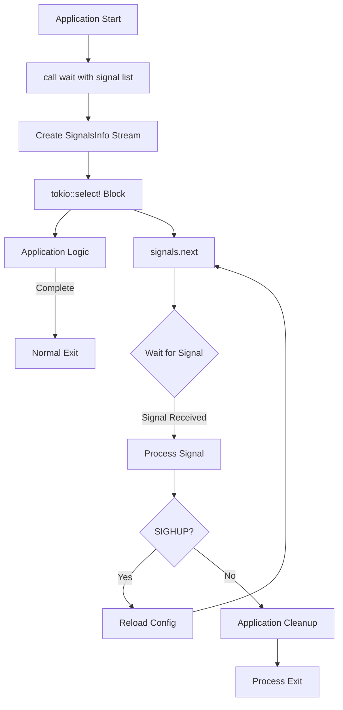

# listen_signal : Graceful Process Termination Made Simple

## Table of Contents

- Introduction
- Features
- Installation
- Usage Example
- API Reference
- Design Philosophy
- Technology Stack
- Project Structure
- Signal Handling History

## Introduction

`listen_signal` is a lightweight Rust library that simplifies graceful shutdown for asynchronous applications. It provides stream-based signal handling for common termination signals (SIGTERM, SIGINT, SIGQUIT, SIGHUP) across Unix-like systems.

## Features

- **Stream-based design** - Returns async signal stream for flexible handling
- **Cross-platform** - Works on Linux, macOS, and Unix-like systems
- **Flexible configuration** - Pre-configured constants for common scenarios
- **Minimal dependencies** - Built on signal-hook ecosystem
- **Production-ready** - Clean API for graceful shutdown patterns

## Installation

Add to your `Cargo.toml`:

```toml
[dependencies]
listen_signal = "0.1"
tokio = { version = "1", features = ["rt-multi-thread", "macros"] }
futures = "0.3"
```

## Usage Example

```rust
use listen_signal::wait;
use futures::StreamExt;

#[tokio::main]
async fn main() {
    let mut signals = wait(&listen_signal::STOP);

    tokio::select! {
        signal = signals.next() => {
            println!("Received signal: {:?}", signal);
        }
        _ = run_application() => {
            println!("Application completed normally");
        }
    }
}

async fn run_application() {
    // Your application logic here
    loop {
        tokio::time::sleep(tokio::time::Duration::from_secs(1)).await;
    }
}
```

### Graceful Shutdown Pattern with Reload Support

```rust
use listen_signal::wait;
use futures::StreamExt;

#[tokio::main]
async fn main() {
    let mut signals = wait(&listen_signal::SINGAL_LI);

    loop {
        tokio::select! {
            signal = signals.next() => {
                match signal {
                    Some(listen_signal::SIGHUP) => {
                        println!("Reloading configuration...");
                        // Reload config without stopping
                    }
                    Some(_) => {
                        println!("Shutting down gracefully...");
                        break;
                    }
                    None => break,
                }
            }
            _ = run_server() => {}
        }
    }
}

async fn run_server() {
    // Server logic
}
```

## API Reference

### Function: `wait()`

```rust
pub fn wait(li: impl AsRef<[i32]>) -> SignalsInfo
```

Creates a signal stream that listens for the specified signals. Returns a `SignalsInfo` stream that yields signal numbers.

**Parameters:**

- `li` - List of signal numbers to monitor (can use predefined constants)

**Returns:**

- `SignalsInfo` - Async stream of received signals

**Panics:**

- If signal handler registration fails

### Constants

#### Signal Constants

```rust
pub use signal_hook::consts::{SIGHUP, SIGINT, SIGQUIT, SIGTERM};
```

Individual signal constants:

- `SIGTERM` (15) - Termination request (systemctl stop, docker stop, kill)
- `SIGINT` (2) - Interrupt from terminal (Ctrl+C)
- `SIGQUIT` (3) - Quit from terminal (Ctrl+\\)
- `SIGHUP` (1) - Hangup / Reload request (systemctl reload)

#### Pre-configured Signal Sets

```rust
pub const STOP: [i32; 3]
```

Standard termination signals: `[SIGTERM, SIGINT, SIGQUIT]`

```rust
pub const SINGAL_LI: [i32; 4]
```

Termination and reload signals: `[SIGTERM, SIGINT, SIGQUIT, SIGHUP]`

## Design Philosophy

### Signal Flow



### Architecture

The library implements a stream-based signal handling approach:

1. **Signal Registration** - Uses `signal-hook` to register OS signal handlers
2. **Stream Creation** - `wait()` returns a `SignalsInfo` stream via `signal-hook-tokio`
3. **Stream Processing** - Use `StreamExt::next()` to await signals asynchronously
4. **Flexible Handling** - Support multiple signals with different behaviors (reload vs stop)
5. **Integration** - Designed for `tokio::select!` macro for concurrent task management

## Technology Stack

- **Runtime** - Tokio async runtime
- **Signal Handling** - signal-hook 0.3 (low-level signal registration)
- **Async Bridge** - signal-hook-tokio 0.3 (Tokio integration with futures-v0_3)
- **Stream Processing** - futures crate for StreamExt trait

## Project Structure

```
listen_signal/
├── Cargo.toml           # Package manifest and dependencies
├── src/
│   └── lib.rs          # Main library implementation
├── tests/
│   └── main.rs         # Integration tests with signal injection
└── readme/
    ├── en.md           # English documentation
    └── zh.md           # Chinese documentation
```

## Signal Handling History

UNIX signals were introduced in Version 7 Unix (1979) by Dennis Ritchie and Ken Thompson. The signal mechanism provided a way for the kernel to notify processes of asynchronous events - from hardware exceptions to user interrupts.

The original signal API was notoriously difficult to use correctly due to race conditions and platform inconsistencies. POSIX.1-1990 standardized `sigaction()` to address these issues, introducing more reliable semantics.

SIGTERM (signal 15) was designed as the "polite" termination request - giving processes time to cleanup before exit. In contrast, SIGKILL (signal 9) forces immediate termination without cleanup. This distinction became crucial for containerized environments: Docker's `docker stop` sends SIGTERM, waits 10 seconds, then sends SIGKILL.

Modern async runtimes like Tokio brought new challenges to signal handling - signals are synchronous C callbacks, but Rust's async code requires thread-safe, future-aware notification. Projects like `signal-hook` emerged to bridge this gap, providing safe primitives for integrating UNIX signals with async ecosystems.

The principle of graceful shutdown - catching signals, closing connections, flushing buffers, saving state - has become a cornerstone of reliable distributed systems. What started as a kernel notification mechanism in 1979 now orchestrates the lifecycle of microservices across global infrastructure.
