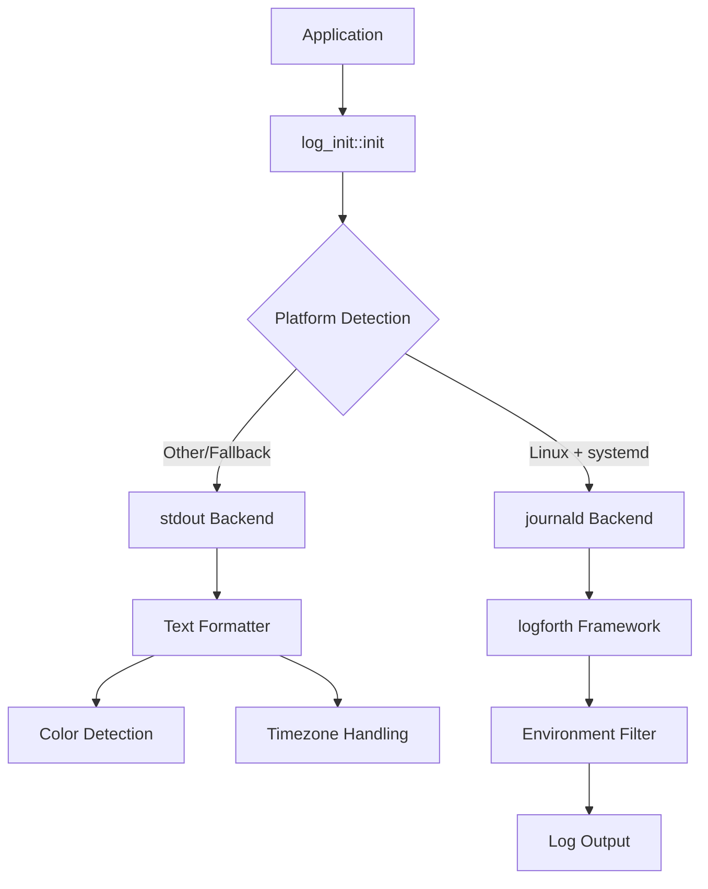
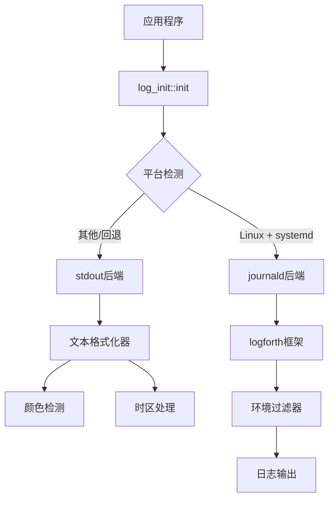

[English](#en) | [中文](#zh)

---

<a id="en"></a>
# log_init: Smart Logging Initialization for Rust Applications

- [log_init: Smart Logging Initialization for Rust Applications](#log_init-smart-logging-initialization-for-rust-applications)
  - [Table of Contents](#table-of-contents)
  - [Overview](#overview)
  - [Features](#features)
  - [Usage](#usage)
    - [Basic Setup](#basic-setup)
    - [Simple Initialization](#simple-initialization)
    - [Structured Logging](#structured-logging)
    - [Environment Configuration](#environment-configuration)
    - [Feature Flags](#feature-flags)
  - [API Reference](#api-reference)
    - [Functions](#functions)
      - [`init()`](#init)
      - [`level_color(level: Level) -> ColoredString`](#level_colorlevel-level-coloredstring)
    - [Types](#types)
      - [`Text`](#text)
      - [`TZ`](#tz)
  - [Design Architecture](#design-architecture)
    - [Initialization Flow](#initialization-flow)
    - [Module Interaction](#module-interaction)
  - [Technology Stack](#technology-stack)
  - [Project Structure](#project-structure)
  - [Development](#development)
    - [Running Tests](#running-tests)
    - [Building Documentation](#building-documentation)
    - [Feature Testing](#feature-testing)
  - [Historical Context](#historical-context)
  - [About](#about)

## Table of Contents

- [Overview](#overview)
- [Features](#features)
- [Usage](#usage)
- [API Reference](#api-reference)
- [Design Architecture](#design-architecture)
- [Technology Stack](#technology-stack)
- [Project Structure](#project-structure)
- [Development](#development)
- [Historical Context](#historical-context)

## Overview

log_init is a Rust logging initialization library that provides intelligent backend selection and cross-platform compatibility. It automatically detects the runtime environment and chooses the optimal logging backend - systemd journald on Linux systems or stdout with customizable formatting on other platforms.

## Features

- **Automatic Backend Detection**: Intelligently selects journald on systemd-enabled Linux systems, falls back to stdout elsewhere
- **Cross-Platform Support**: Works seamlessly across Linux, macOS, and Windows
- **Structured Logging**: Full support for key-value pairs and structured log data
- **Customizable Formatting**: Rich text formatting with color support and timezone handling
- **Environment-Based Filtering**: Configurable log levels via `RUST_LOG` environment variable
- **Zero-Configuration**: Works out of the box with sensible defaults

## Usage

### Basic Setup

Add to your `Cargo.toml`:

```toml
[dependencies]
log_init = "0.1"
log = "0.4"
```

### Simple Initialization

```rust
use log::{info, warn, error};

fn main() {
    log_init::init();

    info!("Application started");
    warn!("This is a warning");
    error!("Something went wrong");
}
```

### Structured Logging

```rust
use log::info;

fn main() {
    log_init::init();

    info!(
        user_id = 42,
        action = "login",
        duration_ms = 150.5;
        "User authentication successful"
    );
}
```

### Environment Configuration

```bash
# Set log level
export RUST_LOG=debug

# Run your application
cargo run
```

### Feature Flags

```toml
[dependencies]
log_init = { version = "0.1", features = ["systemd"] }
```

Available features:

- `stdout` (default): Enable stdout logging backend
- `systemd`: Enable systemd journald support on Linux

## API Reference

### Functions

#### `init()`

Initializes the global logger with automatic backend detection.

```rust
pub fn init()
```

Behavior:

- On Linux with systemd: Uses journald if `INVOCATION_ID` environment variable is present
- Fallback: Uses stdout with formatted text output
- Panics if no logging backend is available

#### `level_color(level: Level) -> ColoredString`

Returns a colored string representation of the log level.

```rust
pub fn level_color(level: Level) -> ColoredString
```

### Types

#### `Text`

Customizable text formatter for stdout logging.

```rust
pub struct Text {
    pub color: bool,
}
```

Methods:

- `default()`: Creates formatter with automatic color detection based on terminal capability
- `format()`: Formats log records with timestamps, file locations, and structured data

#### `TZ`

Global timezone static for consistent timestamp formatting.

```rust
pub static TZ: jiff::tz::TimeZone
```

## Design Architecture



### Initialization Flow

1. **Platform Detection**: Checks for Linux OS and systemd environment
2. **Backend Selection**: Chooses journald or stdout based on detection results
3. **Filter Configuration**: Applies environment-based log level filtering
4. **Formatter Setup**: Configures text formatting with color and timezone support
5. **Global Registration**: Registers the configured logger as the global instance

### Module Interaction

- `init()` orchestrates the entire initialization process
- `layout::Text` handles stdout formatting and color management
- `kv::Kv` processes structured logging key-value pairs
- Platform-specific code is conditionally compiled for optimal performance

## Technology Stack

- **Core Framework**: [logforth](https://crates.io/crates/logforth) - Modern logging framework
- **Structured Logging**: [log](https://crates.io/crates/log) - Standard Rust logging facade
- **Color Output**: [colored](https://crates.io/crates/colored) - Terminal color support
- **Time Handling**: [jiff](https://crates.io/crates/jiff) - Timezone-aware datetime library
- **Static Initialization**: [static_init](https://crates.io/crates/static_init) - Safe static initialization
- **Performance**: [coarsetime](https://crates.io/crates/coarsetime) - Fast timestamp generation
- **Linux Integration**: [logforth-append-journald](https://crates.io/crates/logforth-append-journald) - systemd journald support

## Project Structure

```
log_init/
├── src/
│   ├── lib.rs          # Main library entry point and initialization logic
│   ├── kv.rs           # Key-value pair processing for structured logging
│   └── layout/
│       ├── mod.rs      # Layout module exports
│       └── text.rs     # Text formatter implementation
├── tests/
│   └── main.rs         # Comprehensive test suite
├── readme/
│   ├── en.md          # English documentation
│   └── zh.md          # Chinese documentation
├── Cargo.toml         # Project configuration and dependencies
└── test.sh           # Test execution script
```

## Development

### Running Tests

```bash
# Run all tests with output
./test.sh

# Or use cargo directly
cargo test --all-features -- --nocapture
```

### Building Documentation

```bash
cargo doc --all-features --open
```

### Feature Testing

```bash
# Test stdout backend only
cargo test --no-default-features --features stdout

# Test with systemd support (Linux only)
cargo test --features systemd
```

## Historical Context

The evolution of logging in systems programming reflects the broader development of observability practices. Early Unix systems relied on simple file-based logging through syslog, introduced in the 1980s. The concept of structured logging gained prominence with the rise of distributed systems in the 2000s.

systemd's journald, introduced in 2011, revolutionized Linux logging by providing binary log storage, automatic metadata collection, and integration with the init system. This represented a significant departure from traditional text-based logs, offering better performance and richer context.

The Rust ecosystem's approach to logging, exemplified by the `log` crate's facade pattern, emerged from lessons learned in other languages about the importance of abstraction between logging interfaces and implementations. This design allows libraries to remain agnostic about logging backends while applications retain full control over log destination and formatting.

log_init bridges these historical approaches by providing intelligent backend selection - leveraging modern systemd capabilities where available while maintaining compatibility with traditional stdout-based logging for broader platform support.


## About

This library is developed by [WebC.site](https://webc.site).

[WebC.site](https://webc.site): A new paradigm of web development for AI


---

<a id="zh"></a>
# log_init: Rust应用智能日志初始化库

- [log_init: Rust应用智能日志初始化库](#log_init-rust应用智能日志初始化库)
  - [目录导航](#目录导航)
  - [项目概述](#项目概述)
  - [核心特性](#核心特性)
  - [使用指南](#使用指南)
    - [基础配置](#基础配置)
    - [简单初始化](#简单初始化)
    - [结构化日志](#结构化日志)
    - [环境配置](#环境配置)
    - [特性标志](#特性标志)
  - [API参考](#api参考)
    - [函数](#函数)
      - [`init()`](#init)
      - [`level_color(level: Level) -> ColoredString`](#level_colorlevel-level-coloredstring)
    - [类型](#类型)
      - [`Text`](#text)
      - [`TZ`](#tz)
  - [设计架构](#设计架构)
    - [初始化流程](#初始化流程)
    - [模块交互](#模块交互)
  - [技术栈](#技术栈)
  - [项目结构](#项目结构)
  - [开发指南](#开发指南)
    - [运行测试](#运行测试)
    - [构建文档](#构建文档)
    - [特性测试](#特性测试)
  - [技术历史](#技术历史)
  - [关于](#关于)

## 目录导航

- [项目概述](#项目概述)
- [核心特性](#核心特性)
- [使用指南](#使用指南)
- [API参考](#api参考)
- [设计架构](#设计架构)
- [技术栈](#技术栈)
- [项目结构](#项目结构)
- [开发指南](#开发指南)
- [技术历史](#技术历史)

## 项目概述

log_init是Rust日志初始化库，提供智能后端选择和跨平台兼容性。自动检测运行环境并选择最优日志后端 - Linux系统上使用systemd journald，其他平台使用可定制格式的stdout输出。

## 核心特性

- **自动后端检测**: 智能选择systemd环境下的journald，其他环境回退到stdout
- **跨平台支持**: 无缝支持Linux、macOS和Windows
- **结构化日志**: 完整支持键值对和结构化日志数据
- **可定制格式**: 丰富的文本格式化，支持颜色和时区处理
- **环境过滤**: 通过`RUST_LOG`环境变量配置日志级别
- **零配置**: 开箱即用，具备合理默认设置

## 使用指南

### 基础配置

添加到`Cargo.toml`:

```toml
[dependencies]
log_init = "0.1"
log = "0.4"
```

### 简单初始化

```rust
use log::{info, warn, error};

fn main() {
    log_init::init();

    info!("应用程序启动");
    warn!("这是警告信息");
    error!("发生错误");
}
```

### 结构化日志

```rust
use log::info;

fn main() {
    log_init::init();

    info!(
        user_id = 42,
        action = "login",
        duration_ms = 150.5;
        "用户认证成功"
    );
}
```

### 环境配置

```bash
# 设置日志级别
export RUST_LOG=debug

# 运行应用程序
cargo run
```

### 特性标志

```toml
[dependencies]
log_init = { version = "0.1", features = ["systemd"] }
```

可用特性:

- `stdout` (默认): 启用stdout日志后端
- `systemd`: 在Linux上启用systemd journald支持

## API参考

### 函数

#### `init()`

使用自动后端检测初始化全局日志器。

```rust
pub fn init()
```

行为:

- Linux systemd环境: 存在`INVOCATION_ID`环境变量时使用journald
- 回退方案: 使用格式化文本输出的stdout
- 无可用日志后端时panic

#### `level_color(level: Level) -> ColoredString`

返回日志级别的彩色字符串表示。

```rust
pub fn level_color(level: Level) -> ColoredString
```

### 类型

#### `Text`

stdout日志的可定制文本格式化器。

```rust
pub struct Text {
    pub color: bool,
}
```

方法:

- `default()`: 基于终端能力自动检测颜色创建格式化器
- `format()`: 格式化日志记录，包含时间戳、文件位置和结构化数据

#### `TZ`

用于一致时间戳格式化的全局时区静态变量。

```rust
pub static TZ: jiff::tz::TimeZone
```

## 设计架构



### 初始化流程

1. **平台检测**: 检查Linux操作系统和systemd环境
2. **后端选择**: 根据检测结果选择journald或stdout
3. **过滤器配置**: 应用基于环境的日志级别过滤
4. **格式化器设置**: 配置支持颜色和时区的文本格式化
5. **全局注册**: 将配置的日志器注册为全局实例

### 模块交互

- `init()`协调整个初始化过程
- `layout::Text`处理stdout格式化和颜色管理
- `kv::Kv`处理结构化日志键值对
- 平台特定代码条件编译以获得最佳性能

## 技术栈

- **核心框架**: [logforth](https://crates.io/crates/logforth) - 现代日志框架
- **结构化日志**: [log](https://crates.io/crates/log) - Rust标准日志门面
- **颜色输出**: [colored](https://crates.io/crates/colored) - 终端颜色支持
- **时间处理**: [jiff](https://crates.io/crates/jiff) - 时区感知的日期时间库
- **静态初始化**: [static_init](https://crates.io/crates/static_init) - 安全静态初始化
- **性能优化**: [coarsetime](https://crates.io/crates/coarsetime) - 快速时间戳生成
- **Linux集成**: [logforth-append-journald](https://crates.io/crates/logforth-append-journald) - systemd journald支持

## 项目结构

```
log_init/
├── src/
│   ├── lib.rs          # 主库入口点和初始化逻辑
│   ├── kv.rs           # 结构化日志键值对处理
│   └── layout/
│       ├── mod.rs      # 布局模块导出
│       └── text.rs     # 文本格式化器实现
├── tests/
│   └── main.rs         # 综合测试套件
├── readme/
│   ├── en.md          # 英文文档
│   └── zh.md          # 中文文档
├── Cargo.toml         # 项目配置和依赖
└── test.sh           # 测试执行脚本
```

## 开发指南

### 运行测试

```bash
# 运行所有测试并显示输出
./test.sh

# 或直接使用cargo
cargo test --all-features -- --nocapture
```

### 构建文档

```bash
cargo doc --all-features --open
```

### 特性测试

```bash
# 仅测试stdout后端
cargo test --no-default-features --features stdout

# 测试systemd支持 (仅Linux)
cargo test --features systemd
```

## 技术历史

系统编程中日志记录的演进反映了可观测性实践的广泛发展。早期Unix系统依赖通过syslog进行简单的基于文件的日志记录，该技术在1980年代引入。结构化日志的概念随着2000年代分布式系统的兴起而获得重视。

systemd的journald于2011年引入，通过提供二进制日志存储、自动元数据收集和与init系统的集成，彻底改变了Linux日志记录。这代表了对传统基于文本日志的重大突破，提供了更好的性能和更丰富的上下文。

Rust生态系统的日志记录方法，以`log` crate的门面模式为例，源于其他语言中关于日志接口和实现之间抽象重要性的经验教训。这种设计允许库对日志后端保持不可知，同时应用程序保留对日志目标和格式化的完全控制。

log_init通过提供智能后端选择来桥接这些历史方法 - 在可用时利用现代systemd功能，同时保持与传统基于stdout的日志记录的兼容性以获得更广泛的平台支持。


## 关于

本库由 [WebC.site](https://webc.site) 开发。

[WebC.site](https://webc.site) : 面向人工智能的网站开发新范式

