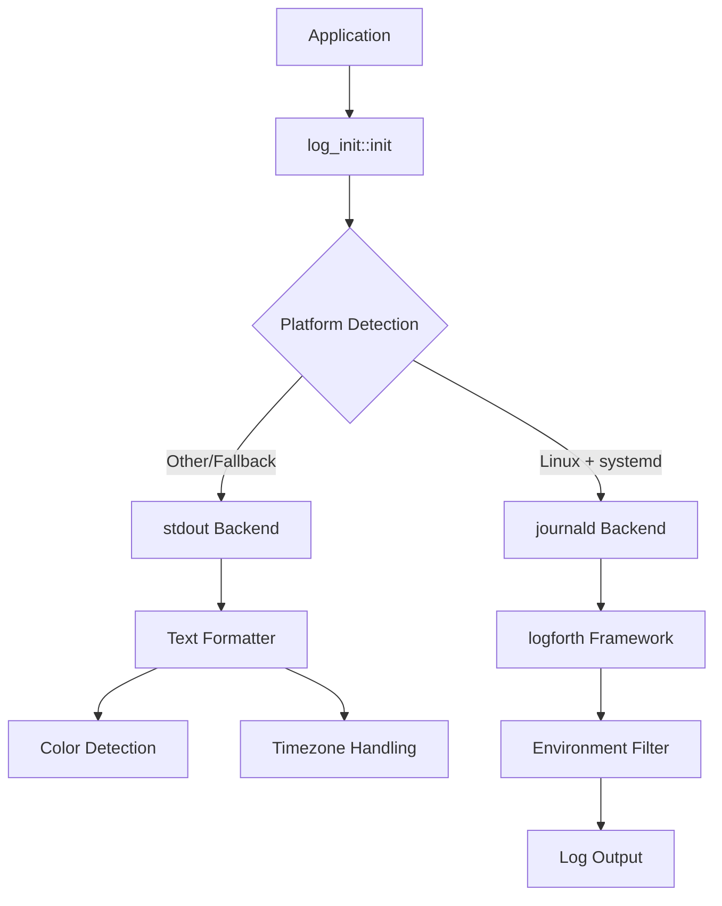

# log_init: Smart Logging Initialization for Rust Applications

## Table of Contents

- [Overview](#overview)
- [Features](#features)
- [Usage](#usage)
- [API Reference](#api-reference)
- [Design Architecture](#design-architecture)
- [Technology Stack](#technology-stack)
- [Project Structure](#project-structure)
- [Development](#development)
- [Historical Context](#historical-context)

## Overview

log_init is a Rust logging initialization library that provides intelligent backend selection and cross-platform compatibility. It automatically detects the runtime environment and chooses the optimal logging backend - systemd journald on Linux systems or stdout with customizable formatting on other platforms.

## Features

- **Automatic Backend Detection**: Intelligently selects journald on systemd-enabled Linux systems, falls back to stdout elsewhere
- **Cross-Platform Support**: Works seamlessly across Linux, macOS, and Windows
- **Structured Logging**: Full support for key-value pairs and structured log data
- **Customizable Formatting**: Rich text formatting with color support and timezone handling
- **Environment-Based Filtering**: Configurable log levels via `RUST_LOG` environment variable
- **Zero-Configuration**: Works out of the box with sensible defaults

## Usage

### Basic Setup

Add to your `Cargo.toml`:

```toml
[dependencies]
log_init = "0.1"
log = "0.4"
```

### Simple Initialization

```rust
use log::{info, warn, error};

fn main() {
    log_init::init();

    info!("Application started");
    warn!("This is a warning");
    error!("Something went wrong");
}
```

### Structured Logging

```rust
use log::info;

fn main() {
    log_init::init();

    info!(
        user_id = 42,
        action = "login",
        duration_ms = 150.5;
        "User authentication successful"
    );
}
```

### Environment Configuration

```bash
# Set log level
export RUST_LOG=debug

# Run your application
cargo run
```

### Feature Flags

```toml
[dependencies]
log_init = { version = "0.1", features = ["systemd"] }
```

Available features:

- `stdout` (default): Enable stdout logging backend
- `systemd`: Enable systemd journald support on Linux

## API Reference

### Functions

#### `init()`

Initializes the global logger with automatic backend detection.

```rust
pub fn init()
```

Behavior:

- On Linux with systemd: Uses journald if `INVOCATION_ID` environment variable is present
- Fallback: Uses stdout with formatted text output
- Panics if no logging backend is available

#### `level_color(level: Level) -> ColoredString`

Returns a colored string representation of the log level.

```rust
pub fn level_color(level: Level) -> ColoredString
```

### Types

#### `Text`

Customizable text formatter for stdout logging.

```rust
pub struct Text {
    pub color: bool,
}
```

Methods:

- `default()`: Creates formatter with automatic color detection based on terminal capability
- `format()`: Formats log records with timestamps, file locations, and structured data

#### `TZ`

Global timezone static for consistent timestamp formatting.

```rust
pub static TZ: jiff::tz::TimeZone
```

## Design Architecture



### Initialization Flow

1. **Platform Detection**: Checks for Linux OS and systemd environment
2. **Backend Selection**: Chooses journald or stdout based on detection results
3. **Filter Configuration**: Applies environment-based log level filtering
4. **Formatter Setup**: Configures text formatting with color and timezone support
5. **Global Registration**: Registers the configured logger as the global instance

### Module Interaction

- `init()` orchestrates the entire initialization process
- `layout::Text` handles stdout formatting and color management
- `kv::Kv` processes structured logging key-value pairs
- Platform-specific code is conditionally compiled for optimal performance

## Technology Stack

- **Core Framework**: [logforth](https://crates.io/crates/logforth) - Modern logging framework
- **Structured Logging**: [log](https://crates.io/crates/log) - Standard Rust logging facade
- **Color Output**: [colored](https://crates.io/crates/colored) - Terminal color support
- **Time Handling**: [jiff](https://crates.io/crates/jiff) - Timezone-aware datetime library
- **Static Initialization**: [static_init](https://crates.io/crates/static_init) - Safe static initialization
- **Performance**: [coarsetime](https://crates.io/crates/coarsetime) - Fast timestamp generation
- **Linux Integration**: [logforth-append-journald](https://crates.io/crates/logforth-append-journald) - systemd journald support

## Project Structure

```
log_init/
├── src/
│   ├── lib.rs          # Main library entry point and initialization logic
│   ├── kv.rs           # Key-value pair processing for structured logging
│   └── layout/
│       ├── mod.rs      # Layout module exports
│       └── text.rs     # Text formatter implementation
├── tests/
│   └── main.rs         # Comprehensive test suite
├── readme/
│   ├── en.md          # English documentation
│   └── zh.md          # Chinese documentation
├── Cargo.toml         # Project configuration and dependencies
└── test.sh           # Test execution script
```

## Development

### Running Tests

```bash
# Run all tests with output
./test.sh

# Or use cargo directly
cargo test --all-features -- --nocapture
```

### Building Documentation

```bash
cargo doc --all-features --open
```

### Feature Testing

```bash
# Test stdout backend only
cargo test --no-default-features --features stdout

# Test with systemd support (Linux only)
cargo test --features systemd
```

## Historical Context

The evolution of logging in systems programming reflects the broader development of observability practices. Early Unix systems relied on simple file-based logging through syslog, introduced in the 1980s. The concept of structured logging gained prominence with the rise of distributed systems in the 2000s.

systemd's journald, introduced in 2011, revolutionized Linux logging by providing binary log storage, automatic metadata collection, and integration with the init system. This represented a significant departure from traditional text-based logs, offering better performance and richer context.

The Rust ecosystem's approach to logging, exemplified by the `log` crate's facade pattern, emerged from lessons learned in other languages about the importance of abstraction between logging interfaces and implementations. This design allows libraries to remain agnostic about logging backends while applications retain full control over log destination and formatting.

log_init bridges these historical approaches by providing intelligent backend selection - leveraging modern systemd capabilities where available while maintaining compatibility with traditional stdout-based logging for broader platform support.
