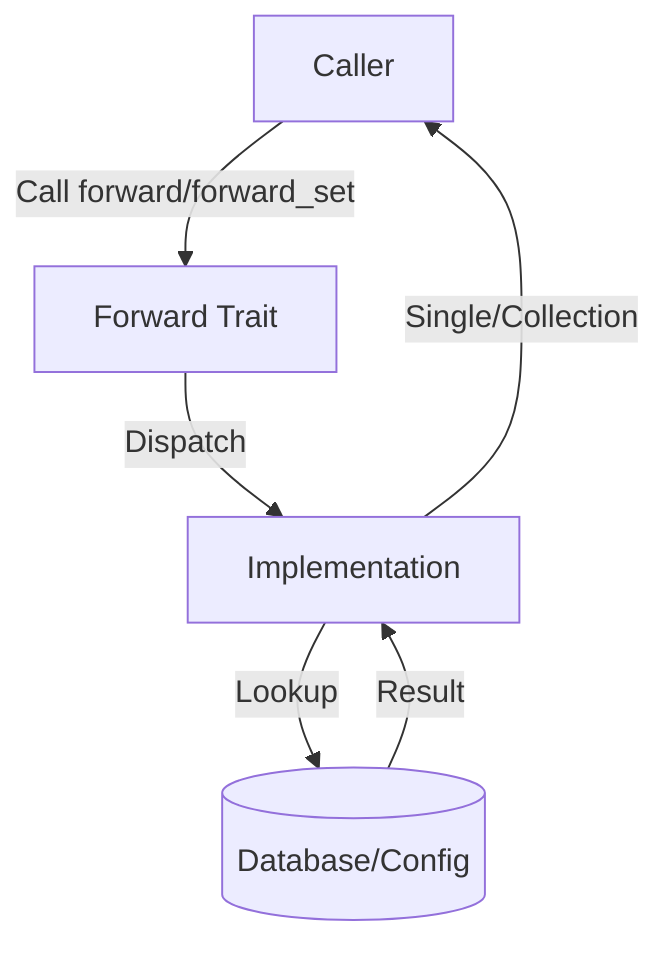
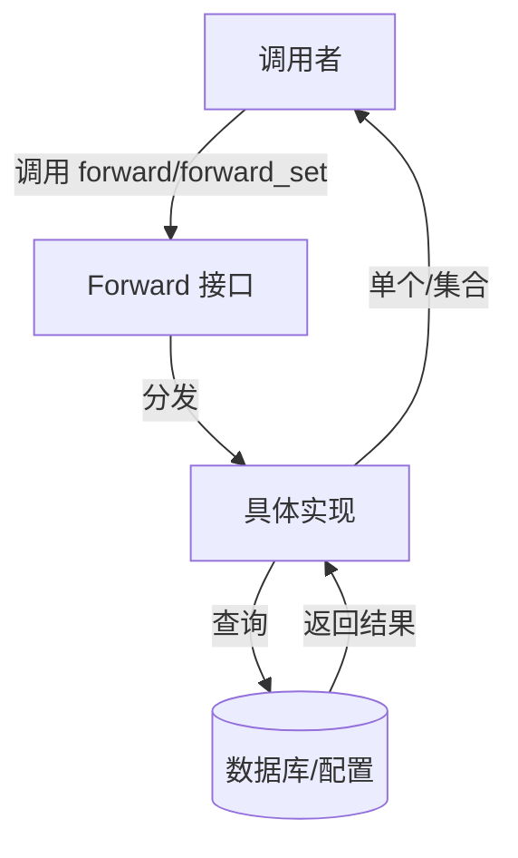

[English](#en) | [中文](#zh)

---

<a id="en"></a>

# mail_forward : Secure and Efficient Mail Forwarding Trait

- [mail_forward : Secure and Efficient Mail Forwarding Trait](#mail_forward-secure-and-efficient-mail-forwarding-trait)
  - [Features](#features)
  - [Usage](#usage)
  - [Design](#design)
    - [Call Flow](#call-flow)
  - [Tech Stack](#tech-stack)
  - [API Reference](#api-reference)
    - [`trait Forward`](#trait-forward)
      - [`fn forward(&self, mail: &str) -> impl Future<Output = Result<Option<String>>> + Send`](#fn-forwardself-mail-str-impl-futureoutput-resultoptionstring-send)
      - [`fn forward_set<S: AsRef<str>>(&self, mail_li: impl IntoIterator<Item = S>) -> impl Future<Output = Result<Vec<String>>> + Send`](#fn-forward_sets-asrefstrself-mail_li-impl-intoiteratoritem-s-impl-futureoutput-resultvecstring-send)
  - [Examples](#examples)
    - [Single Email Lookup](#single-email-lookup)
    - [Batch Processing](#batch-processing)
  - [Historical Anecdote](#historical-anecdote)
  - [About](#about)

`mail_forward` defines a standard interface (trait) for retrieving email forwarding addresses. It abstracts the logic of looking up where incoming emails should be redirected, allowing for various backend implementations with both single and batch processing capabilities.

## Features

- **Async Support**: Built for modern asynchronous Rust applications.
- **Dual Interface**: Supports both single email lookup (`forward`) and batch processing (`forward_set`).
- **Deduplication**: Batch processing automatically handles duplicate emails.
- **Error Handling**: Leverages `anyhow::Result` for flexible error reporting.
- **Thread-Safe**: Full support for concurrent usage with `Send + Sync` bounds.

## Usage

Implement the `Forward` trait for your struct to define how forwarding addresses are resolved.

```rust
use mail_forward::Forward;
use anyhow::Result;
use std::future::Future;
use std::collections::Vec;

pub struct MyForwarder;

impl Forward for MyForwarder {
  fn forward(&self, mail: &str) -> impl Future<Output = Result<Option<String>>> + Send {
    async move {
      // Simulate lookup logic
      if mail == "user@example.com" {
        Ok(Some("forward@target.com".to_string()))
      } else {
        Ok(None)
      }
    }
  }

  fn forward_set<S: AsRef<str>>(
    &self,
    mail_li: impl IntoIterator<Item = S>,
  ) -> impl Future<Output = Result<Vec<String>>> + Send {
    async move {
      let mut results = Vec::new();
      for mail in mail_li {
        if let Some(forwarded) = self.forward(mail.as_ref()).await? {
          results.insert(forwarded);
        }
      }
      Ok(results)
    }
  }
}
```

## Design

The design focuses on decoupling the retrieval logic from the usage while providing both single and batch operation capabilities.

### Call Flow



## Tech Stack

- **Language**: Rust (Edition 2024)
- **Error Handling**: `anyhow`
- **Async Runtime**: Compatible with `tokio` and others.
- **Collections**: Uses `Vec` for automatic deduplication in batch operations.

## API Reference

### `trait Forward`

The core trait of the library.

#### `fn forward(&self, mail: &str) -> impl Future<Output = Result<Option<String>>> + Send`

- **Arguments**:
  - `mail`: The incoming email address to look up.
- **Returns**: An asynchronous result containing `Option<String>`.
  - `Some(String)`: The target forwarding address.
  - `None`: No forwarding address found.

#### `fn forward_set<S: AsRef<str>>(&self, mail_li: impl IntoIterator<Item = S>) -> impl Future<Output = Result<Vec<String>>> + Send`

- **Arguments**:
  - `mail_li`: An iterator of email addresses to look up.
- **Returns**: An asynchronous result containing `Vec<String>`.
  - A set of unique forwarding addresses found.
  - Automatically handles duplicates in the input.
  - Only includes addresses that have valid forwards.

## Examples

### Single Email Lookup

```rust
let forwarder = MyForwarder;
let result = forwarder.forward("user@example.com").await?;
if let Some(target) = result {
    println!("Forward to: {}", target);
} else {
    println!("No forward configured");
}
```

### Batch Processing

```rust
let emails = vec!["user1@example.com", "user2@example.com", "user3@example.com"];
let forwarder = MyForwarder;
let results = forwarder.forward_set(&emails).await?;
for target in results {
    println!("Forward to: {}", target);
}
```

## Historical Anecdote

In the early days of Unix systems, email forwarding was often handled by a simple text file named `.forward` located in a user's home directory. This mechanism, known as "dot-forwarding," allowed users to specify a destination address or a program to process their mail. It was one of the earliest forms of user-controlled email routing, establishing a concept effectively standardized and modernized by traits like `mail_forward` in system-level programming today. The addition of batch processing in `mail_forward` represents the evolution from simple single-mail forwarding to modern bulk email handling capabilities.

## About

This library is developed by [WebC.site](https://webc.site).

[WebC.site](https://webc.site): A new paradigm of web development for AI

---

<a id="zh"></a>

# mail_forward : 安全高效的邮件转发接口

- [mail_forward : 安全高效的邮件转发接口](#mail_forward-安全高效的邮件转发接口)
  - [功能特性](#功能特性)
  - [使用演示](#使用演示)
  - [设计思路](#设计思路)
    - [调用流程](#调用流程)
  - [技术栈](#技术栈)
  - [API 参考](#api-参考)
    - [`trait Forward`](#trait-forward)
      - [`fn forward(&self, mail: &str) -> impl Future<Output = Result<Option<String>>> + Send`](#fn-forwardself-mail-str-impl-futureoutput-resultoptionstring-send)
      - [`fn forward_set<S: AsRef<str>>(&self, mail_li: impl IntoIterator<Item = S>) -> impl Future<Output = Result<Vec<String>>> + Send`](#fn-forward_sets-asrefstrself-mail_li-impl-intoiteratoritem-s-impl-futureoutput-resultvecstring-send)
  - [使用示例](#使用示例)
    - [单个邮件查找](#单个邮件查找)
    - [批量处理](#批量处理)
  - [历史趣闻](#历史趣闻)
  - [关于](#关于)

`mail_forward` 定义了一个标准接口（trait），用于获取邮件转发地址。它抽象了查找邮件重定向目标的逻辑，允许适配多种后端实现，同时支持单个邮件和批量处理功能。

## 功能特性

- **异步支持**：专为现代异步 Rust 应用设计。
- **双重接口**：支持单个邮件查找（`forward`）和批量处理（`forward_set`）。
- **自动去重**：批量处理自动处理重复邮件。
- **错误处理**：利用 `anyhow::Result` 提供灵活的错误报告。
- **线程安全**：通过 `Send + Sync` 约束完全支持并发使用。

## 使用演示

为结构体实现 `Forward` trait 以定义转发地址的解析方式。

```rust
use mail_forward::Forward;
use anyhow::Result;
use std::future::Future;
use std::collections::Vec;

pub struct MyForwarder;

impl Forward for MyForwarder {
  fn forward(&self, mail: &str) -> impl Future<Output = Result<Option<String>>> + Send {
    async move {
      // 模拟查找逻辑
      if mail == "user@example.com" {
        Ok(Some("forward@target.com".to_string()))
      } else {
        Ok(None)
      }
    }
  }

  fn forward_set<S: AsRef<str>>(
    &self,
    mail_li: impl IntoIterator<Item = S>,
  ) -> impl Future<Output = Result<Vec<String>>> + Send {
    async move {
      let mut results = Vec::new();
      for mail in mail_li {
        if let Some(forwarded) = self.forward(mail.as_ref()).await? {
          results.insert(forwarded);
        }
      }
      Ok(results)
    }
  }
}
```

## 设计思路

设计核心在于将获取逻辑与使用逻辑解耦，同时提供单个和批量操作能力。

### 调用流程



## 技术栈

- **编程语言**: Rust (Edition 2024)
- **错误处理**: `anyhow`
- **异步运行时**: 兼容 `tokio` 等。
- **集合类型**: 批量操作使用 `Vec` 自动去重。

## API 参考

### `trait Forward`

库的核心 trait。

#### `fn forward(&self, mail: &str) -> impl Future<Output = Result<Option<String>>> + Send`

- **参数**:
  - `mail`: 待查询的传入电子邮件地址。
- **返回**: 包含 `Option<String>` 的异步结果。
  - `Some(String)`: 目标转发地址。
  - `None`: 未找到转发地址。

#### `fn forward_set<S: AsRef<str>>(&self, mail_li: impl IntoIterator<Item = S>) -> impl Future<Output = Result<Vec<String>>> + Send`

- **参数**:
  - `mail_li`: 待查询的邮件地址迭代器。
- **返回**: 包含 `Vec<String>` 的异步结果。
  - 找到的唯一转发地址集合。
  - 自动处理输入中的重复项。
  - 仅包含有有效转发的地址。

## 使用示例

### 单个邮件查找

```rust
let forwarder = MyForwarder;
let result = forwarder.forward("user@example.com").await?;
if let Some(target) = result {
    println!("转发至: {}", target);
} else {
    println!("未配置转发");
}
```

### 批量处理

```rust
let emails = vec!["user1@example.com", "user2@example.com", "user3@example.com"];
let forwarder = MyForwarder;
let results = forwarder.forward_set(&emails).await?;
for target in results {
    println!("转发至: {}", target);
}
```

## 历史趣闻

在 Unix 系统的早期，邮件转发通常由用户主目录下名为 `.forward` 的简单文本文件处理。这种机制被称为 "dot-forwarding"，允许用户指定目标地址或处理邮件的程序。它是最早的用户自主控制邮件路由的形式之一，这一概念如今在系统级编程中通过像 `mail_forward` 这样的 trait 得到了标准化和现代化。`mail_forward` 中批量处理功能的添加，代表了从简单单邮件转发到现代批量邮件处理能力的演进。

## 关于

本库由 [WebC.site](https://webc.site) 开发。

[WebC.site](https://webc.site) : 面向人工智能的网站开发新范式
