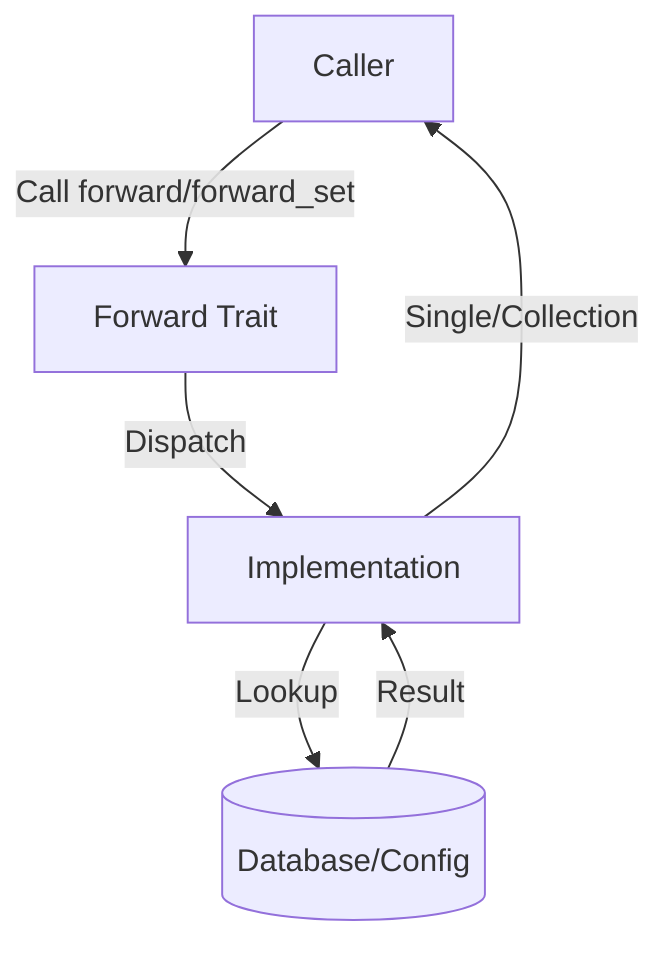

# mail_forward : Secure and Efficient Mail Forwarding Trait

`mail_forward` defines a standard interface (trait) for retrieving email forwarding addresses. It abstracts the logic of looking up where incoming emails should be redirected, allowing for various backend implementations with both single and batch processing capabilities.

## Features

- **Async Support**: Built for modern asynchronous Rust applications.
- **Dual Interface**: Supports both single email lookup (`forward`) and batch processing (`forward_set`).
- **Deduplication**: Batch processing automatically handles duplicate emails.
- **Error Handling**: Leverages `anyhow::Result` for flexible error reporting.
- **Thread-Safe**: Full support for concurrent usage with `Send + Sync` bounds.

## Usage

Implement the `Forward` trait for your struct to define how forwarding addresses are resolved.

```rust
use mail_forward::Forward;
use anyhow::Result;
use std::future::Future;
use std::collections::Vec;

pub struct MyForwarder;

impl Forward for MyForwarder {
  fn forward(&self, mail: &str) -> impl Future<Output = Result<Option<String>>> + Send {
    async move {
      // Simulate lookup logic
      if mail == "user@example.com" {
        Ok(Some("forward@target.com".to_string()))
      } else {
        Ok(None)
      }
    }
  }

  fn forward_set<S: AsRef<str>>(
    &self,
    mail_li: impl IntoIterator<Item = S>,
  ) -> impl Future<Output = Result<Vec<String>>> + Send {
    async move {
      let mut results = Vec::new();
      for mail in mail_li {
        if let Some(forwarded) = self.forward(mail.as_ref()).await? {
          results.insert(forwarded);
        }
      }
      Ok(results)
    }
  }
}
```

## Design

The design focuses on decoupling the retrieval logic from the usage while providing both single and batch operation capabilities.

### Call Flow



## Tech Stack

- **Language**: Rust (Edition 2024)
- **Error Handling**: `anyhow`
- **Async Runtime**: Compatible with `tokio` and others.
- **Collections**: Uses `Vec` for automatic deduplication in batch operations.

## API Reference

### `trait Forward`

The core trait of the library.

#### `fn forward(&self, mail: &str) -> impl Future<Output = Result<Option<String>>> + Send`

- **Arguments**:
  - `mail`: The incoming email address to look up.
- **Returns**: An asynchronous result containing `Option<String>`.
  - `Some(String)`: The target forwarding address.
  - `None`: No forwarding address found.

#### `fn forward_set<S: AsRef<str>>(&self, mail_li: impl IntoIterator<Item = S>) -> impl Future<Output = Result<Vec<String>>> + Send`

- **Arguments**:
  - `mail_li`: An iterator of email addresses to look up.
- **Returns**: An asynchronous result containing `Vec<String>`.
  - A set of unique forwarding addresses found.
  - Automatically handles duplicates in the input.
  - Only includes addresses that have valid forwards.

## Examples

### Single Email Lookup

```rust
let forwarder = MyForwarder;
let result = forwarder.forward("user@example.com").await?;
if let Some(target) = result {
    println!("Forward to: {}", target);
} else {
    println!("No forward configured");
}
```

### Batch Processing

```rust
let emails = vec!["user1@example.com", "user2@example.com", "user3@example.com"];
let forwarder = MyForwarder;
let results = forwarder.forward_set(&emails).await?;
for target in results {
    println!("Forward to: {}", target);
}
```

## Historical Anecdote

In the early days of Unix systems, email forwarding was often handled by a simple text file named `.forward` located in a user's home directory. This mechanism, known as "dot-forwarding," allowed users to specify a destination address or a program to process their mail. It was one of the earliest forms of user-controlled email routing, establishing a concept effectively standardized and modernized by traits like `mail_forward` in system-level programming today. The addition of batch processing in `mail_forward` represents the evolution from simple single-mail forwarding to modern bulk email handling capabilities.
