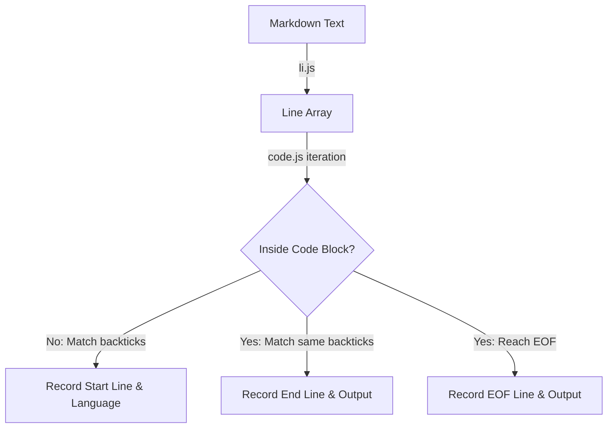
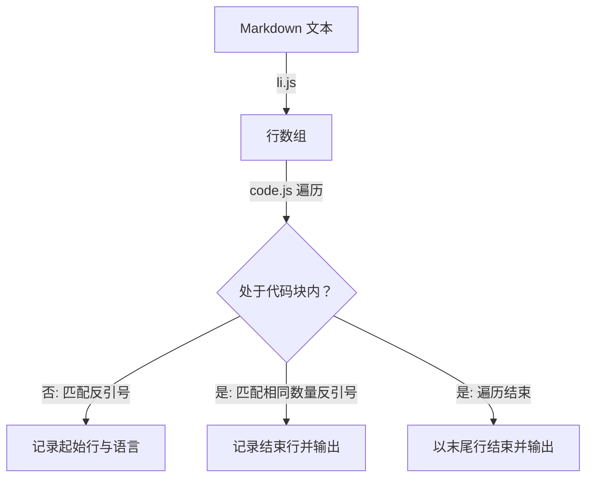

[English](#en) | [中文](#zh)

---

<a id="en"></a>
# @1-/md : Extract code block positions and languages from Markdown

- [@1-/md : Extract code block positions and languages from Markdown](#1-md-extract-code-block-positions-and-languages-from-markdown)
  - [1. Features](#1-features)
  - [2. Usage](#2-usage)
  - [3. Design](#3-design)
  - [4. Tech Stack](#4-tech-stack)
  - [5. Code Structure](#5-code-structure)
  - [6. History](#6-history)
  - [About](#about)

## 1. Features

Extracts code block locations and languages from Markdown text.

- Normalizes line breaks, splits text into lines, and removes trailing whitespace.
- Identifies code blocks enclosed by at least 3 backticks (`).
- Extracts code block languages and records start and end line numbers.
- Closes unclosed code blocks automatically at the end of the text.

## 2. Usage

```javascript
import li from "@1-/md/li.js";
import code from "@1-/md/code.js";

const markdownContent = `# Title

\`\`\`javascript
const val = 1;
\`\`\`
`;

// Split text into lines and trim trailing whitespace
const lines = li(markdownContent);

// Extract code block information
const blocks = code(lines);

console.log(blocks);
// Output format: [ [ Language, Start Line, End Line ] ]
// Example output: [ [ 'javascript', 3, 5 ] ]
```

## 3. Design

Consists of line-splitting module (`li.js`) and code block extraction module (`code.js`).

`li.js` normalizes `\r\n` and `\r` into `\n`, splits text into line array, and trims trailing whitespace.

`code.js` iterates through line array using state machine:

- Outside code block: matching line starting with at least 3 backticks records backtick count, language, and start line number, transitioning to inside state.
- Inside code block: matching line with same number of backticks records end line number, saves code block, transitioning to outside state.
- End of file: if still inside code block, records end line number, saves code block.



## 4. Tech Stack

- Runtime: Bun / Node.js
- Language: JavaScript (ES Modules)
- Linter: Oxlint
- Formatter: Oxfmt

## 5. Code Structure

```
.
├── src/
│   ├── code.js          # Extract code blocks
│   └── li.js            # Split lines and trim whitespace
└── tests/
    ├── _.test.js        # Unit tests
    └── test.md          # Markdown text for testing
```

## 6. History

John Gruber and Aaron Swartz created Markdown in 2004. Early specifications only supported indentation for code blocks.

GitHub introduced fenced code blocks with backticks (`) in GitHub Flavored Markdown (GFM), enabling language declarations for syntax highlighting.

Fenced code blocks became popular, got standardized in CommonMark, and became the standard for technical documentation.

## About

This library is developed by [WebC.site](https://webc.site).

[WebC.site](https://webc.site): A new paradigm of web development for AI


---

<a id="zh"></a>
# @1-/md : 解析 Markdown 提取代码块位置与语言类型

- [@1-/md : 解析 Markdown 提取代码块位置与语言类型](#1-md-解析-markdown-提取代码块位置与语言类型)
  - [1. 功能介绍](#1-功能介绍)
  - [2. 使用演示](#2-使用演示)
  - [3. 设计思路](#3-设计思路)
  - [4. 技术栈](#4-技术栈)
  - [5. 代码结构](#5-代码结构)
  - [6. 历史故事](#6-历史故事)
  - [关于](#关于)

## 1. 功能介绍

解析 Markdown 文本，提取代码块位置与语言类型。

- 支持统一换行符并按行拆分，清除行尾空白。
- 识别连续 3 及以上反引号（`）定义的代码块。
- 提取代码块语言类型，记录起始与结束行号。
- 自动闭合未闭合代码块。

## 2. 使用演示

```javascript
import li from "@1-/md/li.js";
import code from "@1-/md/code.js";

const markdownContent = `# Title

\`\`\`javascript
const val = 1;
\`\`\`
`;

// 按行分割文本并清理空白
const lines = li(markdownContent);

// 提取代码块信息
const blocks = code(lines);

console.log(blocks);
// 输出格式: [ [ 语言类型, 起始行号, 结束行号 ] ]
// 示例输出: [ [ 'javascript', 3, 5 ] ]
```

## 3. 设计思路

系统包含行拆分模块（`li.js`）与代码块提取模块（`code.js`）。

行拆分模块统一 `\r\n` 与 `\r` 换行符为 `\n`，拆分为行数组并清除行尾空白。

代码块提取模块遍历行数组，利用状态机跟踪状态：

- 处于代码块外：匹配到 3 及以上连续反引号开头行，记录反引号数量、语言类型及起始行号，切换至块内状态。
- 处于代码块内：匹配到相同数量反引号结束行，记录结束行号并保存代码块，切换至块外状态。
- 遍历结束：若仍处于代码块内，以末尾行号闭合代码块并保存。



## 4. 技术栈

- 运行环境: Bun / Node.js
- 开发语言: JavaScript (ES Modules)
- 代码检查: Oxlint
- 格式化工具: Oxfmt

## 5. 代码结构

```
.
├── src/
│   ├── code.js          # 提取代码块
│   └── li.js            # 行拆分及清理
└── tests/
    ├── _.test.js        # 单元测试
    └── test.md          # 测试 Markdown 文本
```

## 6. 历史故事

2004 年，John Gruber 与 Aaron Swartz 共同创建 Markdown 标记语言。早期规范仅支持缩进排版代码。

随着 GitHub 推出 GitHub Flavored Markdown (GFM)，引入反引号（`）闭合代码块语法，支持声明语言类型以实现语法高亮。

围栏代码块语法因直观易用被广泛采纳，后写入 CommonMark 规范，成为技术文档标准。

## 关于

本库由 [WebC.site](https://webc.site) 开发。

[WebC.site](https://webc.site) : 面向人工智能的网站开发新范式

