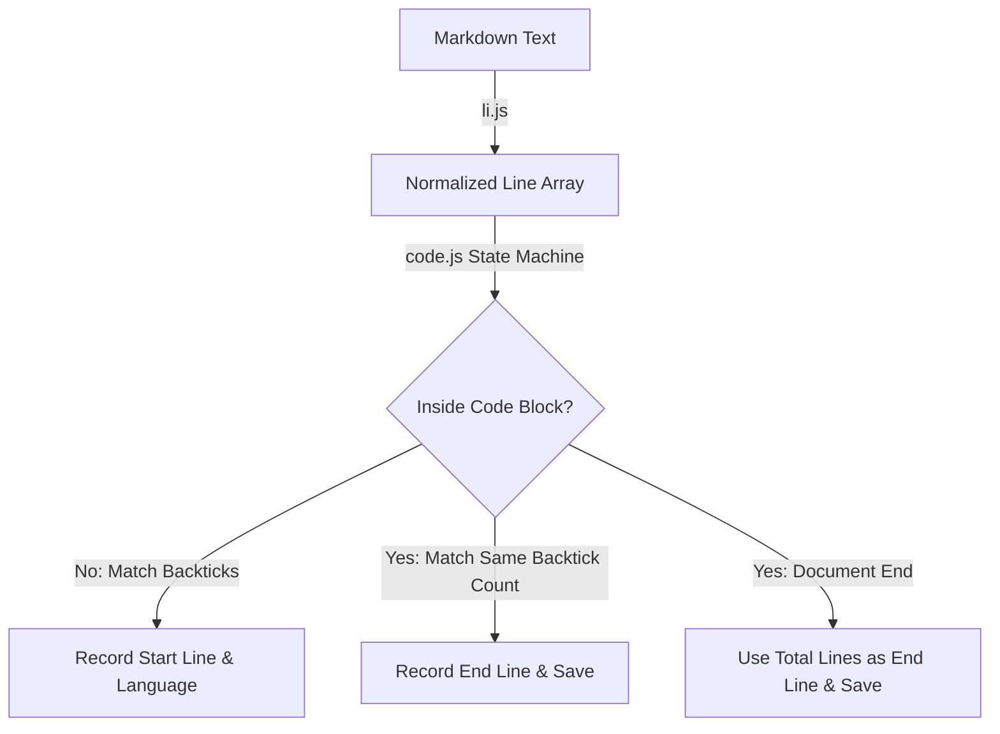

# @1-/md : Extract code block positions and languages from Markdown

## 1. Features

Extract code block locations and language identifiers from Markdown text.

- Normalize cross-platform line endings (\r\n, \r) to standard \n
- Support fenced code blocks with any number of consecutive backticks (≥3)
- Accurately extract language identifiers, including empty strings for language-agnostic blocks
- Record start and end line numbers (1-based indexing) for each code block
- Automatically close unclosed code blocks at document end

## 2. Usage

```javascript
import li from "@1-/md/li.js";
import code from "@1-/md/code.js";

const markdownContent = `# Title

\`\`\`javascript
const val = 1;
\`\`\``;

// Split Markdown text into normalized line array
const lines = li(markdownContent);

// Extract all code block information
const blocks = code(lines);

console.log(blocks);
// Output format: [ [ Language, Start Line, End Line ] ]
// Example output: [ [ 'javascript', 3, 5 ] ]
```

## 3. Design

The system consists of two independent modules: line normalization (`li.js`) and code block extraction (`code.js`).

`li.js` normalizes cross-platform line endings and splits text into line arrays while trimming trailing whitespace from each line.

`code.js` uses a state machine to iterate through the line array:

- Initial state (outside code block): match lines starting with ≥3 backticks, record backtick count, language, and start line number, transition to inside state
- Inside code block state: match ending lines with identical backtick count, record end line number and save block information, transition back to outside state
- Document end: if still inside a code block, use total line count as end line number and save the unclosed block



## 4. Tech Stack

- Runtime: Bun / Node.js
- Language: JavaScript (ES Modules)
- Linter: Oxlint
- Formatter: Oxfmt

## 5. Code Structure

```
.
├── src/
│   ├── code.js          # Code block extraction logic
│   └── li.js            # Line normalization processing
└── test/
    ├── _.test.js        # Unit test
    └── test.md          # Markdown test cases
```

## 6. History

In 2004, John Gruber and Aaron Swartz co-created the Markdown markup language, with early specifications supporting only indented code blocks.

In 2012, GitHub introduced fenced code blocks in GitHub Flavored Markdown (GFM), using backticks (`) to wrap code with optional language identifiers, significantly improving readability and practicality of technical documentation.

In 2014, fenced code blocks were standardized in the CommonMark specification, becoming a core feature of modern Markdown implementations across documentation generators, static site builders, and development tools.
