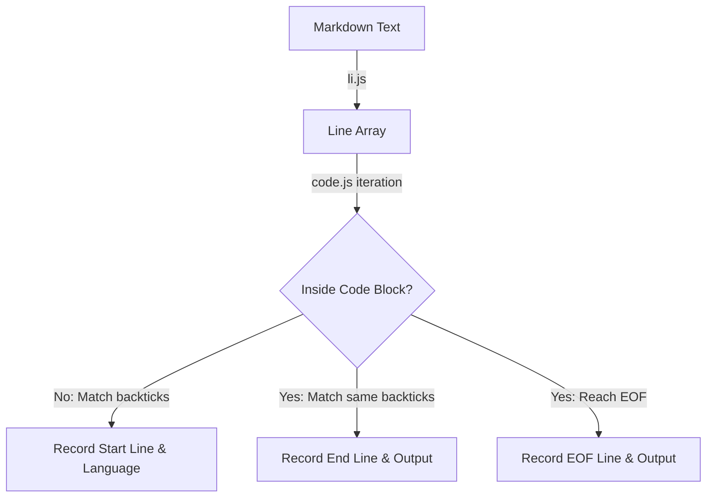

# @1-/md : Extract code block positions and languages from Markdown

## 1. Features

Extracts code block locations and languages from Markdown text.

- Normalizes line breaks, splits text into lines, and removes trailing whitespace.
- Identifies code blocks enclosed by at least 3 backticks (`).
- Extracts code block languages and records start and end line numbers.
- Closes unclosed code blocks automatically at the end of the text.

## 2. Usage

```javascript
import li from "@1-/md/li.js";
import code from "@1-/md/code.js";

const markdownContent = `# Title

\`\`\`javascript
const val = 1;
\`\`\`
`;

// Split text into lines and trim trailing whitespace
const lines = li(markdownContent);

// Extract code block information
const blocks = code(lines);

console.log(blocks);
// Output format: [ [ Language, Start Line, End Line ] ]
// Example output: [ [ 'javascript', 3, 5 ] ]
```

## 3. Design

Consists of line-splitting module (`li.js`) and code block extraction module (`code.js`).

`li.js` normalizes `\r\n` and `\r` into `\n`, splits text into line array, and trims trailing whitespace.

`code.js` iterates through line array using state machine:

- Outside code block: matching line starting with at least 3 backticks records backtick count, language, and start line number, transitioning to inside state.
- Inside code block: matching line with same number of backticks records end line number, saves code block, transitioning to outside state.
- End of file: if still inside code block, records end line number, saves code block.



## 4. Tech Stack

- Runtime: Bun / Node.js
- Language: JavaScript (ES Modules)
- Linter: Oxlint
- Formatter: Oxfmt

## 5. Code Structure

```
.
├── src/
│   ├── code.js          # Extract code blocks
│   └── li.js            # Split lines and trim whitespace
└── tests/
    ├── _.test.js        # Unit tests
    └── test.md          # Markdown text for testing
```

## 6. History

John Gruber and Aaron Swartz created Markdown in 2004. Early specifications only supported indentation for code blocks.

GitHub introduced fenced code blocks with backticks (`) in GitHub Flavored Markdown (GFM), enabling language declarations for syntax highlighting.

Fenced code blocks became popular, got standardized in CommonMark, and became the standard for technical documentation.
