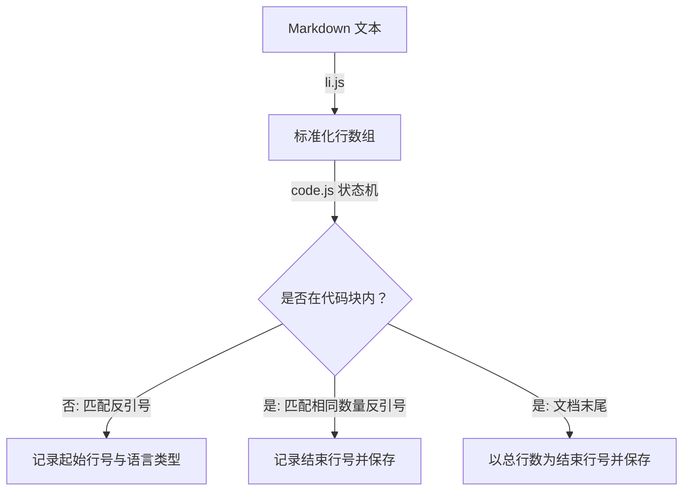

# @1-/md : 解析 Markdown 提取代码块位置与语言类型

## 1. 功能介绍

提取 Markdown 文本中围栏代码块的位置信息与语言标识。

- 统一处理跨平台换行符（\r\n、\r）为标准 \n
- 支持任意数量连续反引号（≥3）定义的围栏代码块
- 准确提取代码块语言标识，包括无语言标识的空字符串情况
- 记录每个代码块的起始行号与结束行号（1-based indexing）
- 自动闭合文档末尾未配对的代码块

## 2. 使用演示

```javascript
import li from "@1-/md/li.js";
import code from "@1-/md/code.js";

const markdownContent = `# Title

\`\`\`javascript
const val = 1;
\`\`\``;

// 将 Markdown 文本拆分为标准化的行数组
const lines = li(markdownContent);

// 提取所有代码块信息
const blocks = code(lines);

console.log(blocks);
// 输出格式: [ [ 语言类型, 起始行号, 结束行号 ] ]
// 示例输出: [ [ 'javascript', 3, 5 ] ]
```

## 3. 设计思路

系统由两个独立模块组成：行标准化模块（`li.js`）和代码块提取模块（`code.js`）。

`li.js` 模块统一处理不同平台的换行符，将文本分割为行数组，并清除每行末尾空白字符。

`code.js` 模块使用状态机遍历行数组：
- 初始状态（代码块外）：匹配以 ≥3 个反引号开头的行，记录反引号数量、语言类型及起始行号，切换至代码块内状态
- 代码块内状态：匹配相同数量反引号的结束行，记录结束行号并保存代码块信息，切换回代码块外状态
- 文档末尾：若仍处于代码块内状态，则以文档总行数作为结束行号，保存未闭合代码块



## 4. 技术栈

- 运行时: Bun / Node.js
- 语言: JavaScript (ES Modules)
- 代码检查: Oxlint
- 代码格式化: Oxfmt

## 5. 代码结构

```
.
├── src/
│   ├── code.js          # 代码块提取逻辑
│   └── li.js            # 行标准化处理
└── test/
    ├── _.test.js        # 单元测试
    └── test.md          # 测试用 Markdown 样例
```

## 6. 历史故事

2004 年，John Gruber 与 Aaron Swartz 共同创建 Markdown 标记语言，早期规范仅支持缩进方式定义代码块。

2012 年，GitHub 在 GitHub Flavored Markdown (GFM) 中引入围栏代码块语法，使用反引号（`）包裹代码并支持语言标识，大幅提升技术文档可读性与实用性。

2014 年，围栏代码块被纳入 CommonMark 规范，成为现代 Markdown 的标准特性，广泛应用于文档生成、静态网站构建和开发工具中。