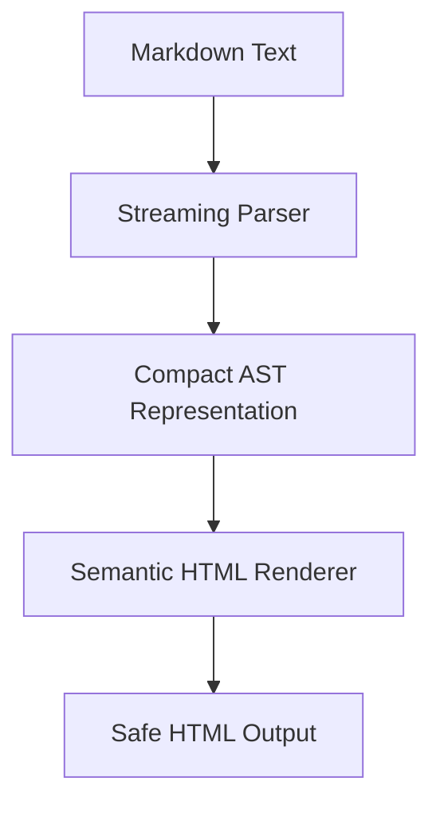
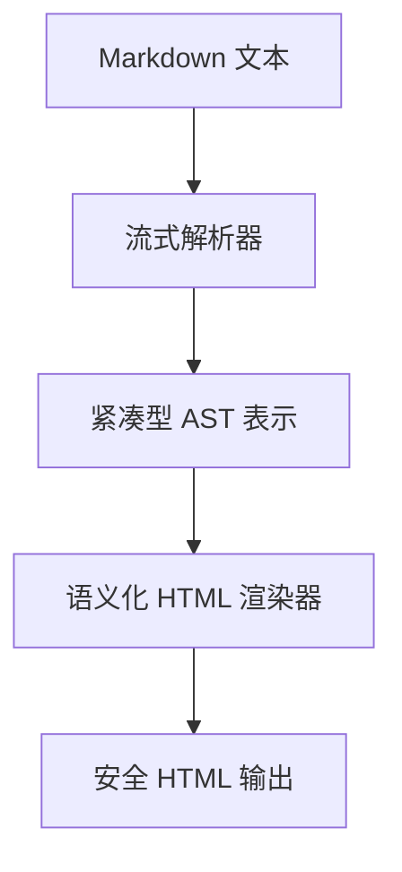

[English](#en) | [中文](#zh)

---

<a id="en"></a>
# md2htm : Lightweight Markdown-to-HTML Converter

- [md2htm : Lightweight Markdown-to-HTML Converter](#md2htm-lightweight-markdown-to-html-converter)
  - [Functionality](#functionality)
  - [Usage Example](#usage-example)
  - [Design Approach](#design-approach)
  - [Technology Stack](#technology-stack)
  - [Code Structure](#code-structure)
  - [Historical Context](#historical-context)
  - [About](#about)

## Functionality

Converts Markdown text to semantic HTML output. Supports standard Markdown syntax plus extensions including admonition blocks (`[!NOTE]`, `[!TIP]`, `[!IMPORTANT]`, `[!WARNING]`, `[!CAUTION]`), math notation (`<c-math>`), and GitHub-style tables with alignment support.

## Usage Example

```javascript
import md2htm from "@1-/md2htm";

const markdown = "# Hello\n\nThis is **bold** text.\n\n[!NOTE]\nThis is an admonition block.";
const html = md2htm(markdown);
// Returns semantic HTML with proper class attributes and structure
```

## Design Approach

The converter implements a three-stage pipeline:



Key implementation features:

- Memory-efficient AST using integer-based node types (`T_H=2`, `T_P=3`, etc.)
- Streaming parsing that processes text line-by-line
- Custom HTML encoding/decoding with comprehensive entity support
- Admonition block detection and semantic class generation (`<blockquote class="q note">`)
- Math notation support with `<c-math>` custom elements
- GitHub-style table alignment support (`left`, `center`, `right`)

## Technology Stack

- Pure JavaScript ES modules (no external dependencies)
- Custom AST-based parsing engine
- Semantic HTML generation with accessibility considerations
- Comprehensive HTML entity decoding (17+ entities supported)
- Safe URL encoding with RFC-compliant handling

## Code Structure

```
src/
├── _.js          # Main entry point with default export
├── ast.js        # Core parser with streaming architecture
├── lib.js        # AST-to-HTML coordinator
├── renderBlock.js # Block-level renderer
├── htmD.js       # HTML decoder with entity mappings and punctuation handling
└── htmE.js       # HTML encoder with 4-character entity escaping
```

## Historical Context

Markdown was created by John Gruber in 2004 to enable easy-to-read, easy-to-write plain text formatting. Aaron Swartz provided critical feedback on its syntax design. This md2htm implementation continues that tradition with modern optimizations, using integer-based AST nodes for memory efficiency and streaming parsing for performance.

## About

This library is developed by [WebC.site](https://webc.site).

[WebC.site](https://webc.site): A new paradigm of web development for AI


---

<a id="zh"></a>
# md2htm : 轻量级 Markdown 到 HTML 转换器

- [md2htm : 轻量级 Markdown 到 HTML 转换器](#md2htm-轻量级-markdown-到-html-转换器)
  - [功能介绍](#功能介绍)
  - [使用演示](#使用演示)
  - [设计思路](#设计思路)
  - [技术栈](#技术栈)
  - [代码结构](#代码结构)
  - [历史故事](#历史故事)
  - [关于](#关于)

## 功能介绍

将 Markdown 文本转换为语义化 HTML 输出。支持标准 Markdown 语法及扩展功能，包括警示块（`[!NOTE]`、`[!TIP]`、`[!IMPORTANT]`、`[!WARNING]`、`[!CAUTION]`）、数学符号（`<c-math>`）以及带对齐支持的 GitHub 风格表格。

## 使用演示

```javascript
import md2htm from "@1-/md2htm";

const markdown = "# 你好\n\n这是 **粗体** 文字。\n\n[!NOTE]\n这是一个警示块。";
const html = md2htm(markdown);
// 返回具有正确类属性和结构的语义化 HTML
```

## 设计思路

转换器采用三阶段流水线架构：



关键实现特性：

- 内存高效 AST，使用整数节点类型（`T_H=2`、`T_P=3` 等）
- 流式解析，逐行处理文本
- 自定义 HTML 编码/解码，支持 17+ 实体映射
- 警示块检测与语义化类生成（`<blockquote class="q note">`）
- 数学符号支持 `<c-math>` 自定义元素
- GitHub 风格表格对齐支持（`left`、`center`、`right`）

## 技术栈

- 纯 JavaScript ES 模块（无外部依赖）
- 自定义 AST 解析引擎
- 语义化 HTML 生成，考虑可访问性
- 完整 HTML 实体解码（支持 17+ 实体）
- 符合 RFC 规范的安全 URL 编码

## 代码结构

```
src/
├── _.js          # 主入口文件，提供默认导出
├── ast.js        # 核心解析器，含流式架构
├── lib.js        # AST 到 HTML 协调器
├── renderBlock.js # 块级渲染器
├── htmD.js       # HTML 解码器，含实体映射和标点处理
└── htmE.js       # HTML 编码器，4 字符实体转义
```

## 历史故事

Markdown 由 John Gruber 于 2004 年创建，旨在提供易读易写的纯文本格式化方案。Aaron Swartz 对其语法设计提供了关键反馈。本 md2htm 实现延续这一传统，采用现代优化技术：使用整数型 AST 节点提升内存效率，流式解析增强性能。

## 关于

本库由 [WebC.site](https://webc.site) 开发。

[WebC.site](https://webc.site) : 面向人工智能的网站开发新范式

